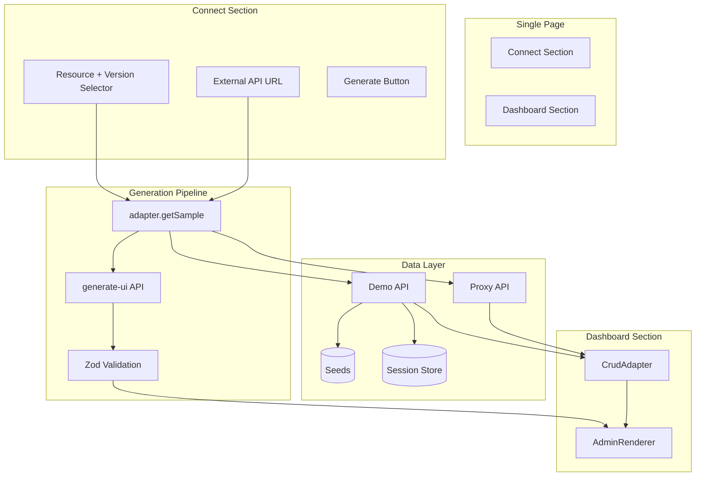
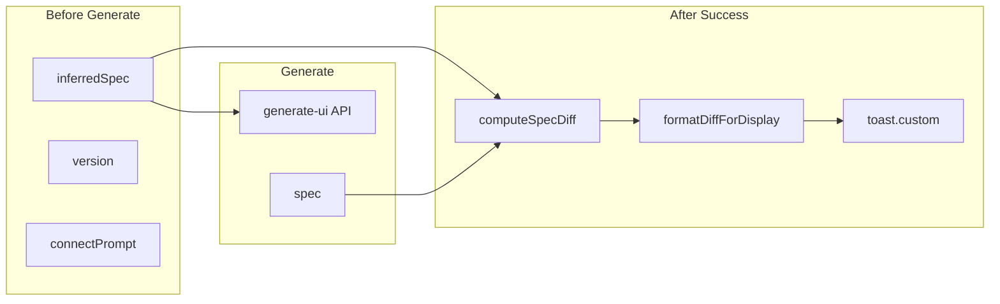
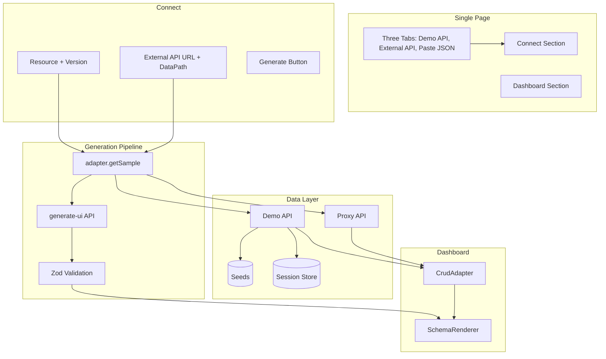
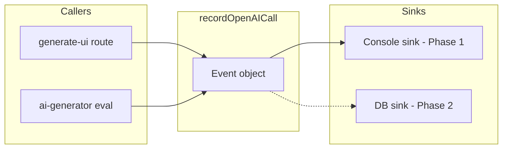

# API-Backed Admin UI — Main Implementation Plan

**This is the primary document for implementation.** Reference: [rapidui_next_mvp_blueprint.md](rapidui_next_mvp_blueprint.md)

---

## Executive Summary

Evolve RapidUI from "JSON paste → admin UI" into a **one-click internal dashboard generator** that connects to a real API (demo API first, external APIs in preview mode). The plan is aligned with the blueprint, incorporates stress-test findings and user feedback, and all design decisions are resolved.

---

## Current State vs Target


| Aspect      | Current     | Target                                               |
| ----------- | ----------- | ---------------------------------------------------- |
| Data source | Pasted JSON | Demo API (primary) or External API                   |
| CRUD        | Local state | API calls via adapter                                |
| Layout      | Single page | Single page (Connect + Dashboard sections)           |
| Session     | None        | In-memory only (reload = fresh start)                |
| Schemas     | Single      | Versioned (v1/v2/v3) per resource, no shared records |


---

## Blueprint Alignment

### Fully Aligned

- 5-phase execution with CHECKPOINTs
- Demo API first, external preview read-only
- Versioned schemas (v1/v2/v3), no shared records
- CrudAdapter interface with capabilities
- One-click generation: Connect → Generate → Dashboard
- Spec preview panel for debugging
- Demo datasets: Users, Products, Tasks, Orders, Blog, Inventory, Nested
- PUT for updates (not PATCH)
- Zod validation gate

### Intentional Divergences


| Blueprint                | Plan                                         | Rationale                                       |
| ------------------------ | -------------------------------------------- | ----------------------------------------------- |
| Session in localStorage  | Session in React state only, no localStorage | Reload = fresh start; two users = separate data |
| `app/dashboard/page.tsx` | Single page, no `/dashboard` route           | Single-page design, no spec in URL              |


### Enhancements Beyond Blueprint

- **Proxy security**: URL validation, SSRF protection, 10s timeout, rate limiting
- **idField**: Explicit `idField` in UISpec (Option A)
- **getSample vs list**: Seeds for spec gen, session data for display; empty table handled gracefully
- **Read-only mode**: Optional `onEdit`/`onDelete` in DataTable
- **Reset endpoint**: `POST /api/demo/[resource]/reset`

---

## Resolved Decisions

1. **JSON paste flow**: Keep as secondary option (tab or toggle). Connect is primary; Paste JSON for backward compatibility and arbitrary JSON.
2. **Optional prompt/intent**: Add optional prompt field on Connect screen; pass to generate-ui as `intent`.
3. **Reset API shape**: `POST /api/demo/[resource]/reset?session={id}&v=1|2|3`. No body required.
4. **Three tabs**: Demo API | External API | Paste JSON. DataSource = "demo" | "external" | "paste".
5. **External API data path**: Configurable. Proxy accepts `dataPath?` (data, results, items, records). Empty/omit = auto-detect.
6. **Proxy rate limit**: 30 requests/minute per IP (in-memory for MVP).

---

## Key Design Decisions

1. **Single page**: Connect and dashboard on one page. No separate `/dashboard` route. No spec in URL.
2. **Session**: sessionId in React state only. Reload = new sessionId = fresh data. No localStorage. Verify Connect and Dashboard are client components (`"use client"`).
3. **IDs**: Backend generates IDs. Demo API POST returns created record. Treat as real API.
4. **Versions**: Each version is brand new—no shared records. Demonstrates "modified backend" behavior.
5. **Empty table**: `getSample()` uses seeds (always valid); `list()` may return `[]` → show "No data."
6. **Testing**: Prefer new decoupled components. Create fresh, delete old if needed. Don't break existing tests.
7. **generate-ui**: Stays payload-based. Client fetches sample first, then calls API.
8. **Resource registry**: `{ label, slug, idField }[]` per resource (e.g. Users → "users", Tasks → "tasks" with idField "taskId").

---

## ID Field and getSample Design

**idField (Option A chosen)**: Add optional `idField?: string` to UISpec (default `"id"`). Resource registry defines per resource. Spec generator sets from registry or infers from payload. Explicit over inference to avoid ambiguity (e.g. both userId and orderId).

**getSample vs list**:

- `getSample()`: Fetches from **seed data** (immutable). For spec generation only. Never uses live data.
- `list()`: Returns session's live data (may be empty).
- Empty list → show "No data." No crash.

**Flow**: User selects resource + version → Generate → `adapter.getSample()` → `generate-ui` with payload → spec → Renderer uses `adapter.list()` for table data.

**Demo store design**: Seeds immutable per resource/version. Per-session data = mutable copy, initialized from seeds on first access. `getSample()` returns seeds; `list()`/create/update/delete operate on session copy.

**External API**: If `getSample()` returns empty, show user-friendly error ("API returned no data").

---

## Read-Only Mode

Make `onEdit` and `onDelete` optional in DataTable. When both undefined, do not render actions column.

**Changes**:

- DataTable props: `onEdit?: (record) => void`, `onDelete?: (id) => void`
- Add actions column only when `onEdit !== undefined || onDelete !== undefined`
- In actions column: render Edit only if `onEdit`, Delete only if `onDelete`
- AdminRenderer: `onEdit={capabilities.update ? handleEdit : undefined}`, `onDelete={capabilities.delete ? handleDelete : undefined}`
- Hide Create button when `!capabilities.create`
- Banner: "Read-only preview" when external

---

## Architecture




---

## Phase 1: Demo Store + CRUD Routes + Session Isolation

**Goal**: In-memory demo API with session-scoped data, versioned seeds, no localStorage.

### Tasks

1. **Session ID** (`lib/session.ts`): `createSessionId()` returns UUID. No localStorage.
2. **Resource registry** (`lib/demoStore/resources.ts`): `{ label, slug, idField }[]` for Users, Products, Tasks, Orders, Blog, Inventory, Nested.
3. **Demo store** (`lib/demoStore/`): store.ts, seeds.ts. `getSeedSample`, `getRecords`, `create`, `update`, `delete`, `reset`.
4. **Demo API routes** (`app/api/demo/`):
  - `[resource]/route.ts`: GET list, POST create
  - `[resource]/[id]/route.ts`: GET, PUT, DELETE
  - `[resource]/sample/route.ts`: GET seed sample (no session)
  - `[resource]/reset/route.ts`: POST reset
5. **ID generation**: Use `idField` from registry. Numeric: `max+1`. String: unique string.

### CHECKPOINT 1

Demo API returns seeded data. CRUD persists within session. Versions isolated. `GET /api/demo/users/sample?v=1` returns seed data.

---

## Phase 2: Adapter Layer + Renderer Integration

**Goal**: CrudAdapter interface; AdminRenderer uses adapter; loading/error states; graceful empty table.

### Tasks

1. **CrudAdapter** (`lib/adapters/types.ts`): `mode`, `capabilities`, `getSample()`, `list()`, `create?`, `update?`, `remove?`
2. **DemoAdapter** (`lib/adapters/demo-adapter.ts`): Full implementation.
3. **UISpec** (`lib/spec/schema.ts`): Add `idField?: z.string().optional()`
4. **AdminRenderer**: New prop `adapter?`. When adapter: fetch via `adapter.list()`, use `spec.idField ?? "id"`, loading/error states.
5. **DataTable**: `onEdit?`, `onDelete?` optional. Conditional actions column.
6. **Adapter factory** (`lib/adapters/index.ts`): `createDemoAdapter(resource, sessionId, version)`

### CHECKPOINT 2 ✅

AdminRenderer with DemoAdapter shows API data. CRUD propagates. Loading/error/empty states work. `initialData` mode still works.

---

## Phase 3: Connect Screen + Generate Pipeline

**Goal**: Connect + dashboard on one page. Generate/regenerate from API sample.

### Tasks

1. **Page layout** (`app/page.tsx`): Connect section + Dashboard section (visible after generation).
2. **Connect components** (`components/connect/`): ResourceSelector, VersionSelector, ExternalUrlInput, GenerateButton. Connect/Paste JSON toggle. Optional prompt field.
3. **Generate flow**: `adapter.getSample()` → `generate-ui` with `{ payload, intent? }` → validate → render.
4. **Regenerate flow**: Version change → new adapter → getSample → generate spec.
5. **Reset data**: Call reset endpoint. Refetch list.

### CHECKPOINT 3 ✅

Choose Users v1 → Generate → CRUD dashboard. Switch v2 → Regenerate → UI updates. Reset restores seeds.

---

## Phase 3.5: Version/Prompt Change Notification

**Goal**: Make version and prompt transitions visible by showing a concise, user-friendly summary of what changed when the UI is regenerated. No user approval required—purely informational. Keep scope minimal.

### Placement: Toast vs Overlay

**Recommendation: Toast with custom content**

- **Toast** (recommended): Non-blocking, keeps user in flow. Sonner supports `duration: Infinity`, custom JSX via `toast.custom()`, and a close button. Fits the "informational, no approval" use case.

### When to Show Diff


| Scenario                                              | Show diff?                                       |
| ----------------------------------------------------- | ------------------------------------------------ |
| First generation (no previous spec)                   | No                                               |
| Resource switch (Users → Products)                    | No — treat as first-time; different API endpoint |
| Paste ↔ Demo ↔ External switch                        | No — different data sources                      |
| External URL change                                   | No — different endpoint                          |
| Fallback spec (`source === "fallback"`)               | No — keep simple                                 |
| Same resource, same source, version change + Generate | Yes                                              |
| Same resource, same source, prompt added + Generate   | Yes                                              |
| Same external URL, prompt change + Generate           | Yes                                              |


### Toast Behavior

- **Simple toast** (no diff): Auto-dismiss as usual.
- **Complex toast** (with diff): `duration: Infinity`, user dismisses via X button.

### What to Diff

Compare `UISpec` prev vs next:


| Area              | What to report                                                                                               |
| ----------------- | ------------------------------------------------------------------------------------------------------------ |
| **Entity**        | "Entity: User → Users" (if name changed)                                                                     |
| **Fields**        | Added: `department`, `fullName` / Removed: `firstName`, `lastName` / Changed: `price` → `total` (type/label) |
| **Table columns** | Added: `department` / Removed: `price`                                                                       |
| **Form fields**   | Added/removed/reordered                                                                                      |
| **Filters**       | Added: `department` / Removed: `role`                                                                        |
| **idField**       | "ID field: id → taskId" (if changed)                                                                         |


**Format rules:** Short bullets, human labels (e.g., "Department" not "department"), max ~5–7 items to avoid clutter. If more, summarize: "5 more changes…".

**Diff styling (GitHub-style):** Additions use `+` prefix with green color; removals use `-` prefix with red color. Use CSS variables or Tailwind (e.g. `text-green-600`, `text-red-600`) for light/dark theme compatibility.

### Architecture




### Tasks

1. **Spec diff utility** (`lib/spec/diff.ts`): `computeSpecDiff(prev: UISpec, next: UISpec): SpecDiff` — structured diff: entityChanged, fieldsAdded/Removed/Changed, tableColumnsAdded/Removed, formFieldsAdded/Removed, filtersAdded/Removed, idFieldChanged.
2. **Diff formatter** (`lib/spec/diffFormatters.ts`): `formatDiffForDisplay(diff: SpecDiff): { added: string[], removed: string[] }` — short bullet strings, human labels, cap at ~7 items total. Returns structured added/removed for GitHub-style styling.
3. **GenerationSuccessToast** (`components/connect/GenerationSuccessToast.tsx`): Props `added: string[]`, `removed: string[]`, `onDismiss`. Title "UI generated successfully", optional context ("Switched to v2" / "With prompt applied"). Render added items with `+` prefix (green), removed with `-` prefix (red). X button.
4. **Connect flow integration** (`app/page.tsx`): Before generate capture prevSpec, prevResource, prevDataSource. Call generate-ui with `existingSpec` when prompt + prevSpec exist. After success: if prevSpec exists, same resource, same dataSource, `source === "ai"` → compute diff, format as `{ added, removed }`, show custom toast when added.length > 0 or removed.length > 0.
5. **Paste flow integration** (`app/page.tsx`): Same pattern for Paste mode; show diff only when same dataSource (no switch), `source === "ai"`.
6. **Sonner**: Ensure `closeButton` works for custom toasts (default). No global duration change.

### File Summary


| File                                            | Action                                                       |
| ----------------------------------------------- | ------------------------------------------------------------ |
| `lib/spec/diff.ts`                              | Create                                                       |
| `lib/spec/diffFormatters.ts`                    | Create                                                       |
| `components/connect/GenerationSuccessToast.tsx` | Create                                                       |
| `app/page.tsx`                                  | Update — wire diff + custom toast in Connect and Paste flows |
| `app/api/generate-ui`                           | No change — already accepts `existingSpec`                   |


### Edge Cases

- **Empty diff:** Same version, same prompt, same payload → diff can be empty. Show simple success toast.
- **Resource change:** No diff (treat as first-time).
- **Paste ↔ Connect switch:** No diff (different sources).
- **Fallback:** No diff (keep simple).

### Success Criteria

- Version switch (v1 → v2) + Generate shows toast with field/column changes
- Prompt added + Generate shows toast with changes from prompt
- Toast stays until user clicks X
- Changes are short, readable, and non-technical
- First-time generation unchanged (simple success toast)
- Resource/source switch and fallback use simple auto-dismiss toast

### CHECKPOINT 3.5 ✅

Version switch (v1 → v2) or prompt change on same resource shows dismissible toast with changes. Resource/source switch and fallback use simple auto-dismiss toast. Toast stays until user clicks X.

---

## Phase 3.75: CRUD UI Polish

**Goal**: Polish the generated CRUD UI so it clearly reflects real API operations: loading states, delete confirmation, fresh data on edit, and a proper empty state. Improves perceived API-backed behavior before Phase 4.

### Tasks

1. **Add `getById` to CrudAdapter** (`lib/adapters/types.ts`, `lib/adapters/demo-adapter.ts`): Add optional `getById?(id: string | number): Promise<Record<string, unknown>>` to interface. Implement in demo adapter via `GET /api/demo/[resource]/[id]` (route exists).
2. **Table loading and empty state** (`components/renderer/SchemaRenderer.tsx`, `components/renderer/DataTable.tsx`): Table loading already implemented. Change empty placeholder from "No results." to "No data". Optional: minimum 300ms loader display for fast demo API.
3. **Edit: fetch individual record via GET** (`components/renderer/SchemaRenderer.tsx`, `components/renderer/FormModal.tsx`): When Edit clicked and `adapter.getById` exists, fetch via `getById(id)` before showing form. Add `editLoading` state; show "Loading record..." in edit modal while fetching. Fallback to table row data when no `getById`.
4. **FormModal: submit button loading** (`components/renderer/FormModal.tsx`, `components/renderer/SchemaRenderer.tsx`): Make `onSubmit` return `Promise<void>`; FormModal awaits it. Add `isSubmitting` state; show Loader2 on submit button, disable while submitting. Parent handlers rethrow on error so modal stays open on failure.
5. **Delete confirmation dialog** (new `components/ui/alert-dialog.tsx`, `components/renderer/SchemaRenderer.tsx`): Add AlertDialog via shadcn. `onDelete` from DataTable → set `deleteTargetId`, show confirmation. Copy: "Are you sure you want to delete this record?" with Cancel / Delete. Loading state on Delete button during API call.
6. **Optional: minimum loading duration** (`components/renderer/SchemaRenderer.tsx`): Ensure table loader visible for at least 300ms when demo API is fast.

### File Summary


| File                                     | Action                                                                                                   |
| ---------------------------------------- | -------------------------------------------------------------------------------------------------------- |
| `lib/adapters/types.ts`                  | Add optional `getById` to interface                                                                      |
| `lib/adapters/demo-adapter.ts`           | Implement `getById` via GET `[resource]/[id]`                                                            |
| `components/renderer/DataTable.tsx`      | Change "No results." to "No data"                                                                        |
| `components/renderer/FormModal.tsx`      | Async `onSubmit`, `isSubmitting` state, loading on submit button                                         |
| `components/renderer/SchemaRenderer.tsx` | Edit: fetch via `getById` when available; delete confirmation; rethrow in handlers; optional min loading |
| `components/ui/alert-dialog.tsx`         | Add via shadcn CLI                                                                                       |


### Success Criteria

- Table shows loader while fetching; empty table shows "No data"
- Create: submit button shows loader; table refetches on success
- Edit: fetches record via GET before showing form; submit button shows loader; table refetches on success
- Delete: confirmation dialog appears; Delete button shows loader during API call; table refetches on success
- Errors: modal stays open on create/edit failure; error banner shows message

### CHECKPOINT 3.75 ✅

Table loader visible. Create/Edit submit buttons show loader. Edit fetches via GET. Delete shows confirmation dialog with loader. Empty table shows "No data". All CRUD flows refetch table on success.

---

## Phase 4: External API Preview ✅ COMPLETE

**Goal**: Proxy with security; read-only UI. Support common REST response shapes (direct array, wrapped).

### Design Decisions

- **Three tabs**: Demo API | External API | Paste JSON
- **Proxy**: POST `{ url, dataPath? }`. GET only. 10s timeout. 30 req/min per IP.
- **Data path**: Configurable. Auto-detect or explicit: `data`, `results`, `items`, `records`.
- **idField**: Inferred from payload by spec generator (no registry for external).
- **Reset Data**: Hidden when external (adapter.mode === "external").

### Example APIs


| API             | URL                                                                                      | dataPath |
| --------------- | ---------------------------------------------------------------------------------------- | -------- |
| JSONPlaceholder | [https://jsonplaceholder.typicode.com/users](https://jsonplaceholder.typicode.com/users) | (auto)   |
| ReqRes          | [https://reqres.in/api/users](https://reqres.in/api/users)                               | data     |
| GitHub          | [https://api.github.com/users](https://api.github.com/users)                             | (auto)   |


### Tasks

1. **Proxy API** (`app/api/proxy/route.ts`): POST `{ url, dataPath? }`. URL validation (reject localhost, private IPs, non-http(s)). 10s timeout. 30 req/min per IP. JSON validation. Extract array: if dataPath, use path; else auto-detect (array → as-is; object → try data/results/items/records).
2. **ExternalAdapter** (`lib/adapters/external-adapter.ts`): Read-only capabilities. `getSample()` and `list()` both call proxy with url + dataPath. No create/update/remove.
3. **Data path extraction** (`lib/utils/extractDataPath.ts`): `extractArrayFromResponse(body, dataPath?: string): unknown[]` — dot-notation support for top-level keys only.
4. **Connect UI refactor**: Three tabs in `app/page.tsx`. `ExternalApiSection` with URL input, optional DataPathSelector (dropdown: Auto | data | results | items | records), optional prompt. Demo section = current ConnectSection.
5. **Page integration**: `handleExternalGenerate` — createExternalAdapter(url, dataPath), getSample, generate-ui, setAdapter. lastGeneratedRef: `resource: "external"`, store externalUrl for diff logic (same URL + prompt → diff).
6. **Toolbar**: Hide "Reset Data" when `adapter?.mode === "external"`. Update banner: "Read-only preview" for external.
7. **SchemaRenderer**: Add "Read-only preview" banner when `adapter?.mode === "external"` (below error banner, above header).

### File Summary


| File                                        | Action                                                  |
| ------------------------------------------- | ------------------------------------------------------- |
| `app/api/proxy/route.ts`                    | Create — proxy with security, dataPath extraction       |
| `lib/utils/extractDataPath.ts`              | Create — extract array from response                    |
| `lib/adapters/external-adapter.ts`          | Create — read-only adapter                              |
| `lib/adapters/index.ts`                     | Export createExternalAdapter                            |
| `components/connect/ExternalApiSection.tsx` | Create — URL input, DataPathSelector, prompt            |
| `components/connect/DataPathSelector.tsx`   | Create — dropdown for data path                         |
| `components/connect/ConnectSection.tsx`     | Demo API tab content                                    |
| `app/page.tsx`                              | Three tabs, external generate flow, toolbar conditional |
| `components/renderer/SchemaRenderer.tsx`    | Read-only banner when external                          |


### CHECKPOINT 4 ✅

External URL → read-only dashboard. Wrapped responses (e.g. DummyJSON, RandomUser) work with dataPath. Proxy rejects internal URLs. Reset Data hidden for external. Tests: extractDataPath.test.ts, external-adapter.test.ts.

---

## Phase 5: Polish + Testing + Documentation

**Goal**: Robustness, tests, documentation. Verify implementation completeness and update all docs to reflect the new architecture.

### Implementation Verification Summary

Cross-referencing both plans against the codebase, Phases 1–4 are complete: session, demoStore, demo API routes, adapters, connect components, diff toast, CRUD polish, external API preview.

**Minor gaps (resolved)**:

- `demo-adapter.test.ts` created ✓
- ARCHITECTURE.md no longer references `docs/TESTING.md` ✓

### Documentation Analysis


| Document                                 | Required Updates                                                                                                          |
| ---------------------------------------- | ------------------------------------------------------------------------------------------------------------------------- |
| **ARCHITECTURE.md**                      | Major rewrite: adapter flow, getSample vs list, demo API, external API, proxy, three tabs, session design, file structure |
| **README.md**                            | Add Demo API and External API flows; update Quick Demo; mention three tabs                                                |
| **docs/demo-api-testing.md**             | No changes needed                                                                                                         |
| **tests/examples/TEST_EXAMPLES.md**      | Add note: "Also works via Demo API tab or External API tab"                                                               |
| **tests/examples/EDGE_CASE_EXAMPLES.md** | Same note as above                                                                                                        |


### Tasks

1. **Component verification**: Confirm `app/page.tsx` and SchemaRenderer use `"use client"`. Confirm no localStorage for session. Document in ARCHITECTURE.md.
2. **Tests**: Optional `tests/adapters/demo-adapter.test.ts` with mocked fetch. Ensure all existing tests pass.
3. **Demo flow verification**: Manual E2E — Demo API tab → Users v1 → Generate → CRUD → version switch → Regenerate → Reset. Target: under 2 min, no crashes.
4. **ARCHITECTURE.md**: Rewrite — data sources (Demo/External/Paste), adapter layer, getSample vs list, session design, API routes, connect components, CRUD flow, file structure. Remove/fix `docs/TESTING.md` reference.
5. **README.md**: Update Quick Demo, Features, How It Works, Project Structure.
6. **Test example docs**: Add note in TEST_EXAMPLES.md and EDGE_CASE_EXAMPLES.md about Demo/External tabs.

### Architecture Diagram (for ARCHITECTURE.md)




### File Summary


| File                                 | Action                                                                 |
| ------------------------------------ | ---------------------------------------------------------------------- |
| ARCHITECTURE.md                      | Major update: adapter, demo API, external API, session, file structure |
| README.md                            | Update Quick Demo, Features, How It Works, Project Structure           |
| tests/examples/TEST_EXAMPLES.md      | Add note about Demo/External tabs                                      |
| tests/examples/EDGE_CASE_EXAMPLES.md | Add note about Demo/External tabs                                      |
| tests/adapters/demo-adapter.test.ts  | Create (optional, for adapter path coverage)                           |


### CHECKPOINT 5 ✅

All tests pass. Component verification documented. ARCHITECTURE.md reflects adapter flow, demo API, external API, session design. README.md mentions Demo API and External API. Demo flow works end-to-end in under 2 minutes. Test example docs note Demo/External options.

---

## OpenAI Metrics Tracking ✅ COMPLETE

**Reference**: [openai_metrics_tracking_3f592ed6.plan.md](openai_metrics_tracking_3f592ed6.plan.md)

### Overview

Centralized metrics module for all OpenAI API calls. Uses OpenTelemetry GenAI semantic conventions. Sink abstraction allows adding DB or OTLP later without changing call sites.

### Phase 1 (Implemented)


| Component                      | Location                                                    | Status |
| ------------------------------ | ----------------------------------------------------------- | ------ |
| `lib/ai/metrics.ts`            | OpenAICallEvent, MetricsSink, recordOpenAICall, consoleSink | ✅      |
| `app/api/generate-ui/route.ts` | recordOpenAICall with source: "api"                         | ✅      |
| `eval/utils/ai-generator.ts`   | recordOpenAICall with source: "eval"                        | ✅      |


### Metrics Tracked (per call)


| Metric            | Attribute (OTel-style)         | Purpose        |
| ----------------- | ------------------------------ | -------------- |
| Latency (ms)      | `gen_ai.operation.duration_ms` | Performance    |
| Prompt tokens     | `gen_ai.usage.input_tokens`    | Cost, usage    |
| Completion tokens | `gen_ai.usage.output_tokens`   | Cost, usage    |
| Model             | `gen_ai.request.model`         | Model tracking |
| Source            | `rapidui.source` (api or eval) | Context        |
| Success/failure   | `gen_ai.response.status`       | Reliability    |


### Architecture




### Environment

- **Development**: Pretty-printed JSON with color (cyan label, green/red status, dim body).
- **Production**: Compact JSON to stdout (Vercel/Node captures for log aggregators).
- **OPENAI_METRICS_DISABLED=true**: Disable metrics (e.g. CI).

### Additional Enhancements (beyond plan)

- **Timeout**: `lib/ai/client.ts` — 2 min default, override via `OPENAI_TIMEOUT_MS`.
- **Retry**: `generate-ui` route retries once on timeout/rate limit/ECONNRESET before fallback.
- **Graceful degradation**: API failures → fallback spec generator → 200 response with `source: "fallback"`.

### Phase 2 (Future)

- **DB sink**: Vercel Postgres, `openai_calls` table. See comments in `lib/ai/metrics.ts`.
- **Analytics**: `GET /api/admin/analytics`, `/admin/analytics` page.
- **Future**: OTLP exporter for Honeycomb, Jaeger, Datadog.

### File Summary


| File                           | Action                                                               |
| ------------------------------ | -------------------------------------------------------------------- |
| `lib/ai/metrics.ts`            | Create — OpenAICallEvent, MetricsSink, recordOpenAICall, consoleSink |
| `lib/ai/client.ts`             | Update — timeout config, OPENAI_TIMEOUT_MS                           |
| `app/api/generate-ui/route.ts` | Update — recordOpenAICall, retry for transient errors                |
| `eval/utils/ai-generator.ts`   | Update — recordOpenAICall                                            |


---

## File Structure

```
app/
  page.tsx                 # Three tabs: Demo API, External API, Paste JSON
  api/
    generate-ui/route.ts   # recordOpenAICall, retry on transient errors
    demo/
      [resource]/route.ts
      [resource]/[id]/route.ts
      [resource]/sample/route.ts
      [resource]/reset/route.ts
    proxy/route.ts

components/
  renderer/
    SchemaRenderer.tsx      # adapter, idField, loading/error, read-only banner
    DataTable.tsx           # optional onEdit/onDelete, empty placeholder
    FormModal.tsx           # async onSubmit, submit button loader
  ui/
    alert-dialog.tsx        # Phase 3.75: delete confirmation
  connect/
    ResourceSelector.tsx
    VersionSelector.tsx
    ConnectSection.tsx       # Demo API tab content
    ExternalApiSection.tsx  # External API tab: URL, DataPathSelector, prompt
    DataPathSelector.tsx    # Dropdown: Auto | data | results | items | records
    GenerateButton.tsx
    GenerationSuccessToast.tsx

lib/
  session.ts
  ai/
    client.ts              # OpenAI client, timeout config
    metrics.ts             # recordOpenAICall, consoleSink, Phase 2 DB comments
    payload-guard.ts
    prompt.ts
  adapters/
    types.ts
    demo-adapter.ts
    external-adapter.ts
    index.ts
  demoStore/
    store.ts
    seeds.ts
    resources.ts
  spec/
    schema.ts              # Add idField
    diff.ts                # Phase 3.5: computeSpecDiff
    diffFormatters.ts      # Phase 3.5: formatDiffForDisplay
  utils/
    extractDataPath.ts     # Phase 4: extract array from wrapped response
```

---

## Implementation Todo List

- **OpenAI Metrics Tracking** ✅ COMPLETE
  - lib/ai/metrics.ts — OpenAICallEvent, MetricsSink, recordOpenAICall, consoleSink
  - lib/ai/client.ts — timeout (OPENAI_TIMEOUT_MS)
  - app/api/generate-ui/route.ts — recordOpenAICall, retry on timeout/rate limit
  - eval/utils/ai-generator.ts — recordOpenAICall
- **Phase 1**: Demo store + CRUD routes + session isolation
  - lib/session.ts
  - lib/demoStore/resources.ts, seeds.ts, store.ts
  - app/api/demo/[resource]/* routes
  - Verify client components
- **Phase 2**: Adapter layer + renderer integration ✅ COMPLETE
  - lib/adapters/types.ts, demo-adapter.ts, index.ts
  - lib/spec/schema.ts — add idField
  - AdminRenderer, DataTable updates
- **Phase 3**: Connect screen + generate pipeline ✅ COMPLETE
  - components/connect/*
  - app/page.tsx — Connect + Dashboard, toggle, prompt
- **Phase 3.5**: Version/prompt change notification ✅ COMPLETE
  - lib/spec/diff.ts, diffFormatters.ts
  - components/connect/GenerationSuccessToast.tsx
  - app/page.tsx — diff toast (same resource + source, AI only)
- **Phase 3.75**: CRUD UI polish ✅ COMPLETE
  - lib/adapters/types.ts — add getById
  - lib/adapters/demo-adapter.ts — implement getById
  - components/renderer/DataTable.tsx — empty placeholder
  - components/renderer/FormModal.tsx — async onSubmit, submit button loader
  - components/renderer/SchemaRenderer.tsx — edit fetch, delete confirmation, rethrow
  - components/ui/alert-dialog.tsx — add via shadcn
- **Phase 4**: External API preview ✅ COMPLETE
  - lib/utils/extractDataPath.ts
  - app/api/proxy/route.ts
  - lib/adapters/external-adapter.ts
  - lib/adapters/index.ts — export createExternalAdapter
  - components/connect/DataPathSelector.tsx
  - components/connect/ExternalApiSection.tsx
  - app/page.tsx — three tabs, handleExternalGenerate, toolbar conditional
  - components/renderer/SchemaRenderer.tsx — read-only banner
  - lib/externalApiExamples.ts — Try Example, Try Prompt (enhancement)
  - tests/utils/extractDataPath.test.ts
  - tests/adapters/external-adapter.test.ts
  - lib/utils/urlValidation.ts — SSRF protection (extracted for testing)
  - tests/utils/urlValidation.test.ts — URL security tests
- **Phase 5**: Polish + testing + documentation ✅ COMPLETE
  - Component verification (client components, no localStorage)
  - tests/adapters/demo-adapter.test.ts
  - Demo flow E2E verification (under 2 min)
  - ARCHITECTURE.md — major update
  - README.md — Quick Demo, Features, How It Works, Project Structure
  - tests/examples/TEST_EXAMPLES.md, EDGE_CASE_EXAMPLES.md — note about Demo/External tabs

---

## Success Criteria

- One-click live CRUD dashboard from demo API
- Version regen updates UI. Versions do not share records
- External preview read-only. Edit/Delete/Create hidden
- Empty table handled gracefully
- Proxy: URL validation, timeout, rate limit
- Single page. No spec in URL. Reload = fresh start
- Demo usable in under 2 minutes. No crashes

---

## Current Codebase Gaps


| Component                             | Current                   | Plan                                 |
| ------------------------------------- | ------------------------- | ------------------------------------ |
| AdminRenderer                         | initialData only          | adapter prop, idField, loading/error |
| DataTable                             | onEdit, onDelete required | optional, conditional actions        |
| lib/spec/schema.ts                    | No idField                | Add idField                          |
| app/page.tsx                          | JSON paste                | Connect + Dashboard, toggle, prompt  |
| lib/session.ts, demoStore/, adapters/ | Do not exist              | Create                               |
| app/api/demo/, proxy/                 | Do not exist              | Create                               |


