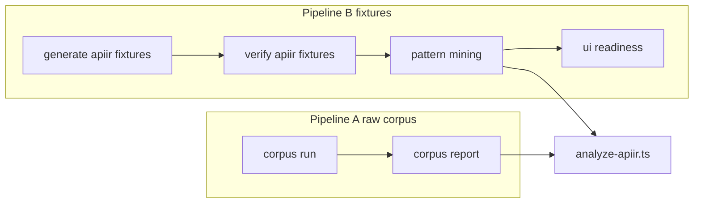

# ApiIR vNext: listScoped, mining, and corpus reports

## What we are building

- **ApiIR** remains the contract-facing source of truth: parameters, request/response schemas, and **operation kinds** including a new **listScoped** kind for `GET` with one path param and a **list-shaped** success body (shared classifier everywhere).
- **Pattern mining** stays one code path over **committed fixture ApiIR** under `[tests/compiler/fixtures/apiir/](tests/compiler/fixtures/apiir/)`. **MVP:** continuity with old pattern-mining baselines is **not** required.
- **Outputs:** markdown reports plus **JSONL** with **fixed grain** and stable keys for LLM chunking.
- **Two pipelines** must be documented so operators do not confuse them:
  - **Pipeline A (raw corpus):** `corpus:run` → `corpus:report` — rebuilds ApiIR from paths in raw corpus data.
  - **Pipeline B (fixtures):** `fixtures:generate-apiir` → verify → `corpus:pattern-mining` → `corpus:ui-readiness` (when added).

## Pre-implementation gate (complete before Phase 1 code)

All items below must be **written down** (this section + **ARCHITECTURE.md** stubs) and **reviewer-approved** so implementation is not blocked mid-stream.

### Resolved product / contract choices (former open questions)

#### User-visible meaning of `GET /items/{id}` returning a list

Compiler/mock treat as **scoped list**: response is list-shaped data for that path param. **No** compiler-mandated breadcrumb or marketing copy in MVP; **document** “scope = route context” in ARCHITECTURE. App UX is out of scope.

#### Row identity when only listScoped + create

**idField** inferred from list / listScoped **response** item shape (envelope + array item properties), same heuristics as today’s list path — **never** from `listScoped.identifierParam`. If no id is inferable, **idField** is absent; mock **item** route (`/[paramId]`) returns **404**; tests lock one agreed fallback (e.g. synthetic ids **not** in MVP unless already in mock).

#### ParameterIR `format`

**Enumerate only** what [lib/compiler/openapi/subset-validator.ts](lib/compiler/openapi/subset-validator.ts) allows for path/query primitives; extend IR only **in lockstep** with subset. Document allowed set in ARCHITECTURE / IR comment.

#### Warning when persisted apiIrVersion < compiler

**Yes (recommended MVP):** compilation or read path surfaces **stale IR** (API + optional UI copy). Exact surface TBD in [lib/db/compilations.ts](lib/db/compilations.ts) / API route — must match documented legacy semantics.

#### apiIrVersion bump policy

**Bump** when serialized **ApiIR JSON meaning** or **field set** changes such that old persisted rows would be **misinterpreted** (document each bump in ARCHITECTURE changelog). Purely internal refactors with **identical** emitted JSON shape → **no** bump.

#### specId for JSONL

**Required:** path **relative to** `tests/compiler/fixtures/apiir/` (include corpus dir segment, e.g. `valid-specs-foo/bar`) so rows are **collision-free**. Optional extra column `specBasename` for display.

#### queryParamCount vs parameters[]

**Single source:** `parameters[]`; `queryParamCount` = **derived** at build time (count of `in: "query"` entries) and **must** stay equal; **no** independent authoring.

#### eval:llm after prompt changes

**MVP:** run `npm run eval:llm` (or agreed spot-check) **once** after Phase 6 lands; **no** mandatory threshold edits unless results regress — document outcome in PR.

### Risk mitigations (operational, before/during rollout)

- **Mock / corpus:report / mining disagree** — **Single** analyze-apiir path; **merge policy:** land Phase **7** before trusting analytics; on **main**, do not ship **listScoped-only** fixtures without Phase **6** (runtime). Use a **PR checklist**: grep `OperationKind`, run both scripts.
- **Legacy DB rows missing `apiIrVersion`** — **Document in Phase 1:** treat missing as `0` (legacy / unknown); all readers (**API, DB layer, UI**) use the **same** rule; optional warning when `0` < current.
- **Half-updated branches** — Prefer **stacked PRs** or one train with explicit order; do not merge fixture regen **alone** on `main` if it introduces listScoped-only resources before Phase 6.

---

## Locked decisions (MVP)

These are **fixed** for implementation; do not invent a third convention.

#### Kind

Add **listScoped**. Classifier precedence: array root → list-shaped; object envelope → heuristics; **GET** + one path param + **non-list** body stays **detail**.

#### Pattern tokens

**normalizePattern**: **listScoped** stays **distinct** in ops strings. Archetypes / table-surface patterns: same policy — either distinct `listScoped_`* **or** documented fold with **list**; not both conventions.

#### identifierParam

For **listScoped**, this is **scope id** (parent context), not row id. Prompts / metadata must **not** treat it like **detail** row identity.

#### UiPlan view key

**listScoped** behaves like **list** for planning; **no new UiPlan view key** unless schema is deliberately extended. [lib/compiler/uiplan/normalize.ts](lib/compiler/uiplan/normalize.ts) keeps **list** as the view key.

#### Parameters

**ParameterIR**: path/query only, aligned with [lib/compiler/openapi/subset-validator.ts](lib/compiler/openapi/subset-validator.ts); sort `(in, name)` with **path** before **query**.

#### Versioning

**apiIrVersion**: integer on root **ApiIR** only; participates in **apiIrHash** after implementation; **document** semantics for legacy rows **missing** version (see Pre-implementation gate).

#### UI readiness input

Primary: fixture ApiIR JSON + `verify:apiir-fixtures`.

#### JSONL identity

One row per **(specId, resourceKey)**; **resourceKey** = `ResourceIR.key`; **specId** = **relative path** under fixture apiir root (see Pre-implementation gate); composite **specId::resourceKey** is globally unique.

#### Required query flag

**list** and **listScoped** both participate (UISpec/filter UI deferred; same intent when built).

#### Scope / LLM

**listScoped.identifierParam** = **scope**, not row id — exclude from naive “row id” / table-column treatment in prompts; **scope is route context** unless schema repeats it; document after UX pass in ARCHITECTURE.

---

## Where to change code (inventory from baseline)

Treat as **list** ∪ **listScoped** unless **pattern tokens** must distinguish **listScoped** ([analyze-apiir.ts](scripts/corpus-data/analyze-apiir.ts) `normalizePattern`).

- **IR build** — [lib/compiler/apiir/build.ts](lib/compiler/apiir/build.ts) — `KIND_ORDER`
- **Kind order strategy** — Prefer one exported `KIND_ORDER` (and display order) from `lib/compiler/apiir/` consumed by build + analyze-apiir; else **grep checklist** on every merge. [extractResourceSignature](scripts/corpus-data/analyze-apiir.ts) uses `KIND_ORDER.indexOf` — missing **listScoped** ⇒ **-1** and unstable sort.
- **Lowering** — [lib/compiler/lowering/lower.ts](lib/compiler/lowering/lower.ts) — `mergeSchemaFields`, `hasOpaqueOrMapShape`, `inferIdField`
- **Mock** — [app/api/mock/[id]/[resource]/route.ts](app/api/mock/[id]/[resource]/route.ts), [app/api/mock/[id]/[resource]/[paramId]/route.ts](app/api/mock/[id]/[resource]/[paramId]/route.ts); optional [lib/compiler/mock/store.ts](lib/compiler/mock/store.ts)
- **Mining / report language** — [scripts/corpus-data/analyze-apiir.ts](scripts/corpus-data/analyze-apiir.ts) — `listResponseShapes`, archetypes, CRUD, primitives, `has("list")`, **KIND_ORDER**, **opOrder** (~line 889; sync display vs sort).
- **Corpus report** — [scripts/corpus-report.ts](scripts/corpus-report.ts) imports analyze-apiir — Phase 7 affects **language analysis**, not only [corpus-pattern-mining.ts](scripts/corpus-pattern-mining.ts).
- **Archetypes** — [scripts/corpus-data/archetype-extractor.ts](scripts/corpus-data/archetype-extractor.ts), [scripts/extract-archetypes.ts](scripts/extract-archetypes.ts) — `deriveOperationPattern` / list-only strings
- **UiPlan** — [lib/compiler/uiplan/prompt.user.ts](lib/compiler/uiplan/prompt.user.ts), [lib/compiler/uiplan/prompt.system.txt](lib/compiler/uiplan/prompt.system.txt), [lib/compiler/uiplan/normalize.ts](lib/compiler/uiplan/normalize.ts)
- **Persistence / eval** — [lib/db/compilations.ts](lib/db/compilations.ts), `app/api/compilations/`, [eval/eval-llm-only.ts](eval/eval-llm-only.ts)
- **Grouping (defer)** — [lib/compiler/apiir/grouping.ts](lib/compiler/apiir/grouping.ts) only if corpus buckets break
- **Tests** — [tests/compiler/apiir.test.ts](tests/compiler/apiir.test.ts), [uiplan.test.ts](tests/compiler/uiplan.test.ts), [lowering.test.ts](tests/compiler/lowering.test.ts), [analyze-apiir.test.ts](tests/compiler/analyze-apiir.test.ts), [archetype-extractor.test.ts](tests/compiler/archetype-extractor.test.ts)
- **New** — `corpus-ui-readiness.ts` (Phase 8)

### Baseline repo facts (do not rediscover)

- **Parameter merge:** [lib/compiler/apiir/operations.ts](lib/compiler/apiir/operations.ts) already merges like subset (`paramKey` = `in:name`). Emitting **ParameterIR[]** refactors that loop.
- **Fixtures:** ~**144** / **379** YAML in `valid-specs-`* with parallel **apiir** JSON; plus [tests/compiler/fixtures/demo/](tests/compiler/fixtures/demo/) (**5** YAML ↔ `apiir/demo/`). **Generator and verifier must include demo.**
- **Verifier** today: `*.yaml` / `*.yml` only — OpenAPI `*.json` beside YAML needs **verifier extended**; **JSON-only** specs may generate but not verify until supported.
- **Committed fixture JSON** = raw **apiIr** only (no embedded `apiIrHash`; hash is build-time). After **apiIrVersion** on root, it is part of hashed object → bumps change **apiIrHash** (expected).
- **CI:** no `.github/workflows` at time of planning — **local/regen discipline** until `verify:apiir-fixtures` runs in CI.

## Phase checkpoints (at a glance)

- **Phase 1** — **Done when:** contract documented in types + ARCHITECTURE; `apiIrVersion` / `ParameterIR` / kind rules decided. **Run:** `npm run type`; targeted `apiir` tests if types land here.
- **Phase 2** — **Done when:** shared list-shape module wired into build; `ParameterIR[]` emitted from merge. **Run:** `npm run type`; `npm test -- tests/compiler/apiir.test.ts`
- **Phase 3** — **Done when:** `listScoped` in every `KIND_ORDER` / sort path (no `indexOf` −1). **Run:** above + `npm test -- tests/compiler/analyze-apiir.test.ts`
- **Phase 4** — **Done when:** either explicitly deferred, or grouping/multi-list-likes stable. **Run:** if implemented: `npm run corpus:report` completes without throw
- **Phase 5** — **Done when:** fixtures regen + verifier green; counts reconciled. **Run:** `npm run fixtures:generate-apiir`; `npm run verify:apiir-fixtures`; full `npm test`
- **Phase 6** — **Done when:** lowering, mock, UiPlan match `list` ∪ `listScoped` rules; scope-vs-row tested. **Run:** `npm test -- tests/compiler/lowering.test.ts tests/compiler/uiplan.test.ts` (+ mock checks)
- **Phase 7** — **Done when:** mining + corpus-report language use updated analyze-apiir. **Run:** `npm test -- tests/compiler/analyze-apiir.test.ts tests/compiler/archetype-extractor.test.ts`; `corpus:pattern-mining`; spot `corpus:report`
- **Phase 8** — **Done when:** JSONL + npm script exist; schema matches spec. **Run:** `npm run corpus:ui-readiness` + spot-check output
- **Phase 9** — **Done when:** docs match reality; reviewers agree. **Run:** `npm run type`; `npm test`

Full gate criteria and optional notes are under each phase below.

## Work packages (by phase number in source doc)

### Phase 1 — ApiIR contract (design-first)

- Specify **apiIrVersion**, **ParameterIR**, and `parameters[]` as **sole authority**; `queryParamCount` derived at build (must stay in sync — see Pre-implementation gate).
- Define **OperationKind** rules: **listScoped** vs **detail**; **identifierParam** semantics for each.
- Changelog / **ARCHITECTURE.md** for version and legacy read semantics.

**Checkpoint**

- **Done when:** Root `apiIrVersion` and legacy read semantics are written down; `ParameterIR` and sort order match subset validator intent; `listScoped` vs `detail` and `identifierParam` (scope vs row) are unambiguous for implementers.
- **Verify:** `npm run type`. If this phase only updates markdown/spec: reviewer sign-off. If TS types/schemas land: extend `[tests/compiler/apiir.test.ts](tests/compiler/apiir.test.ts)` (or adjacent tests) and run `npm test -- tests/compiler/apiir.test.ts`.
- **Blocked until:** N/A (first gate).

### Phase 2 — Shared list-shape classifier + builder

- New module (e.g. `[lib/compiler/apiir/list-shape.ts](lib/compiler/apiir/list-shape.ts)`) consumed by IR build, lowering table source, mining (`listResponseShapes`), and ui-readiness.
- [lib/compiler/apiir/operations.ts](lib/compiler/apiir/operations.ts): emit **ParameterIR[]** from existing parameter merge loop.

**Checkpoint**

- **Done when:** One classifier module drives `inferKind` / list-shape; build emits `parameters` + synced counts per Phase 1 decision; fixture compile produces expected kinds for golden cases (e.g. `GET` + one path param + list body → `listScoped` where intended; non-list body → `detail`).
- **Verify:** `npm run type`; `npm test -- tests/compiler/apiir.test.ts`; if lowering reads new shapes: `npm test -- tests/compiler/lowering.test.ts`.
- **Blocked until:** Phase 1 checkpoint passed (contract stable enough to encode).

### Phase 3 — Kind ordering everywhere

- **KIND_ORDER**: **listScoped** after **list**, before **detail** in [lib/compiler/apiir/build.ts](lib/compiler/apiir/build.ts).
- Sync [scripts/corpus-data/analyze-apiir.ts](scripts/corpus-data/analyze-apiir.ts) (**KIND_ORDER**, **opOrder**, anything using `indexOf`) so **listScoped** never sorts as **-1**.

**Checkpoint**

- **Done when:** Every sort/order that uses operation kind includes `listScoped` in a consistent position; signatures like `extractResourceSignature` do not produce unstable ordering.
- **Verify:** `npm test -- tests/compiler/apiir.test.ts tests/compiler/analyze-apiir.test.ts`; repo-wide grep for `KIND_ORDER`, `OperationKind`, and `indexOf` on kind — no stragglers.
- **Blocked until:** Phase 2 checkpoint passed.

### Phase 4 — Grouping / multi–list-like ops (mostly defer)

- Optional smoke: [scripts/corpus-report.ts](scripts/corpus-report.ts) already calls **groupOperations** — verify metrics when **listScoped** appears.
- **JSONL / mining:** support **multiple** list-like ops per resource (e.g. **listLikeOps** array column); if code picks a **primary** list op (mock seeds, archetypes), define precedence.

**Checkpoint**

- **Done when (if not deferring):** `groupOperations` and any “primary list op” logic behave with multiple list-like kinds; documented rule for which op wins.
- **Verify (if implementing):** `npm run corpus:report` (with expected corpus/fixture inputs present) exits 0; no metric NaN/regression vs smoke baseline you choose.
- **If deferring:** Record “Phase 4 skipped” in PR; checkpoint = Phase 3 still green.
- **Blocked until:** Phase 3 checkpoint passed.

### Phase 5 — Fixtures, verification, repo hygiene

- Regen: `npm run fixtures:generate-apiir`; add `verify:apiir-fixtures` script in [package.json](package.json) if not present; reconcile **corpus vs fixture counts** (~145 vs 144) as a **copy/process** issue, not “missing JSON.”
- Include **demo** in regen/verify ([tests/compiler/fixtures/demo/](tests/compiler/fixtures/demo/)).
- Grep **OperationKind**, `kind === "list"`, **listScoped**, `case "list"`; update tests: [tests/compiler/apiir.test.ts](tests/compiler/apiir.test.ts), [tests/compiler/lowering.test.ts](tests/compiler/lowering.test.ts), [tests/compiler/uiplan.test.ts](tests/compiler/uiplan.test.ts), [tests/compiler/analyze-apiir.test.ts](tests/compiler/analyze-apiir.test.ts).

**Checkpoint**

- **Done when:** Committed fixture ApiIR matches YAML sources; verifier script exists and is documented; corpus vs fixture count mismatch explained; compiler tests updated for `listScoped` grep hits.
- **Verify:** `npm run fixtures:generate-apiir`; `npm run verify:apiir-fixtures` (after adding the `package.json` script) or `npx tsx scripts/verify-apiir-fixtures.ts`; `npm run type`; `npm test`.
- **Merge note:** Respect Phase 6 gate — do not put `listScoped`-only resources on `main` until Phase 6 ships in the same train (see Phase 6).
- **Blocked until:** Phases 1–4 checkpoints satisfied for the work you intend to merge.

### Phase 6 — Runtime path: lowering, mock, UiPlan

**Merge gate for `main`:** do **not** ship fixture ApiIR that introduces **listScoped-only** resources **without** lowering + mock + prompt fixes in the **same release train** (feature branches may reorder; gate demo/mock).

- **Lowering** [lib/compiler/lowering/lower.ts](lib/compiler/lowering/lower.ts): **listScoped** ≡ **list** for **mergeSchemaFields** / **hasOpaqueOrMapShape**.
- **inferIdField:** **do not** use `listScoped.identifierParam` as row **idField**; derive from list response / envelope; document fallback for **listScoped** without **detail** (404 vs synthetic — **one rule + tests**).
- **Mock:** `list ?? listScoped` wherever list schema is needed ([app/api/mock/.../route.ts](app/api/mock/[id]/[resource]/route.ts) and [[paramId]/route.ts](app/api/mock/[id]/[resource]/[paramId]/route.ts)); handle **scope vs row** when both ops exist.
- **UiPlan:** [lib/compiler/uiplan/prompt.user.ts](lib/compiler/uiplan/prompt.user.ts) — list view when **list** or **listScoped**; update [prompt.system.txt](lib/compiler/uiplan/prompt.system.txt) for **identifierParam** (scope vs row).

**Checkpoint**

- **Done when:** Lowering and mock treat `listScoped` like `list` where required; row `idField` never comes from scope param; prompts encode scope vs row exclusions; stress cases from the plan (scope vs row URL, `listScoped`-only resource) have tests or documented manual checks.
- **Verify:** `npm run type`; `npm test -- tests/compiler/lowering.test.ts tests/compiler/uiplan.test.ts`; hit mock routes for at least one `listScoped` scenario (collection + item) if available.
- **Blocked until:** Phase 5 verifier + tests green for the fixture set you ship; if you use “runtime first” ordering, Phase 6 can run before Phase 5 regen on a branch — still gate `main` per merge policy above.

### Phase 7 — Pattern mining + analyze-apiir (dual consumers)

[scripts/corpus-report.ts](scripts/corpus-report.ts) and [scripts/corpus-pattern-mining.ts](scripts/corpus-pattern-mining.ts) both use [scripts/corpus-data/analyze-apiir.ts](scripts/corpus-data/analyze-apiir.ts). Update:

- **listResponseShapes**, archetypes / CRUD / primitives, **normalizePattern**, any `Record<OperationKind, …>` / exhaustive **switch** — treat **list** ∪ **listScoped** where aggregates mean “has table,” except where tokens must stay distinct.
- [scripts/corpus-data/archetype-extractor.ts](scripts/corpus-data/archetype-extractor.ts) and [scripts/extract-archetypes.ts](scripts/extract-archetypes.ts) as needed — align with locked token policy.

**Checkpoint**

- **Done when:** Analytics and pattern strings match locked decisions (`normalizePattern` vs archetype table policy); no missing `OperationKind` branches; corpus-report language sections and pattern-mining agree because they share analyze-apiir.
- **Verify:** `npm test -- tests/compiler/analyze-apiir.test.ts tests/compiler/archetype-extractor.test.ts`; `npm run corpus:pattern-mining`; spot-check `npm run corpus:report` (no throws; language/archetype sections sane).
- **Blocked until:** Fixture ApiIR may include `listScoped` (Phase 5) — do not trust pre–Phase-7 baselines for comparisons (per execution invariant in this plan).
- **Note:** The **recommended merge sequence** runs Phase **7** before Phase **6**; feature branches may reorder. If Phase 7 lands first, mock/runtime may trail until Phase 6; on `main`, keep merge policy consistent.

### Phase 8 — UI readiness report (new)

- New script e.g. `scripts/corpus-ui-readiness.ts` + npm script `corpus:ui-readiness`; output under `[scripts/corpus-data/reports/](scripts/corpus-data/reports/)`.
- **JSONL** schema: grain, **required_query_on_list** (per op or aggregate — **specify**), **listLikeOps** if multiple list-like ops.

**Checkpoint**

- **Done when:** `corpus:ui-readiness` runs on verified fixture ApiIR; JSONL has one row per `(specId, resourceKey)` with documented fields; collision policy for `specId` documented in script or ARCHITECTURE.
- **Verify:** `npm run verify:apiir-fixtures` then `npm run corpus:ui-readiness`; spot-check first lines (required keys, `listLikeOps` shape if used); optional: `wc -l` vs resource count expectation.
- **Blocked until:** Phase 5 verifier green; Phase 7 optional but recommended so row metrics match mining semantics.

### Phase 9 — Documentation

- **ARCHITECTURE.md**: two pipelines; fixture-relative vs raw corpus; optional trivial footer on corpus report.

**Checkpoint**

- **Done when:** New operators can run pipeline A vs B without confusion; `apiIrVersion` / legacy rows / bump policy (as decided) documented; corpus-report footer done or explicitly out of scope.
- **Verify:** Doc review checklist; `npm run type`; `npm test` to ensure no drift from final behavior.
- **Blocked until:** All shipped phases (per your execution order) are complete.

## Recommended execution order (merge hygiene)

Before closing each execution step, confirm the **Phase checkpoints** (checklist + per-phase **Checkpoint** blocks above) for every phase touched in that step.

The **phase numbers** are topical; **this order** is how to land without broken `main` or misleading analytics:

1. **Phases 1–4** + tests (contract, classifier, `KIND_ORDER`, optional grouping smoke).
2. **Phase 5:** regen fixtures + `verify:apiir-fixtures` + count reconciliation — **respect Phase 6 merge policy** (no listScoped-only fixtures on `main` before runtime).
3. **Phase 7** + run `corpus:pattern-mining` and spot-check `corpus:report` (lang stats share analyze-apiir).
4. **Phase 8** (ui-readiness JSONL).
5. **Phase 6** (lowering, mock, uiplan) — **may run before step 2 on a feature branch** (“runtime first”).

**Invariant:** after step 2, fixtures may contain **listScoped** while analytics are still wrong until **step 3** lands — **do not** compare to pre-change mining baselines until then (MVP allows discontinuity; this is operator hygiene).

## Stress tests / edge cases + risks

- `**KIND_ORDER` / `indexOf`** — Missing `listScoped` → **-1**, unstable signature sort (Phase 3).
- `**GET` + one path + non-list body** — Stays `detail`.
- `**GET` + one path + list + detail** siblings — Mock/store: **scope** vs **row**; URL invariant so `[paramId]` never treats scope as row id.
- **Missing / empty success schema** — Classifier fallback: `detail` vs error — specify in classifier tests.
- **Non-200 success** (e.g. only `204`) — Same: define how classifier / IR build behaves.
- **Envelope lists** (`items` + cursor/tokens) — Classifier + `idField` / column heuristics must agree with lowering.
- `**listScoped` without `detail`** — `idField`, mock `/[paramId]` — one rule + tests (see gate).
- **Duplicate list-like ops** — `listLikeOps` column; **primary op** for seeds if code picks one.
- **Classifier single source** — IR, lowering, mining, readiness share one module.
- `**OperationKind` exhaustiveness** — `switch` / `Record<OperationKind, …>` maps break on new kinds.

**Operational risks:** half-updated **analyze-apiir** vs mock/report; legacy rows missing **apiIrVersion**; bump policy (covered in Pre-implementation gate).

## Remaining discretion (optional polish, post-MVP)

Pre-implementation gate + **Locked decisions** cover contract choices. Track during build only if scope expands:

- **App UX** beyond documented “scope = route context” (breadcrumbs, copy) — out of MVP per gate.
- Finer **eval:llm** thresholds if regressions appear after Phase 6 (gate: one spot-check + PR note).
