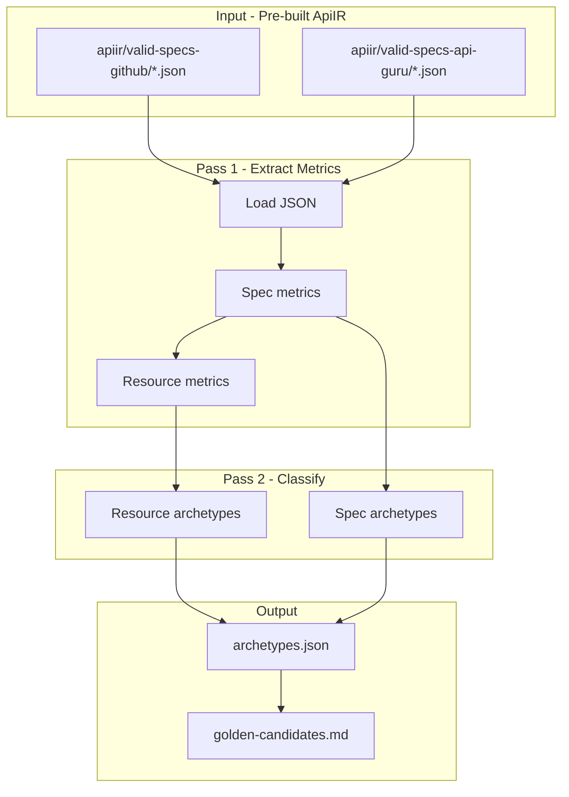

# Archetype Extraction Tool — Implementation Plan

## Context

You have two blueprints: (1) the **tool architecture** (Untitled-2) and (2) the **22 golden archetypes** (Untitled-1). The tool will analyze ApiIR from `valid-specs-github` and `valid-specs-api-guru`, classify each resource into archetypes, and output a dataset plus a golden-candidates report.

**Design principle:** Keep the archetype tool **fully separate** from the existing [scripts/corpus-data/analyze-apiir.ts](scripts/corpus-data/analyze-apiir.ts) (~1000 lines, used for corpus pattern mining). Do not extend or import from it. The archetype tool is a standalone module with its own metrics and logic — easier to maintain, smaller scope, focused tests.

**Existing infrastructure (reference only, no imports):**

- [scripts/corpus-pattern-mining.ts](scripts/corpus-pattern-mining.ts): pattern for loading ApiIR JSON fixtures (same input approach)
- ApiIR fixtures: `tests/compiler/fixtures/apiir/valid-specs-{github|api-guru}/*.json`
- ApiIR types: [lib/compiler/apiir/types.ts](lib/compiler/apiir/types.ts)

---

## Architecture

**Input:** Pre-built ApiIR JSON fixtures. All valid specs have already been parsed, resolved, canonicalized, and built to ApiIR by `fixtures:generate-apiir`. The archetype tool reads these directly — no pipeline execution.




**No pipeline:** The tool does not run parse → resolve → canonicalize → buildApiIR. It reuses the existing ApiIR fixtures in `tests/compiler/fixtures/apiir/valid-specs-{github|api-guru}/`. Same approach as [corpus-pattern-mining.ts](scripts/corpus-pattern-mining.ts). If fixtures are stale, run `npm run fixtures:generate-apiir` first.

**Two-pass design:** Spec-level archetypes (`multi_resource`, `large_api`, `mixed_operations`) require knowledge of the entire spec. Classification must run in two passes: Pass 1 extracts all spec + resource metrics; Pass 2 classifies (resource archetypes + spec archetypes). Do not classify during resource iteration — that would break spec-level archetypes.

**Pass 1 rule:** Spec metrics must be **aggregated from resource metrics** in Pass 1. Do not recompute in Pass 2. Pass 2 must be **pure classification** — guarantees determinism and prevents drift if metrics change later.

---

## Feedback incorporated (round 2 + final sign-off)

- **Pass 1 spec aggregates** — Spec metrics aggregated from resource metrics in Pass 1. Pass 2 is pure classification. No recomputation.
- **maxArrayOfObjects** — Explicit rule: max arrayOfObjectsCount across all resources in the spec.
- **Response shape guard** — object_wrapped requires array's `items.type === "object"`. `{ "ids": ["a","b","c"] }` → unknown.
- **resourceKey** — Use ApiIR `resource.key` as-is (source of truth).
- **mixed_operations** — Precise: count resources with create_only, list_only, detail_only; if all ≥1 → mixed_operations.
- **selectedSpecs Set** — Explicit `Set<string>` for deduplication; check `specId in selectedSpecs`.
- **ARCHETYPE_ORDER** — Frozen constant; deduplication depends on fixed order.
- **Zero-candidates warning** — Print warning if archetype has no matching specs.
- **primitiveOnly** — Informational only; does not influence archetype classification.
- **Performance** — Expected ~1–2s; workload is trivial.
- **toolVersion** — Add `"toolVersion": "1.0"` to meta; detects dataset version mismatches when rules change.
- **ARCHETYPES constants** — Freeze string constants for IDs; prevents typos.
- **operationCount** — `resource.operationCount` = ApiIR operations on resource; `spec.operationCount` = sum(resource.operationCount).
- **Missing response schema** — If `response.schema == undefined` → `unknown`; avoid crashes on edge fixtures.
- **Depth algorithm** — Add map rules: `map(object)` → depth +1, `map(primitive)` → depth +0.
- **Report "why"** — Include score and key metrics in golden-candidates (e.g. `score=22, arrayOfObjects=1, fields=5`).
- **Dataset integrity** — Before selection: if `specCount === 0` or `resourceCount === 0`, throw "No ApiIR fixtures found. Run fixtures:generate-apiir."
- **Deterministic sorting** — specs[] by specId; resources by resource.key; archetype index alphabetically. Byte-stable JSON.
- **Archetype index** — Spec IDs only; use Set internally; each spec appears once per archetype.
- **Candidate selection** — Resource-first: collect matching resources, sort by parent spec's score, select parent spec.
- **Sort tie-breaker** — When sorting candidates: score, then specId, then resourceKey. Guarantees stable ordering when scores match.
- **ARCHETYPE_ORDER** — Explicit array, not Object.values(); prevents silent behavior changes if constants are refactored.
- **Candidate dedupe by spec** — After collecting candidates, keep 1 per spec per archetype (Map specId→candidate; keep lower resourceKey when duplicate). Better diversity, fewer wasted slots.

---

## Implementation Tasks

### 1. Create standalone `scripts/corpus-data/archetype-extractor.ts`

A new, self-contained module (~200–300 lines). **No imports from analyze-apiir.ts.** Contains:

**Metrics extraction** — minimal schema helpers (can duplicate/adapt logic as needed):

- `getObjectSchema(schema)` — extract object from array items or object type
- `extractResourceMetrics(resource)` — returns `ResourceArchetypeMetrics`:
  - `fieldCount`, `requiredCount`, `optionalCount`
  - `enumCount`, `arrayCount`, `arrayOfObjectsCount`, `arrayOfPrimitivesCount`
  - `mapCount`, `nullableCount`, `nestedObjectCount`
  - `maxDepth`, `maxEnumValues`
  - `operations: OperationKind[]`
  - `operationCount` — number of ApiIR operations attached to the resource. **Invariant:** `spec.operationCount = sum(resource.operationCount)`. Do not count spec-level endpoints separately.
  - `operationPattern`: `OperationPattern` enum (see below)
  - `listResponseShape`: `"array_root"` | `"object_wrapped"` | `"unknown"`
  - `primitiveOnly` — `true` if `nestedObjectCount = 0` AND `arrayCount = 0` AND `mapCount = 0` (validates renderer assumptions for flat schemas). **Informational only** — does not influence archetype classification.

**OperationPattern enum** — Derive using **boolean checks only**. Do not rely on operation order or array comparison.

```
if hasCreate AND NOT(hasList, hasDetail, hasUpdate, hasDelete) → create_only
if hasList AND NOT(hasCreate, hasDetail, hasUpdate, hasDelete) → list_only
if hasDetail AND NOT(hasList, hasCreate, hasUpdate, hasDelete) → detail_only
if hasList AND hasCreate AND NOT(hasDetail, hasUpdate, hasDelete) → list_create
if hasList AND hasDetail AND NOT(hasCreate, hasUpdate, hasDelete) → list_detail
if hasList AND hasDetail AND hasCreate AND NOT(hasUpdate, hasDelete) → list_detail_create
if hasList AND hasDetail AND hasCreate AND hasUpdate AND hasDelete → crud
else → other
```

**Depth calculation** — Maximum object nesting depth. Document explicitly for maintainers:

- `object` → depth +1
- `array(object)` → depth +1
- `array(primitive)` → depth +0
- `map(object)` (additionalProperties: object) → depth +1
- `map(primitive)` → depth +0
- Example: `User { address { city } }` → depth = 2

**Response shape rule** (deterministic). Guard against missing schemas:

```
if response.schema === undefined → unknown

if response schema type === "array" → array_root

if response schema type === "object"
  AND has property with type === "array"
  AND that array's items.type === "object"
  → object_wrapped

else → unknown
```

Some specs may lack response schemas even after RUS filtering. Avoid crashes on edge fixtures.

The array must contain **objects** — `{ "ids": ["a","b","c"] }` is NOT a list resource, so → `unknown`.

Example: `GET /users → { data: [{ id, name }] }` = `object_wrapped`.

**maxArrayOfObjects** (spec-level): `maximum arrayOfObjectsCount across all resources in the spec`. Used in specComplexityScore. Define explicitly to avoid ambiguity.

**resourceKey:** Use `resource.key` from ApiIR as-is (normalized slug from compiler, e.g. `"users"`, `"products"`). Do not derive — ApiIR is source of truth.

**Classification (Pass 2):**

- `classifyResourceArchetypes(resourceMetrics, specMetrics): string[]` — resource-level archetypes
- `classifySpecArchetypes(specMetrics, resourceMetrics[]): string[]` — spec-level archetypes (multi_resource, large_api, mixed_operations)

**Why separate:** Keeps archetype logic isolated. Easier to maintain, test, and reason about. The existing `analyze-apiir.ts` stays untouched and continues to serve corpus pattern mining.

### 2. Archetype classification rules (inside archetype-extractor.ts)

**Archetype IDs and rules** (from Untitled-1):


| ID  | Archetype             | Rule                                                                                         |
| --- | --------------------- | -------------------------------------------------------------------------------------------- |
| 1   | simple_create         | `fields ≤ 4`, `depth = 0`, `operationPattern = create_only`                                  |
| 2   | simple_list           | `fields ≤ 4`, `depth = 0`, `operationPattern = list_only`                                    |
| 3   | list_detail           | `fields ≤ 4`, `depth = 0`, `operationPattern = list_detail`                                  |
| 4   | list_create           | `fields ≤ 4`, `depth = 0`, `operationPattern = list_create`                                  |
| 5   | full_crud             | `fields ≤ 6`, `depth = 0`, `operationPattern = crud`                                         |
| 6   | enum_heavy            | `enumCount ≥ 2`                                                                              |
| 7   | array_of_objects      | `arrayOfObjectsCount ≥ 1` (array-of-objects stresses renderer; array-of-primitives does not) |
| 8   | nested_depth_1        | `depth = 1`                                                                                  |
| 9   | nested_depth_2        | `depth = 2`                                                                                  |
| 10  | map_schema            | `mapCount ≥ 1`                                                                               |
| 11  | multi_resource        | `resourceCount ≥ 3` (spec-level)                                                             |
| 12  | large_resource        | `fieldCount ≥ 15`                                                                            |
| 13  | optional_heavy        | `optionalCount` high, `requiredCount` low (e.g. required ≤ 2, optional ≥ 5)                  |
| 14  | array_heavy           | `arrayOfObjectsCount ≥ 2`                                                                    |
| 15  | mixed_operations      | Spec has ≥1 resource with `create_only` AND ≥1 with `list_only` AND ≥1 with `detail_only`    |
| 16  | deep_schema           | `depth ≥ 3`                                                                                  |
| 17  | many_enum_values      | `maxEnumValues ≥ 10`                                                                         |
| 18  | nullable_fields       | `nullableCount ≥ 2`                                                                          |
| 19  | large_api             | `resourceCount ≥ 10`                                                                         |
| 20  | mixed_schema_types    | `enumCount ≥ 1` AND `arrayOfObjectsCount ≥ 1` AND `nestedObjectCount ≥ 1`                    |
| 21  | array_root_list       | List op response shape = array root                                                          |
| 22  | wrapped_list_response | List op response shape = object.                                                             |


**Ordering:** A resource can match multiple archetypes (e.g. simple_create + enum_heavy). Store all matches.

**ARCHETYPES** — Freeze string constants for IDs. Prevents typos (hard to detect otherwise):

```ts
const ARCHETYPES = {
  SIMPLE_CREATE: "simple_create",
  SIMPLE_LIST: "simple_list",
  LIST_DETAIL: "list_detail",
  LIST_CREATE: "list_create",
  FULL_CRUD: "full_crud",
  ENUM_HEAVY: "enum_heavy",
  ARRAY_OF_OBJECTS: "array_of_objects",
  NESTED_DEPTH_1: "nested_depth_1",
  NESTED_DEPTH_2: "nested_depth_2",
  MAP_SCHEMA: "map_schema",
  MULTI_RESOURCE: "multi_resource",
  LARGE_RESOURCE: "large_resource",
  OPTIONAL_HEAVY: "optional_heavy",
  ARRAY_HEAVY: "array_heavy",
  MIXED_OPERATIONS: "mixed_operations",
  DEEP_SCHEMA: "deep_schema",
  MANY_ENUM_VALUES: "many_enum_values",
  NULLABLE_FIELDS: "nullable_fields",
  LARGE_API: "large_api",
  MIXED_SCHEMA_TYPES: "mixed_schema_types",
  ARRAY_ROOT_LIST: "array_root_list",
  WRAPPED_LIST_RESPONSE: "wrapped_list_response",
} as const;

const ARCHETYPE_ORDER = [
  ARCHETYPES.SIMPLE_CREATE,
  ARCHETYPES.SIMPLE_LIST,
  ARCHETYPES.LIST_DETAIL,
  ARCHETYPES.LIST_CREATE,
  ARCHETYPES.FULL_CRUD,
  ARCHETYPES.ENUM_HEAVY,
  ARCHETYPES.ARRAY_OF_OBJECTS,
  ARCHETYPES.NESTED_DEPTH_1,
  ARCHETYPES.NESTED_DEPTH_2,
  ARCHETYPES.MAP_SCHEMA,
  ARCHETYPES.MULTI_RESOURCE,
  ARCHETYPES.LARGE_RESOURCE,
  ARCHETYPES.OPTIONAL_HEAVY,
  ARCHETYPES.ARRAY_HEAVY,
  ARCHETYPES.MIXED_OPERATIONS,
  ARCHETYPES.DEEP_SCHEMA,
  ARCHETYPES.MANY_ENUM_VALUES,
  ARCHETYPES.NULLABLE_FIELDS,
  ARCHETYPES.LARGE_API,
  ARCHETYPES.MIXED_SCHEMA_TYPES,
  ARCHETYPES.ARRAY_ROOT_LIST,
  ARCHETYPES.WRAPPED_LIST_RESPONSE,
] as const;
```

**ARCHETYPE_ORDER** — Explicit array, not `Object.values(ARCHETYPES)`. Property insertion order is not guaranteed if someone refactors; deduplication depends on fixed order.

### 3. Create `scripts/extract-archetypes.ts`

**Naming:** `extract-archetypes` (not `corpus-archetypes`) — the script **extracts** archetypes, it does not analyze. Avoids confusion with `corpus-pattern-mining`.

**Flow:**

1. Read ApiIR JSON from `apiir/valid-specs-github`, `apiir/valid-specs-api-guru` (no pipeline — fixtures are pre-built)
2. **Safety check:** If `specCount === 0` or `resourceCount === 0`, throw: `"No ApiIR fixtures found. Run fixtures:generate-apiir."`
3. Sort spec paths lexicographically (determinism)
4. **Pass 1 — Extract metrics:** For each ApiIR file, compute `resourceMetrics[]` per resource, then **aggregate** into `specMetrics`: `resourceCount`, `operationCount` (= sum of resource.operationCount), `maxFieldsPerResource`, `maxDepth`, `maxArrayOfObjects`. Do not classify. Do not recompute spec aggregates in Pass 2.
5. **Pass 2 — Classify:** For each spec, call `classifySpecArchetypes(specMetrics, resourceMetrics[])` and `classifyResourceArchetypes(resourceMetrics, specMetrics)` for each resource.
6. Build `archetypes.json` dataset (include archetype index, toolVersion — see Output Artifacts). Archetype index: use `Set` per archetype, add `specId` when any resource matches (each spec once). Sort: `specs[]` by `specId`; `resources[]` by `resource.key`; archetype index keys alphabetically.
7. For each of 22 archetypes: select 1–3 candidate specs using heuristics **with deduplication**
8. Write `golden-candidates.md` (include score and key metrics per candidate — see Output Artifacts)

**Imports:** Only from `./corpus-data/archetype-extractor` and `@/lib/compiler/apiir` (types). No imports from `analyze-apiir.ts`.

**CLI flags:**

- `--limit N` — process only first N specs
- `--verbose` — log progress
- `--write-json` — write archetypes.json (default: true)
- `--write-report` — write golden-candidates.md (default: true)
- `--repo github|api-guru` — restrict to one corpus
- `--show-archetype NAME` — debug mode: output matching specs, resources, metrics for archetype `NAME` (e.g. `--show-archetype simple_create`)

**Output paths:**

- `scripts/corpus-data/archetypes.json`
- `scripts/corpus-data/reports/golden-candidates.md`

### 4. Selection heuristics for golden candidates

**specComplexityScore** (lower = simpler, preferred). Uses spec aggregates from Pass 1:

```
specComplexityScore =
  resourceCount * 5
+ operationCount * 1
+ maxDepth * 10
+ maxFieldsPerResource * 2
+ maxArrayOfObjects * 3
```

Where `maxArrayOfObjects` = maximum `arrayOfObjectsCount` across all resources in the spec. Arrays of objects are UI complexity multipliers.

**Algorithm with deduplication (resource-first):**

Selection must be **resource-first**, not spec-first. A spec may match because **one resource** fits, while the spec itself is large. The resource qualifies, not the spec.

1. Maintain `selectedSpecs: Set<string>` (specIds already chosen).
2. Process archetypes in `ARCHETYPE_ORDER` (frozen constant).
3. For each archetype, collect **candidate resources** (not specs) that match.
4. **Dedupe by specId:** A spec may have multiple resources matching the same archetype (e.g. users + products both → simple_list). Keep **1 candidate per spec** per archetype. Use `Map<specId, candidate>`: when a spec already has a candidate, keep the one with lower resourceKey (deterministic). Ensures better diversity, cleaner selection, fewer wasted slots.
5. Sort candidates with **deterministic tie-breaker** (many specs have identical scores; Node/JS sort may be non-stable otherwise):
  - 1. specComplexityScore (ascending)
  - 1. specId (ascending)
  - 1. resourceKey (ascending)
6. For each candidate in order: if `candidate.specId in selectedSpecs`, **skip** unless this archetype has no other candidates.
7. When selecting, add the **parent spec** (via specId) to `selectedSpecs`. The resource qualified; we select its spec.
8. Take top 1–3 per archetype. Goal: **~22–30 unique specs** total.

**Zero-candidates warning:** If any archetype has **zero matching specs**, print: `⚠ Archetype 'deep_schema' has no matching specs.` Helps detect corpus drift.

**Prefer:** Lower score (smaller specs, fewer ops, shallower schemas).

**Avoid:** Specs with `resourceCount > 10`, `operationCount > 50` — they will naturally rank low anyway.

### 5. Add npm script

In [package.json](package.json):

```json
"extract:archetypes": "tsx scripts/extract-archetypes.ts"
```

---

## Output Artifacts

### archetypes.json

Include an **archetype index** for debugging (which specs match each archetype):

**Rule:** Index lists **SPEC IDs** that contain ≥1 matching resource. Each spec appears **only once** per archetype, even if multiple resources in that spec match. Use `Set` internally: `archetypeIndex[archetype].add(specId)`.

```json
{
  "meta": { "toolVersion": "1.0", "timestamp": "...", "specCount": 550, "resourceCount": 1234 },
  "archetypes": {
    "simple_create": ["specA", "specB"],
    "nested_depth_2": ["specC", "specD"],
    "array_root_list": ["specA", "specE"]
  },
  "specs": [
    {
      "specId": "github/foo__bar__openapi",
      "corpus": "github",
      "resourceCount": 2,
      "operationCount": 8,
      "maxFieldsPerResource": 4,
      "maxDepth": 0,
      "maxArrayOfObjects": 0,
      "specComplexityScore": 18,
      "resources": [
        {
          "resourceName": "Users",
          "resourceKey": "users",
          "fieldCount": 4,
          "operationCount": 3,
          "operationPattern": "list_detail_create",
          "maxDepth": 0,
          "enums": 1,
          "arrayOfObjects": 0,
          "maps": 0,
          "nullable": 0,
          "primitiveOnly": false,
          "responseShape": "array_root",
          "archetypes": ["simple_list", "list_detail", "list_create", "array_root_list"]
        }
      ]
    }
  ]
}
```

**specComplexityScore** uses `maxArrayOfObjects` (max `arrayOfObjectsCount` across resources in the spec) in the formula.

**Deterministic sorting (byte-stable JSON):**

- `specs[]` — sorted by `specId`
- `resources[]` (within each spec) — sorted by `resource.key`
- Archetype index keys — alphabetically

Otherwise snapshot tests may change if file traversal order changes.

### golden-candidates.md

Include **why** each spec was chosen (score and key metrics). Self-explanatory, easier to review:

```markdown
# Golden Spec Candidates by Archetype

## 1. simple_create
- github/example__create-only__openapi (score=7, fields=3, resources=1)

## 2. simple_list
- api-guru/minimal__list__openapi (score=7, fields=2, resources=1)

## 7. array_of_objects
- github/foo_api (score=22, arrayOfObjects=1, fields=5)
...
```

---

## 22 Golden Archetypes — Use Case Document

A separate document will be created: `docs/golden-archetypes.md` with:

- Each of the 22 archetypes
- Exact classification rules
- Why it matters for the compiler
- Example spec characteristics

---

## Determinism

- Sort specs by path (lexicographic) when loading
- **Output:** `specs[]` sorted by `specId` (critical for snapshot stability)
- **Output:** `resources[]` sorted by `resource.key`
- **Output:** Archetype index keys alphabetically
- Sort archetypes in output
- No randomness
- Byte-stable JSON across runs (enables snapshot tests)

---

## Performance

- Read ApiIR JSON only (no pipeline per spec)
- Two-pass: metrics extraction, then classification
- Workload: ~550 JSON reads, ~1200 resource scans — trivial
- Expected runtime: **~1–2 seconds** (target under 10s is very safe)

---

## Final tool structure

```
scripts/
  extract-archetypes.ts

scripts/corpus-data/
  archetype-extractor.ts
  archetypes.json

scripts/corpus-data/reports/
  golden-candidates.md

docs/
  golden-archetypes.md
```

---

## Files to Create/Modify


| File                                         | Action                                                     |
| -------------------------------------------- | ---------------------------------------------------------- |
| `scripts/corpus-data/archetype-extractor.ts` | New — standalone module: metrics + two-pass classification |
| `scripts/extract-archetypes.ts`              | New — main script, imports only archetype-extractor        |
| `package.json`                               | Add `extract:archetypes` script                            |
| `docs/golden-archetypes.md`                  | New — 22 use cases with rules and rationale                |


**Do not modify:** `scripts/corpus-data/analyze-apiir.ts` — stays as-is for corpus pattern mining.

**Optional later:** Rename `analyze-apiir.ts` → `corpus-pattern-analyzer.ts` (or similar) to clarify its purpose. Would require updating `corpus-report.ts`, `corpus-pattern-mining.ts`, and `tests/compiler/analyze-apiir.test.ts`. Not part of this implementation.

---

## Post-implementation: Freeze golden set

After implementing, run the tool and **freeze the first golden set** into:

```
tests/compiler/golden-specs/
```

This becomes the **compiler regression suite** — more valuable than the corpus itself. Same spec → same UISpec hash.

---

## Testing

- Unit test `archetype-extractor.ts`: `extractResourceMetrics`, `deriveOperationPattern`, `classifyResourceArchetypes`, `classifySpecArchetypes` with known ApiIR inputs
- Snapshot or smoke test: run `extract:archetypes`, assert archetypes.json structure (including archetype index) and golden-candidates.md has 22 sections

