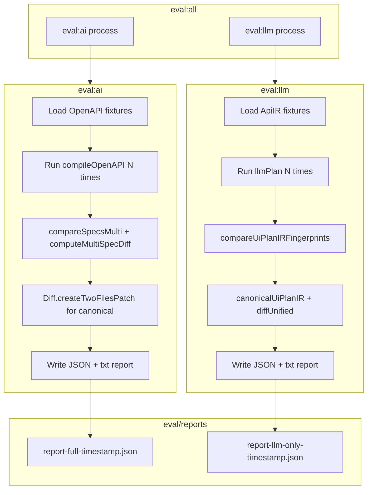

# Eval Determinism Refactor Plan

## Current State

- **eval:ai** ([eval/eval-ai.ts](eval/eval-ai.ts)): Full pipeline OpenAPI → UISpec. Runs N times per fixture, compares via UISpec fingerprints. On failure: prints truncated diff (20 lines) to console; writes `.txt` report.
- **eval:llm** ([eval/eval-llm-only.ts](eval/eval-llm-only.ts)): ApiIR → UiPlanIR. On failure: prints truncated `similarityDifferences` (15 items); writes `.txt` report.
- **Comparator** ([eval/utils/comparator.ts](eval/utils/comparator.ts)): `diffCanonical` (simple line-by-line); `compareSpecsMulti`, `compareUiPlanIRFingerprints`. No full canonical diff for UiPlanIR.
- **Existing diff utilities** ([lib/spec/diff.ts](lib/spec/diff.ts)): `computeMultiSpecDiff`, `computeSpecDiff` — structured UISpec diff. Not used by evals.

## Goals

1. **Trace deterministic outputs** — run evals many times, compare all outputs
2. **Report full diffs** — when outputs differ, include complete diff (no truncation)
3. **Structured JSON reports** — machine-readable format for CI, trend analysis, prompt debugging
4. **Scale to many specs** — easy to add fixtures; run both evals together
5. **Speed** — run eval:ai and eval:llm in parallel; use `--parallel` for runs within fixtures

---

## 1. Add `diff` Package (jsdiff)

- **Package:** `diff` on npm (repo: kpdecker/jsdiff). Already a transitive dep of Vitest.
- **Add as explicit devDependency:** `npm install diff --save-dev`
- **Use for eval reports:**
  - `diffLines(oldStr, newStr)` — line-by-line comparison for JSON/canonical strings
  - `createTwoFilesPatch(oldFile, newFile, oldStr, newStr, oldHeader, newHeader)` — unified diff (Git-style) for reports
- **Replace** current `diffCanonical` in [eval/utils/comparator.ts](eval/utils/comparator.ts) with diff-based implementation, or add `diffUnified(a, b)` that uses `Diff.createTwoFilesPatch` for better insert/delete handling.

---

## 2. Unified JSON Report Format

Introduce a shared report schema written to `eval/reports/`:

```json
{
  "evalType": "full" | "llm-only",
  "timestamp": "ISO8601",
  "config": { "runs": 5, "parallel": false },
  "summary": {
    "passed": false,
    "validity": 0.95,
    "minSimilarity": 0.85,
    "totalRuns": 25,
    "totalValid": 24
  },
  "fixtures": [
    {
      "fixtureName": "golden_openapi_users_tagged_3_0",
      "validRuns": 5,
      "totalRuns": 5,
      "minSimilarity": 0.85,
      "passed": false,
      "errors": [],
      "worstPair": { "runA": 1, "runB": 3, "similarity": 0.85 },
      "diff": {
        "structural": ["[users] listPaths: only run1: [x]; only run2: [y]"],
        "unified": "--- run1\n+++ run2\n@@ ...",
        "multiSpecDiff": { "resourcesAdded": [], "resourceDiffs": {...} }
      }
    }
  ]
}
```

- **eval:ai**: `diff.multiSpecDiff` uses `computeMultiSpecDiff`; `diff.unified` uses `Diff.createTwoFilesPatch`.
- **eval:llm**: `diff.structural` = existing `similarityDifferences`; `diff.unified` for raw UiPlanIR canonical JSON.

---

## 3. Enhanced Diff Reporting

### 3a. Full pipeline (eval:ai)

- Use `computeMultiSpecDiff(validRuns[i].specs!, validRuns[j].specs!)` for structured diff.
- Use `Diff.createTwoFilesPatch("run1", "run2", canonicalA, canonicalB, "Run 1", "Run 2", { context: 2 })` for unified diff.
- Remove truncation: include full diff in report.
- Store `worstPair` indices and full diff in fixture result.

### 3b. LLM-only (eval:llm)

- Add `canonicalUiPlanIR(uiPlan: UiPlanIR): string` in [eval/utils/comparator.ts](eval/utils/comparator.ts) using `fast-json-stable-stringify`.
- Add `diffUnified(a, b)` using `Diff.createTwoFilesPatch` for UiPlanIR canonical strings.
- Include full `similarityDifferences` (no 15-line cap) and full unified diff in report.
- Pass `worstPair` and full diff from [eval/utils/llm-only-eval.ts](eval/utils/llm-only-eval.ts) into result.

---

## 4. Report Writing

- **Always** write JSON report to `eval/reports/` when `--output-dir` is set (default).
- Filenames: `report-full-{timestamp}.json`, `report-llm-only-{timestamp}.json`.
- Keep `.txt` summary for quick human scan (optional or alongside JSON).
- `--json` flag: continue to output summary JSON to stdout for CI; full report still written to file.

---

## 5. eval:all — Run Both Evals in Parallel

- **Goal:** Run eval:ai and eval:llm **concurrently** for speed (not sequentially).
- **Implementation:** Create [eval/eval-all.ts](eval/eval-all.ts) that spawns both processes and waits for both:

```typescript
// Spawn eval:ai and eval:llm in parallel, wait for both
const p1 = spawn("npx", ["tsx", "--env-file-if-exists=.env.local", "eval/eval-ai.ts", ...args], { stdio: "inherit" });
const p2 = spawn("npx", ["tsx", "--env-file-if-exists=.env.local", "eval/eval-llm-only.ts", ...args], { stdio: "inherit" });
// Exit 0 only if both pass
```

- **package.json:** `"eval:all": "tsx --env-file-if-exists=.env.local eval/eval-all.ts"`
- **Pass-through flags:** `--parallel`, `--runs`, `--quick`, `--fixture`, `--output-dir`, `--json` forwarded to both evals.
- **Usage:** `npm run eval:all -- --parallel` runs both suites concurrently, each with parallel runs per fixture.

---

## 6. Scaling to Many Specs

- **Fixture discovery:** Already automatic via `readdirSync` on fixtures dirs.
- **Add new spec:** Add YAML to `tests/compiler/fixtures/`, run `npm run fixtures:generate-apiir`.
- **CLI:** Support `--runs 10` or higher for thorough determinism checks.
- **Documentation:** Update [eval/README.md](eval/README.md) with fixture workflow, JSON schema, eval:all usage.

---

## 7. File Changes Summary


| File                                                       | Change                                                                                          |
| ---------------------------------------------------------- | ----------------------------------------------------------------------------------------------- |
| [package.json](package.json)                               | Add `diff` devDependency; add `eval:all` script                                                 |
| [eval/utils/comparator.ts](eval/utils/comparator.ts)       | Add `canonicalUiPlanIR`, `diffUnified` (using diff package); optionally replace `diffCanonical` |
| [eval/utils/llm-only-eval.ts](eval/utils/llm-only-eval.ts) | Return `worstPair`, full `similarityDifferences`, full unified diff                             |
| [eval/eval-ai.ts](eval/eval-ai.ts)                         | Use `computeMultiSpecDiff`; include full diff; write JSON report                                |
| [eval/eval-llm-only.ts](eval/eval-llm-only.ts)             | Include full diff; write JSON report                                                            |
| [eval/utils/report-schema.ts](eval/utils/report-schema.ts) | New: shared types and JSON report builder                                                       |
| [eval/eval-all.ts](eval/eval-all.ts)                       | New: spawn eval:ai + eval:llm in parallel, forward args                                         |
| [eval/README.md](eval/README.md)                           | Document diff package, JSON report, eval:all, fixture workflow                                  |


---

## 8. Data Flow




---

## 9. Implementation Order

1. Add `diff` devDependency
2. Add `canonicalUiPlanIR` and `diffUnified` in comparator (using diff package)
3. Extend `LlmOnlyFixtureResult` with `worstPair`, full diffs; update llm-only-eval
4. Create `report-schema.ts` with shared types and `buildJsonReport()`
5. Update eval-ai to use `computeMultiSpecDiff`, `Diff.createTwoFilesPatch`, write JSON
6. Update eval-llm to collect full diff, write JSON
7. Create eval-all.ts (parallel spawn)
8. Add eval:all script to package.json
9. Update README

