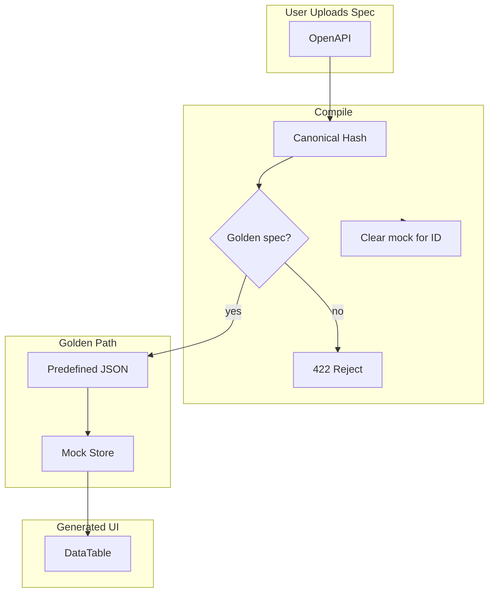

# Fix DataTable Dates and Realistic Seeds (Revised)

## MVP Simplification: Golden Specs Only

Support only the two golden specs. Reject others at compile. This removes:

- Adapter selection (mock vs real API)
- Real API adapter implementation
- Seed generator (no on-the-fly generation)
- Fallback behavior for non-golden specs

---

## Alignment with Vision

From [mvp_v3_rapidui_vision_summary.md](.cursor/context/mvp_v3_rapidui_vision_summary.md):

- **OpenAPI contract is the single source of truth** — the UI is derived, not authored
- **No manual configuration** — no SDKs, no UI config, no upkeep
- **Deterministic compilation** — same input → same output
- **Scales naturally** — the compiler evolves; users move forward automatically

The previous plan violated this by: (1) threading format through the pipeline as a bolt-on, and (2) hardcoding field names (firstName, sku, etc.) in the seed generator. That does not scale.

---

## Problem Summary

1. **DataTable shows dates in non-date columns** — `new Date(value)` parses `"1"`, `"2001"`, `"12345"` as valid dates, causing false positives
2. **Mock data approach** — Use predefined, stable data for the two golden specs only. No on-the-fly generation.
3. **Reset Data button** — Should not exist; generated UI has no control over backend reset
4. **Reset behavior** — Data resets when same session re-uploads same spec → reset on every compile

---

## Principle: Contract-First

**DataTable:** The renderer receives values. Use **convention** (ISO 8601) via date-fns. No format passing, no schema changes.

**MVP scope:** Only the two golden specs. Predefined data. No adapter selection, no real API path.

---

## Implementation Plan

### 1. Date Display: Extensible Utility + DataTable Integration

**Approach:** Create a small abstraction so date formatting is centralized and extensible. Different OpenAPI specs may use `date-time`, `date`, Unix timestamps, or custom formats. Start simple; extend later without touching consumers.

**Dependency:** Add `date-fns` to package.json.

**New file:** `lib/utils/formatDate.ts`

```ts
import { parseISO, isValid, format, fromUnixTime } from "date-fns";

/** Display format for dates (locale can be added later) */
const DISPLAY_FORMAT = "MMM d, yyyy, h:mm a";
const DISPLAY_FORMAT_DATE_ONLY = "MMM d, yyyy";

/**
 * Try to format a value as a date for display.
 * Returns null if the value is not a recognizable date.
 *
 * Supported now (simplified):
 * - ISO 8601 strings (date-time, date) via parseISO
 * - Unix timestamp (number, seconds or ms)
 *
 * Extensible later:
 * - formatHint from schema (date-time | date | time | unix-ts)
 * - Custom format strings (parse with date-fns parse)
 */
export function formatDateForDisplay(
  value: unknown,
  _formatHint?: "date-time" | "date" | "time" | "unix-ts"
): string | null {
  if (value === null || value === undefined) return null;

  let date: Date;
  if (typeof value === "number") {
    // Unix timestamp: assume seconds if < 1e12, else ms
    const ms = value < 1e12 ? value * 1000 : value;
    date = fromUnixTime(Math.floor(ms / 1000));
  } else if (typeof value === "string") {
    date = parseISO(value);
  } else {
    return null;
  }

  if (!isValid(date)) return null;
  // For date-only values (no time component), use shorter format
  const hasTime = typeof value === "string" && value.includes("T");
  return format(date, hasTime ? DISPLAY_FORMAT : DISPLAY_FORMAT_DATE_ONLY);
}
```

**DataTable:** Import and use `formatDateForDisplay` instead of inline logic.

**Why this scales:**

- **Now:** ISO 8601 + Unix timestamp. Covers most APIs.
- **Later:** Add `formatHint` handling — when schema format flows through, pass it. Add `parse(value, "dd/MM/yyyy", ...)` for custom formats. All changes stay in `formatDate.ts`; DataTable stays dumb.

---

### 2. Mock Store: Predefined Data, Golden Specs Only (MVP)

**Simplification:** MVP supports only the two golden specs. Reject non-golden specs at compile time. No adapter selection, no real API adapter, no seed generator.

**Predefined data:**

- `lib/compiler/mock/fixtures/users.json` — matches [golden_openapi_users_tagged_3_0.yaml](tests/compiler/fixtures/golden_openapi_users_tagged_3_0.yaml)
- `lib/compiler/mock/fixtures/products.json` — matches [golden_openapi_products_path_3_1.yaml](tests/compiler/fixtures/golden_openapi_products_path_3_1.yaml)

**Fixture matching:** Canonical OpenAPI hash. Precompute hashes for the two golden YAML files at init. Simple lookup: `hash === USERS_HASH` → users data; `hash === PRODUCTS_HASH` → products data.

**Implementation:**

- `lib/compiler/mock/fixtures.ts` — `getPredefinedData(hash)`, `isGoldenSpec(hash)`. Two known hashes.
- **Compile route:** Before `putCompilation`, check `isGoldenSpec(openapiCanonicalHash)`. If false → return 422 with message "Only demo specs supported. Use golden_openapi_users_tagged_3_0.yaml or golden_openapi_products_path_3_1.yaml."
- **Mock store:** Always uses predefined data (we only reach it for golden specs). Remove `generateSeeds` usage entirely. Can delete or deprecate seed-generator.

### 3. Remove Reset Data Button

**Files:** [CompiledUISidebar.tsx](components/compiler/CompiledUISidebar.tsx), [CompiledUIContent.tsx](components/compiler/CompiledUIContent.tsx)

- Remove the Reset Data button from the sidebar. The generated UI should not expose backend reset controls.
- Remove `onReset`, `isResetting` props and related logic.
- Remove or keep `POST /api/mock/[id]/[resource]/reset` for internal use only (compile-triggered reset); do not expose in UI.

### 4. Reset on Every Compile

**File:** Compile pipeline or [app/api/compile-openapi/route.ts](app/api/compile-openapi/route.ts)

- On every successful compile, clear the mock store for that compilation ID before returning.
- So: re-upload same spec (same session) → same compilation ID → mock cleared on compile → fresh predefined data on next request.

---

### 5. Data Flow




- **Golden spec:** Hash matches → predefined data → mock store. Reset on every compile.
- **Non-golden:** Reject at compile with clear message.
- **DataTable:** Uses `formatDateForDisplay` (date-fns).

---

### 6. Files to Modify


| File                                                                                   | Changes                                                            |
| -------------------------------------------------------------------------------------- | ------------------------------------------------------------------ |
| `package.json`                                                                         | Add `date-fns` dependency                                          |
| `lib/utils/formatDate.ts` (new)                                                        | `formatDateForDisplay(value, formatHint?)`                         |
| [components/renderer/DataTable.tsx](components/renderer/DataTable.tsx)                 | Import `formatDateForDisplay`; replace inline `formatDateTime`     |
| `lib/compiler/mock/fixtures/users.json` (new)                                          | Predefined users data                                              |
| `lib/compiler/mock/fixtures/products.json` (new)                                       | Predefined products data                                           |
| `lib/compiler/mock/fixtures.ts` (new)                                                  | `getPredefinedData(hash)`, `isGoldenSpec(hash)` — two known hashes |
| [lib/compiler/mock/store.ts](lib/compiler/mock/store.ts)                               | Use predefined data only; remove generateSeeds                     |
| [components/compiler/CompiledUISidebar.tsx](components/compiler/CompiledUISidebar.tsx) | Remove Reset Data button                                           |
| [components/compiler/CompiledUIContent.tsx](components/compiler/CompiledUIContent.tsx) | Remove onReset, isResetting, handleReset                           |
| [app/api/compile-openapi/route.ts](app/api/compile-openapi/route.ts)                   | Reject non-golden specs; reset mock for ID on success              |


**Removed/deprecated:** `lib/compiler/mock/seed-generator.ts` — no longer used.

---

### 7. Testing

- **formatDateForDisplay:** `"1"`, `"2001"`, `"sample-1"` → null; `"2026-02-23T01:06:41Z"`, `"2026-02-23"` → formatted
- **Predefined data:** Golden users/products specs load correct fixture data
- **Reset:** Re-compile same spec → mock cleared → fresh predefined data on next request

