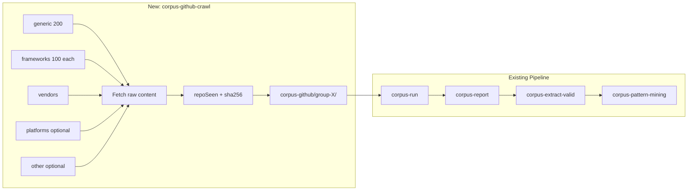

# GitHub OpenAPI Spec Crawler Implementation Plan

## Current State

- **Corpus source:** APIs.guru via openapi-directory ([scripts/copy-openapi-specs.ts](scripts/copy-openapi-specs.ts))
- **Pipeline:** `corpus-run` (parse → validateSubset → resolveRefs → buildApiIR) → `corpus-report` → `corpus-extract-valid` → `corpus-pattern-mining`
- **No GitHub API usage** in the codebase; Octokit not installed
- **Parser** supports OpenAPI 3.0/3.1 only (no Swagger 2.0 conversion)

## Architecture




---

## Phase Overview


| Phase       | Scope               | Agent focus                                                                                                                                   |
| ----------- | ------------------- | --------------------------------------------------------------------------------------------------------------------------------------------- |
| **Phase 1** | Pipeline extensions | Extend corpus-run, corpus-extract-valid, corpus-report, corpus-pattern-mining, generate-apiir-fixtures; add config (.gitignore, .env.example) |
| **Phase 2** | GitHub crawler      | Create corpus-github-crawl.ts with query groups, search API, fetch, dedup, storage                                                            |
| **Phase 3** | Documentation       | Add docs/corpus-github.md and update docs/openapi-subset-v1.md with workflow                                                                  |


**Dependencies:** Phase 2 requires Phase 1 (pipeline must accept corpus-github layout). Phase 3 can run after Phase 2.

---

# Phase 1: Pipeline Extensions

**Goal:** Make the existing corpus pipeline work with the corpus-github layout. No crawler yet. Verify with manually placed specs if needed.

## 1.1 Extend `corpus-run.ts`

**Current:** Reads from `scripts/corpus-data/specs/{batchNum}/` only via `--batch N`.

**Add:**

- `--specs-dir PATH` — override base dir (default: `scripts/corpus-data/specs`)
- `--output-name NAME` — output `raw-{NAME}-{timestamp}.json` instead of `raw-batch{N}-{timestamp}.json`
- `--recurse` — when set, recursively scan subdirs of `--specs-dir` (needed for `group-frameworks/` with fastapi/, nestjs/, etc.)

**Behavior:**

- When `--specs-dir` is used: require `--output-name` (no batch number).
- When `--output-name` is set: `meta.batch` = output name string (e.g. `"github-generic"`). Keep `meta.batch` as `number | string` for backward compat.
- **Path in results:** Use `path.relative(cwd, absPath)` so paths are like `scripts/corpus-data/corpus-github/group-generic/owner__repo__path.yaml`.
- **File discovery:** If `--recurse`, use recursive `readdirSync`/`statSync` to find all `.yaml`, `.yml`, `.json` under `--specs-dir`.

**Example:**

```bash
npm run corpus:run -- --specs-dir scripts/corpus-data/corpus-github/group-generic --output-name github-generic
npm run corpus:run -- --specs-dir scripts/corpus-data/corpus-github/group-frameworks --output-name github-frameworks --recurse
```

## 1.2 Extend `corpus-extract-valid.ts`

**Current:** Only reads `raw-batch*.json`; manifest `source` is hardcoded "APIs.guru (via openapi-directory)".

**Add:**

- Include `raw-github-*.json` in file filter:

```ts
.filter((f) =>
  (f.startsWith("raw-batch") || f.startsWith("raw-github-")) && f.endsWith(".json")
)
```

- **Sorting:** Handle both numeric batch (`raw-batch1`, `raw-batch2`) and string batch (`raw-github-generic`). Sort numeric first, then `raw-github-`* alphabetically.
- **ValidSpecEntry.batch:** Change to `number | string` (GitHub batches are strings).
- **Manifest source:** Derive from paths. If any path contains `corpus-github`, include "GitHub". If any contains `specs/`, include "APIs.guru (via openapi-directory)". Set `source` to the appropriate combination (e.g. `"APIs.guru (via openapi-directory) + GitHub"` or single source).

## 1.3 Extend `corpus-report.ts`

**Current:** Report shows "Source: APIs.guru (via openapi-directory)" and "Batch: {meta.batch}".

**Change:**

- When `meta.batch` is a string starting with `github-`, show "Source: GitHub" and "Batch: {meta.batch}".
- When `meta.batch` is a number, keep current "Source: APIs.guru (via openapi-directory)" and "Batch: {meta.batch}".
- Update `RawOutput` interface: `meta.batch: number | string`.

## 1.4 Extend `corpus-pattern-mining.ts`

**Current:** Prints pattern distribution to stdout only.

**Add:**

- `--output PATH` (or `-o`) — write report to file.
- If `--output` is omitted: keep current behavior (print to stdout).
- If `--output` is set: write to file, ensure parent dir exists (`mkdir -p`), log `Report written to: {path}`.

**Example:**

```bash
npm run corpus:pattern-mining -- --output scripts/corpus-data/reports/pattern-mining-2026-03-06.md
```

## 1.5 Extend `generate-apiir-fixtures.ts`

**Current:** Filters only `.yaml` and `.yml` in corpus-valid-v1.

**Change:**

- Add `.json` support. Filter: `(f.endsWith(".yaml") || f.endsWith(".yml") || f.endsWith(".json"))`.
- Output base name: `file.replace(/\.(yaml|yml|json)$/i, "")` so `foo.json` → `foo.json` in apiir output.

## 1.6 Config Updates

- **.gitignore:** Add `scripts/corpus-data/corpus-github/`
- **.env.example:** Add `# GITHUB_TOKEN=... (required for corpus:github-crawl)` with brief note

**Phase 1 verification:** Create `scripts/corpus-data/corpus-github/group-generic/` with 1–2 YAML specs (copy from fixtures). Run `corpus:run --specs-dir ... --output-name github-test`. Run `corpus:report` on the raw output. Confirm "Source: GitHub" and correct paths.

---

# Phase 2: GitHub Crawler

**Goal:** Create `scripts/corpus-github-crawl.ts` that searches GitHub for OpenAPI specs, fetches content, deduplicates, and stores in corpus-github.

## 2.1 Script: `scripts/corpus-github-crawl.ts`

### Responsibilities

- Run query groups against GitHub Code Search API
- Fetch raw file content for each result
- Enforce deduplication (1 per repo, sha256 content)
- Per-group caps: generic 200, frameworks 100 per framework, vendors flexible
- Store in `scripts/corpus-data/corpus-github/{group}/`

### Query Groups

#### Group A — Generic (200 specs)

Broad ecosystem sampling. One combined group.


| Target    | Queries                                                          |
| --------- | ---------------------------------------------------------------- |
| 200 specs | `filename:openapi.yaml "openapi: 3" size:5000..200000 stars:>10` |
|           | `filename:openapi.yml "openapi: 3" size:5000..200000 stars:>10`  |
|           | `filename:openapi.json "openapi" size:5000..200000 stars:>10`    |


#### Group B — Frameworks (100 specs per framework × 5+ frameworks)

**Purpose:** Realistic backend APIs. Each framework generates OpenAPI from code; high probability of valid specs.


| Framework       | Search keywords               | Notes                                    |
| --------------- | ----------------------------- | ---------------------------------------- |
| **FastAPI**     | `fastapi`                     | Python, native OpenAPI 3.0               |
| **NestJS**      | `nestjs`                      | Node, @nestjs/swagger                    |
| **Spring Boot** | `springdoc` or `spring boot`  | Java, springdoc-openapi                  |
| **Django**      | `drf-spectacular` or `django` | Python, DRF + drf-spectacular            |
| **Laravel**     | `laravel`                     | PHP, L5-Swagger / darkaonline/l5-swagger |
| **Rails**       | `rswag` or `rails`            | Ruby, rswag                              |
| **Express**     | `tsoa` or `express`           | Node, tsoa or swagger-jsdoc              |
| **Micronaut**   | `micronaut`                   | JVM, micronaut-openapi                   |
| **Ktor**        | `ktor`                        | Kotlin, ktor-openapi                     |


**Target:** 5+ frameworks, **100 specs each** (500+ total). Use subdirs: `group-frameworks/fastapi/`, `group-frameworks/nestjs/`, etc.

**Example queries:**

```
filename:openapi.yaml fastapi "openapi: 3"
filename:openapi.json nestjs
filename:openapi.yaml springdoc
filename:openapi.yaml drf-spectacular
filename:openapi.yaml laravel
```

#### Group C — Vendors (broadened list)

**Purpose:** Production API designs from known SaaS/API providers.


| Category           | Vendors                           |
| ------------------ | --------------------------------- |
| Payments / fintech | stripe, plaid, adyen              |
| Communications     | twilio, sendgrid, mailgun         |
| Productivity       | slack, notion, linear, asana      |
| Dev tools          | github, gitlab, circleci, vercel  |
| Cloud / infra      | digitalocean, cloudflare, datadog |
| AI                 | openai, anthropic                 |
| Other              | postman, rapidapi                 |


**Target:** ~200 specs total across vendors (or cap per-vendor at 20–30 to avoid dominance).

#### Group D — Additional (optional)


| Group         | Purpose                    | Example queries                                         |
| ------------- | -------------------------- | ------------------------------------------------------- |
| **platforms** | BaaS / auto-generated APIs | `filename:openapi.yaml postgrest`, `supabase`, `hasura` |
| **cloud**     | Cloud provider APIs        | `filename:openapi.yaml aws`, `googleapis`, `azure`      |
| **api-docs**  | Spec-first / doc tooling   | `filename:openapi.yaml redoc`, `openapi-generator`      |


Include 1–2 if time permits. Swagger 2.0 specs excluded — only OpenAPI 3.x.

### GitHub API Constraints

- **Search Code:** `GET /search/code` — requires auth, **9 requests/min**
- **Raw content:** Use `GET /repos/{owner}/{repo}/contents/{path}` (decode base64) or `raw.githubusercontent.com` — 5000 req/hour (authenticated)
- **Pagination:** Search returns max 100 per page. Use `?page=1`, `?page=2`, etc. until target reached or no more results.
- **Rate limit:** On 429, respect `Retry-After`; exponential backoff. Throttle ~1 search / 2 sec; small delays between content fetches.

### Script Rules

1. **repoSeen[fullRepoName]** — skip if repo already contributed a spec. **Global across all groups.**
2. **contentHashes[sha256(content)]** — skip duplicate specs. **Global across all groups.**
3. **Per-group caps:** generic 200; frameworks 100 per framework; vendors ~200 total (or per-vendor cap).
4. **GITHUB_TOKEN** — required env var (create at github.com/settings/tokens). Exit with clear error if missing.

### Storage Layout

```
scripts/corpus-data/corpus-github/
  group-generic/
    owner__repo__path.yaml
    ...
  group-frameworks/
    fastapi/
    nestjs/
    springdoc/
    django/
    laravel/
    ...
  group-vendors/
    ...
  group-platforms/     # optional
  group-cloud/         # optional
```

**Filename:** `{owner}__{repo}__{path.replace(/\//g, "__")}` to avoid collisions.

### Output

- Write `corpus-github-manifest.json` in `scripts/corpus-data/corpus-github/` with metadata: query groups, counts, timestamps, repo list.
- Log progress: specs found, skipped (duplicate repo/content), downloaded per group.

### Implementation Notes

- Use `fetch` only — no new npm deps.
- **package.json:** Add `"corpus:github-crawl": "tsx scripts/corpus-github-crawl.ts"`
- Parse response for `openapi: 3` or `"openapi":"3` to avoid Swagger 2.0 (optional pre-filter before storing).

---

# Phase 3: Documentation

**Goal:** Document the full GitHub corpus workflow for future runs.

## 3.1 Create `docs/corpus-github.md`

Include:

- Prerequisites: `GITHUB_TOKEN` in env
- End-to-end workflow:

```bash
# 1. Crawl (requires GITHUB_TOKEN)
npm run corpus:github-crawl

# 2. Run validation per group
npm run corpus:run -- --specs-dir scripts/corpus-data/corpus-github/group-generic --output-name github-generic
npm run corpus:run -- --specs-dir scripts/corpus-data/corpus-github/group-frameworks --output-name github-frameworks --recurse
npm run corpus:run -- --specs-dir scripts/corpus-data/corpus-github/group-vendors --output-name github-vendors

# 3. Report (per raw file)
npm run corpus:report -- scripts/corpus-data/reports/raw-github-generic-{timestamp}.json
# ... repeat for other groups

# 4. Extract valid (reads all raw-*.json)
npm run corpus:extract-valid -- --copy-to-fixtures

# 5. Generate ApiIR + pattern mining
npm run fixtures:generate-apiir
npm run corpus:pattern-mining -- --output scripts/corpus-data/reports/pattern-mining-$(date +%Y-%m-%d).md
```

- Optional: `corpus:github-pipeline` script or `--run-all-groups` flag in corpus-run (future enhancement).

## 3.2 Update `docs/openapi-subset-v1.md`

Add a short section or link to corpus-github workflow: "GitHub corpus: see [docs/corpus-github.md](corpus-github.md) for crawling and validation."

---

## Expected Outcome

- **~900–1100 specs** downloaded: generic 200 + frameworks 500+ (100 × 5) + vendors ~200 + optional groups
- **~300–500 valid OpenAPI** (parse success)
- **~50–120 subset-compatible** (pass RUS-v1)
- **Pattern mining report** on operations, resource shapes, CRUD patterns — informs which use cases the app can support

---

## Coherence Checklist

- corpus-run outputs paths relative to cwd; corpus-extract-valid and corpus-report consume them
- meta.batch can be number or string; all consumers handle both
- corpus-extract-valid manifest source derived from paths
- generate-apiir-fixtures supports .json for GitHub-fetched specs
- .gitignore includes corpus-github before crawler runs
- GITHUB_TOKEN documented in .env.example

