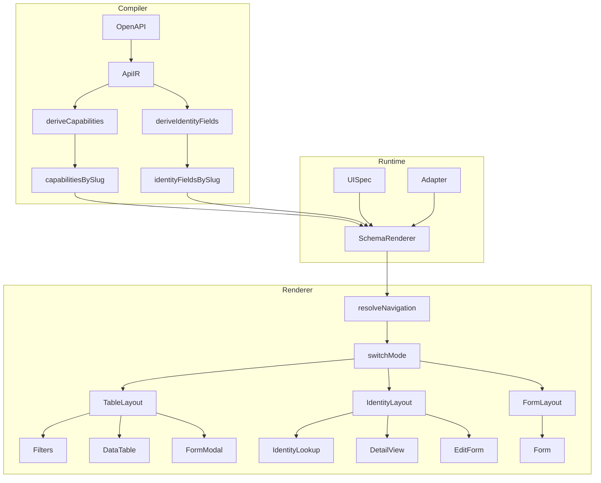

# Identity Fields and Capability-Driven Renderer Plan

## Goal

Prepare the system for future support of nested paths like `/orgs/{orgId}/users/{userId}` by introducing **resource identity fields** and fixing the renderer to use **capability-driven layout rules**. Only ApiIR extraction changes later for multi-param; renderer, lowering, and evals remain untouched.

---

## Core Renderer Contract

```
Renderer(UISpec, Capabilities, IdentityFields, Adapter)
```

The renderer must **never inspect ApiIR**. This keeps the pipeline clean:

```
OpenAPI → ApiIR → UiPlanIR → UISpec → Renderer
```

---

## Critical Determinism Rule

The renderer must **never** infer behavior from:

- runtime data
- adapter heuristics
- schema inference
- invented fallbacks (e.g. `identityFields = ["id"]`)

Only from:

- `capabilities`
- `UISpec` (spec.table, spec.form, spec.detail, spec.filters)
- `identityFields`

**Same UISpec + Capabilities → Same UI** always holds.

---

## Capabilities Resolution (Strict Rule)

The renderer must resolve capabilities in this order — **never merge, never invent**:

```
if (capabilitiesProp)
    capabilities = capabilitiesProp
else if (adapter?.capabilities)
    capabilities = normalizeAdapterCapabilities(adapter.capabilities)
else
    throw RendererInvariantError("Missing capabilities")
```

**Normalization helper (when falling back to adapter):**

`AdapterCapabilities` has `read` not `list`/`detail`. Define a single helper so the mapping stays symmetric — `list` and `detail` must both derive from `read` to avoid impossible states like `list: true, detail: false`:

```ts
function normalizeAdapterCapabilities(adapter: AdapterCapabilities): Capabilities {
  return {
    list: adapter.read,
    detail: adapter.read,
    create: adapter.create,
    update: adapter.update,
    delete: adapter.delete,
  };
}
```

**Constraints:**

- `capabilities` prop **MUST NEVER** be merged with `adapter.capabilities`. The prop overrides everything.
- The renderer **MUST NEVER** invent capabilities (e.g. no `FULL_CRUD_DEFAULT` fallback). Inventing capabilities breaks the `UISpec + Capabilities → UI` invariant — e.g. `spec.form` exists, `spec.table` absent, but invented `list: true` would yield table mode and contradict the UISpec.
- Fail loudly if the pipeline is miswired. **Boring and trustworthy > flexible**.

---

## Progress


| Phase       | Status      | Notes                                                                                   |
| ----------- | ----------- | --------------------------------------------------------------------------------------- |
| **Phase 1** | Done        | identityFields in ApiIR; deriveIdentityFields; pipeline integration                     |
| **Phase 2** | Done        | identityFieldsBySlug in CompilationEntry; page/CompiledUIContent pass to SchemaRenderer |
| **Phase 3** | Not started | resolveNavigation; mode switch; inline conditional rendering; skip list when !list      |
| **Phase 4** | Not started | Extract TableLayout, IdentityLayout, FormLayout; IdentityLookup, DetailView             |


**Phase 3 & 4 split:** Phase 3 implements mode-based behavior **inline** in SchemaRenderer (no new layout components). Phase 4 extracts that logic into TableLayout, IdentityLayout, FormLayout and primitives. Each phase has its own checkpoints.

---

## Current State

- **ApiIR**: [lib/compiler/apiir/types.ts](lib/compiler/apiir/types.ts) — `ResourceIR` has `identityFields`; `deriveIdentityFields` in [lib/compiler/apiir/identity.ts](lib/compiler/apiir/identity.ts)
- **Runtime**: [lib/db/compilations.ts](lib/db/compilations.ts) — `identityFieldsBySlug` derived in rowToEntry; page passes to CompiledUIContent
- **CompiledUIContent**: [components/compiler/CompiledUIContent.tsx](components/compiler/CompiledUIContent.tsx) — passes `capabilities` and `identityFields` to SchemaRenderer
- **Renderer**: [components/renderer/SchemaRenderer.tsx](components/renderer/SchemaRenderer.tsx) — receives capabilities/identityFields but **ignores them**; always shows DataTable; always calls `adapter.list()`; never renders `spec.detail`
- **Operations**: [lib/compiler/apiir/operations.ts](lib/compiler/apiir/operations.ts) — extracts path params; sets `identifierParam` per operation
- **Lowering**: [lib/compiler/lowering/lower.ts](lib/compiler/lowering/lower.ts) — capability-aware UISpec (spec.table/form/detail); spec.detail may be absent when capabilities.detail but no valid detail fields

**Gaps for Phase 3:** SchemaRenderer must use capabilities prop as source of truth (never merge with adapter); add resolveNavigation; call `adapter.list()` only when `adapter && capabilities.list`; inline conditional rendering for table/identity/form modes (no layout components yet); handle `spec.detail` undefined in identity mode.

---

## Three-Layer Renderer Architecture

Separate navigation logic from view components:

### Layer 1 — Mode Resolver (pure function)

```
mode = resolveNavigation(capabilities)
```

### Layer 2 — Layout Controller

```
switch(mode)
  case "table":   TableLayout
  case "identity": IdentityLayout
  case "form":    FormLayout
```

### Layer 3 — View Components (inside layouts)

```
TableLayout     → Filters, DataTable, FormModal (row click → edit modal; existing behavior)
IdentityLayout  → IdentityLookup, DetailView | EditForm
FormLayout      → Form + CreateButton
```

**Important:** Table mode uses the existing FormModal for row editing. No new DetailPanel. DetailView exists only in identity mode.

---

## Architecture Diagram




---

## Implementation Phases

### Phase 1 — ApiIR: Add identityFields

**1.1 Extend ResourceIR type**

- **File:** [lib/compiler/apiir/types.ts](lib/compiler/apiir/types.ts)
- Add `identityFields: string[]` to `ResourceIR`
- For MVP: `identityFields.length === 1` (single path param)

**1.2 Derive identityFields in ApiIR build**

- **File:** [lib/compiler/apiir/build.ts](lib/compiler/apiir/build.ts)
- After building resources, derive `identityFields` per resource:
  - Inspect detail/update/delete operations for path params
  - Collect unique param names from `identifierParam` (or `extractPathParams` on detail path)
  - For MVP: take first param only; enforce `identityFields.length === 1` (reject multi-param with compile error)
- **Fallback:** If no detail/update/delete ops, `identityFields = []` (e.g. list-only, create-only)

**1.3 Optional: Extract in capabilities stage**

- Alternatively, add `deriveIdentityFields(apiIr)` in [lib/compiler/apiir/capabilities.ts](lib/compiler/apiir/capabilities.ts) or a new `identity.ts` — keeps build.ts focused. Call after `deriveCapabilities`.

**Checkpoint:** Unit test: ResourceIR with GET /items/{id} → identityFields = ["id"]; create-only → identityFields = [] — **Done**

---

### Phase 2 — Pass identityFields to Runtime

**2.1 Add identityFieldsBySlug to CompilationEntry**

- **File:** [lib/db/compilations.ts](lib/db/compilations.ts)
- Add `identityFieldsBySlug: Record<string, string[]>` to `CompilationEntry`
- Derive from `apiIr.resources[].identityFields` in `rowToEntry` (no DB migration — derived from apiIr like capabilitiesBySlug)

**2.2 Update page and CompiledUIContent**

- **File:** [app/u/[id]/[resource]/page.tsx](app/u/[id]/[resource]/page.tsx)
- Pass `identityFields={entry.identityFieldsBySlug[resource] ?? []}` to CompiledUIContent
- **File:** [components/compiler/CompiledUIContent.tsx](components/compiler/CompiledUIContent.tsx)
- Add `identityFields?: string[]` prop; pass `capabilities` and `identityFields` to SchemaRenderer

**Important:** Do **not** invent `identityFields = ["id"]` when absent. Use `[]`. Inventing identity breaks determinism. When `identityFields = []`, navigation falls back to form mode (create-only) or table mode (list-only); identity mode only applies when detail/update ops exist, which always have path params.

**Checkpoint:** identityFieldsBySlug in CompilationEntry; page passes `?? []` (never `["id"]`) — **Done**

---

### Phase 3 — Renderer: Capability-Driven Navigation (Logic Only)

**Scope:** Mode-based conditional rendering **inline** in SchemaRenderer. No new layout components. Keeps Phase 3 small and testable.

**3.1 Create resolveNavigation and RendererInvariantError**

- **File:** [components/renderer/navigation.ts](components/renderer/navigation.ts) (new)
- Function: `resolveNavigation(capabilities: Capabilities): "table" | "identity" | "form"`
- Rules (priority order):
  - `capabilities.list` → `"table"`
  - `capabilities.detail || capabilities.update` → `"identity"`
  - `capabilities.create` → `"form"`
  - else `"form"`
- **File:** [lib/renderer/errors.ts](lib/renderer/errors.ts) or inline — `RendererInvariantError` for mode=identity && identityFields.length===0

**3.2 SchemaRenderer: use capabilities prop and mode switch**

- Resolve capabilities per **Capabilities Resolution** rule above. Prop overrides; never merge. Use `normalizeAdapterCapabilities` when falling back to adapter.
- Use `identityFields` prop (already passed; use `?? []`)
- At entry: `mode = resolveNavigation(capabilities)`; assert `mode !== "identity" || identityFields.length > 0`
- **Identity mode runtime guard:** When `mode === "identity"` and `adapter` exists but `!adapter.getById`, throw `RendererInvariantError("Adapter missing getById for identity mode")`. The adapter interface allows `getById?` but identity mode requires it — fail loudly to preserve the boring infrastructure contract.

**3.3 Inline conditional rendering (no layout components)**

- **mode "table":** Filters + DataTable + FormModal (row click → edit modal; existing behavior). No new DetailPanel.
- **mode "identity":** IdentityLookup (inputs for identityFields + View/Edit button) → when loaded: `spec.detail` ? DetailView : EditForm. When create-update, Create button → FormModal. **Never render inline forms**; only modal flows (CreateButton→FormModal, IdentityLookup→EditFormModal). Do not show both forms simultaneously.
- **mode "form":** Form + CreateButton only. No DataTable. No `adapter.list()` call.

**3.4 Skip adapter.list() when !adapter or !capabilities.list**

- In the useEffect that fetches data: `if (!adapter || !capabilities.list) return`. Both conditions required — tests with `initialData` and no adapter must not call `adapter.list()`.

**3.5 Capabilities normalization (when prop not passed)**

- Use the `normalizeAdapterCapabilities` helper defined in **Capabilities Resolution** above.
- When neither `capabilities` prop nor `adapter?.capabilities`: throw `RendererInvariantError("Missing capabilities")`. Do not invent a fallback.

**Checkpoints**

- **3.1:** `resolveNavigation` unit test — all 12 capability scenarios map to correct mode (table/identity/form)
- **3.2:** create-only: Form only, no DataTable, no `adapter.list()` call (test: mock adapter.list not called when capabilities.list=false)
- **3.3:** list-only: DataTable + Filters rendered; adapter.list() called
- **3.4:** detail-only: IdentityLookup UI (inline) visible; no DataTable; adapter.list() not called
- **3.5:** detail-only with spec.detail undefined: EditForm shown after lookup (not DetailView)
- **3.6:** Runtime assertion: mode=identity with identityFields=[] throws RendererInvariantError
- **3.7:** Runtime guard: mode=identity with adapter but no adapter.getById throws RendererInvariantError

**Tests**

- `**tests/renderer/navigation.test.ts`** — Unit test `resolveNavigation` for all 12 capability combinations (create-only→form, list-only→table, detail-only→identity, etc.)
- **Tests using initialData without adapter:** Must pass `capabilities` (e.g. full CRUD for table-mode tests). Without capabilities, renderer throws RendererInvariantError.
- `**tests/renderer/schemaRenderer.test.tsx`** — Extend existing tests:
  - create-only: pass `capabilities={{ list: false, create: true, ... }}`; assert no DataTable; assert `adapter.list` not called
  - list-only: assert DataTable rendered; assert adapter.list called
  - detail-only: pass `capabilities={{ list: false, detail: true, ... }}`, `identityFields={["id"]}`; assert IdentityLookup UI visible, no DataTable
  - **detail-only with spec.detail undefined:** `capabilities={{ list: false, detail: true, ... }}`, `identityFields={["id"]}`, spec without `spec.detail`. Expected: IdentityLookup visible; after lookup, EditForm shown (not DetailView)
  - RendererInvariantError: mode=identity with identityFields=[] throws

**Pre-flight checklist (before implementation)**

- **Capabilities resolution:** Prop overrides everything. Never merge with adapter. See **Capabilities Resolution** section.
- **Capabilities type:** Use `Capabilities` from `@/lib/compiler/apiir` (list, detail, create, update, delete). Adapter has `AdapterCapabilities` (read, create, update, delete) — normalize when falling back.
- **spec.detail optional:** Lowering emits `spec.detail` only when `capabilities.detail && validDetailFields.length > 0`. Renderer must handle `spec.detail` undefined in identity mode: show EditForm instead of DetailView. Do not fix in lowering.
- **Adapter.getById:** Required for identity mode. Mock adapter has it. Identity mode must not call `adapter.list()`. Runtime guard: when `mode === "identity"` and `adapter` exists but `!adapter.getById`, throw `RendererInvariantError("Adapter missing getById for identity mode")`.
- **Form mode:** No DataTable, no list fetch. Form + CreateButton only. Uses `spec.form` for create fields.
- **Table mode:** Row click → existing FormModal. No new DetailPanel.
- **List fetch:** Only when `adapter && capabilities.list`. Tests with `initialData` and no adapter must not call `adapter.list()`.
- **No capabilities fallback:** When neither capabilities prop nor adapter: throw RendererInvariantError. Tests must pass `capabilities` or `adapter` with capabilities.

---

### Phase 4 — Layout and View Components (Extract & Polish)

**Scope:** Extract inline logic from Phase 3 into layout components and primitives. Same behavior, cleaner architecture.

**4.1 Create primitives (extract from SchemaRenderer)**

- **IdentityLookup** — `components/renderer/IdentityLookup.tsx`. Inputs for identityFields; "View" or "Edit" button. On submit: fetch via adapter.getById, then show DetailView (if spec.detail) or EditForm (if spec.detail missing).
- **DetailView** — `components/renderer/DetailView.tsx`. Renders record as label-value from spec.detail.fields. Only used when spec.detail exists.

**4.2 Create layout components (Layer 2)**

- **TableLayout** — Filters + DataTable + FormModal (row click → edit modal; existing behavior). No DetailPanel.
- **IdentityLayout** — IdentityLookup + (spec.detail ? DetailView : EditForm). When create-update, Create button → FormModal. Never render inline forms; only modal flows. Do not show both forms simultaneously.
- **FormLayout** — Form + CreateButton only (create-only).

**4.3 Refactor SchemaRenderer**

- Replace inline conditional rendering with `switch(mode) { case "table": return <TableLayout ... />; case "identity": return <IdentityLayout ... />; case "form": return <FormLayout ... /> }`
- Pass through spec, adapter, capabilities, identityFields to layouts.

**4.4 Adapter.getById**

- **File:** [lib/adapters/mock-adapter.ts](lib/adapters/mock-adapter.ts)
- Current `getById(id: string | number)` — for MVP identityFields.length === 1, pass single value
- Future: `getById(identity: Record<string, string | number>)` when multi-param; not in this phase

**Checkpoints**

- **4.1:** TableLayout, IdentityLayout, FormLayout exist; SchemaRenderer delegates to them via switch(mode)
- **4.2:** IdentityLookup and DetailView are standalone components
- **4.3:** All 12 capability scenarios produce correct UI (same as Phase 3, verified via capability-specs fixtures or integration test)

**Tests**

- `**tests/renderer/schemaRenderer.test.tsx`** — Same capability scenarios; verify layout components render (can assert on data-testid from layouts)
- `**tests/renderer/identityLookup.test.tsx`** (optional) — IdentityLookup standalone behavior
- `**tests/renderer/detailView.test.tsx`** (optional) — DetailView renders spec.detail.fields

---

## Hard Renderer Invariant

The renderer must **never attempt to render sections that don't exist**. Lowering enforces:

- `capabilities.list` → spec.table exists
- `capabilities.create/update` → spec.form exists
- `capabilities.detail` → spec.detail *may* exist (only when `validDetailFields.length > 0`)

**spec.detail can be undefined** when capabilities.detail is true but the schema has no usable detail fields. In identity mode, when `spec.detail` is missing: show EditForm after lookup, not DetailView. Do not fix in lowering.

**Runtime assertion (guardrail):** At renderer entry, assert `mode !== "identity" || identityFields.length > 0`. If violated, throw `RendererInvariantError`. Protects against pipeline regressions (compiler should guarantee `detail || update → path param exists`); fail loudly if that invariant breaks.

---

## File Summary


| File                                        | Phase | Status | Action                                                                          |
| ------------------------------------------- | ----- | ------ | ------------------------------------------------------------------------------- |
| `lib/compiler/apiir/types.ts`               | 1     | Done   | Added `identityFields: string[]` to ResourceIR                                  |
| `lib/compiler/apiir/identity.ts`            | 1     | Done   | deriveIdentityFields from operations (enforce length 1 for MVP)                 |
| `lib/db/compilations.ts`                    | 2     | Done   | identityFieldsBySlug in rowToEntry (from apiIr)                                 |
| `app/u/[id]/[resource]/page.tsx`            | 2     | Done   | Pass identityFields to CompiledUIContent (use `[]` when absent)                 |
| `components/compiler/CompiledUIContent.tsx` | 2     | Done   | Pass capabilities + identityFields to SchemaRenderer                            |
| `components/renderer/navigation.ts`         | 3     | Todo   | Create — resolveNavigation(capabilities); normalizeAdapterCapabilities(adapter) |
| `lib/renderer/errors.ts` or inline          | 3     | Todo   | Add RendererInvariantError for mode=identity && identityFields.length===0       |
| `components/renderer/SchemaRenderer.tsx`    | 3     | Todo   | Use capabilities prop; mode = resolveNavigation; inline conditional rendering   |
| `components/renderer/TableLayout.tsx`       | 4     | Todo   | Create — Filters + DataTable + FormModal (row click → edit)                     |
| `components/renderer/IdentityLayout.tsx`    | 4     | Todo   | Create — IdentityLookup + DetailView/EditForm                                   |
| `components/renderer/FormLayout.tsx`        | 4     | Todo   | Create — Form + CreateButton (create-only only)                                 |
| `components/renderer/IdentityLookup.tsx`    | 4     | Todo   | Create — inputs for identityFields, View/Edit button                            |
| `components/renderer/DetailView.tsx`        | 4     | Todo   | Create — render record as label-value from spec.detail.fields                   |


---

## MVP Scope

Renderer needs **four primitives only**: Table, Detail, Form, IdentityLookup. Everything else is composition. Do not add more primitives.

---

## What This Does NOT Change

- **Lowering** — UISpec schema unchanged; lowering logic unchanged
- **Evals** — No changes to eval:ai, eval:llm, comparator
- **Snapshots** — ApiIR snapshots will gain identityFields (additive)
- **Multi-param** — Not implemented; only `identityFields.length === 1` for MVP

---

## Capability → UI Mapping (Scenario-by-Scenario)


| Scenario                  | Capabilities                 | Mode     | UI                                                                               |
| ------------------------- | ---------------------------- | -------- | -------------------------------------------------------------------------------- |
| create-only               | create                       | form     | FormLayout: Form, CreateButton                                                   |
| create-update             | create, update               | identity | IdentityLayout: CreateButton→FormModal + IdentityLookup → EditForm               |
| detail-only               | detail                       | identity | IdentityLayout: IdentityLookup → DetailView (or EditForm if spec.detail missing) |
| detail-update             | detail, update               | identity | IdentityLayout: IdentityLookup → DetailView + EditForm                           |
| list-only                 | list                         | table    | TableLayout: Filters, DataTable                                                  |
| list-create               | list, create                 | table    | TableLayout: Filters, DataTable, CreateButton                                    |
| list-detail               | list, detail                 | table    | TableLayout: DataTable, RowClick → FormModal (view/edit)                         |
| list-detail-create        | list, detail, create         | table    | TableLayout: DataTable, RowClick → FormModal, CreateButton                       |
| list-detail-update        | list, detail, update         | table    | TableLayout: DataTable, RowClick → FormModal, EditButton                         |
| list-detail-create-update | list, detail, create, update | table    | TableLayout: DataTable, RowClick → FormModal, EditButton, CreateButton           |
| list-detail-delete        | list, detail, delete         | table    | TableLayout: DataTable, RowClick → FormModal, DeleteButton                       |
| update-only               | update                       | identity | IdentityLayout: IdentityLookup → EditForm                                        |


All cases covered without heuristics. Same UISpec + Capabilities → Same UI.

---

## Recommended Implementation Order

1. ~~**Phase 1**~~ — ApiIR identityFields (types, build, derive); no `["id"]` fallback — **Done**
2. ~~**Phase 2**~~ — Pass identityFields through page/CompiledUIContent (use `[]` when absent) — **Done**
3. **Phase 3** — Capability-driven navigation (logic only, inline):
  - Create `navigation.ts` — resolveNavigation(capabilities)
  - Create `RendererInvariantError`
  - SchemaRenderer: mode = resolveNavigation; inline conditional rendering; call adapter.list() only when adapter && capabilities.list
4. **Phase 4** — Extract layout components:
  - Create IdentityLookup, DetailView
  - Create TableLayout, IdentityLayout, FormLayout
  - Refactor SchemaRenderer to use layouts

