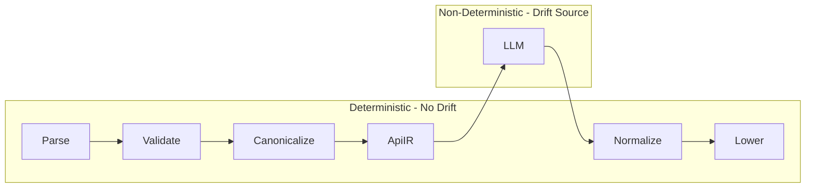
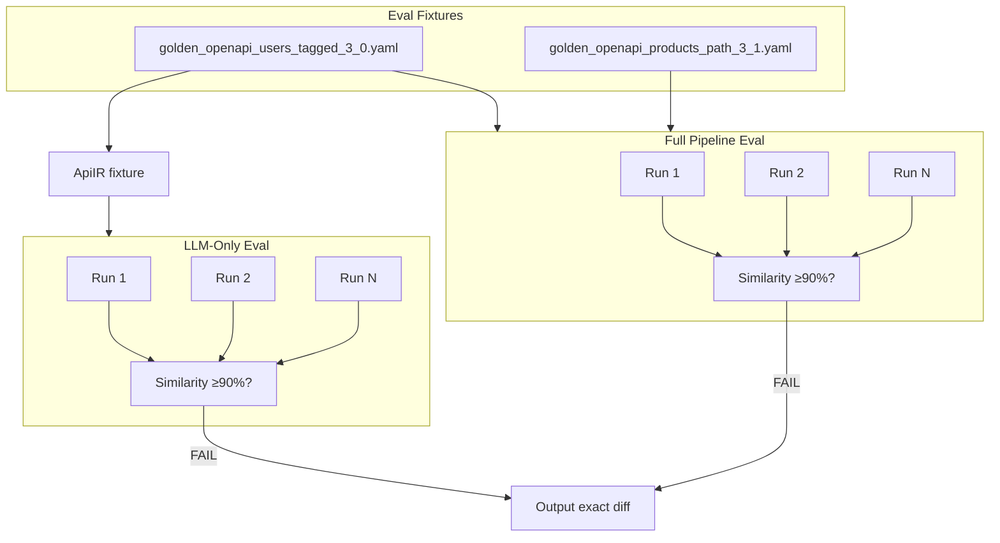

# LLM Evals for Determinism (Pre-Phase 6.5)

**Goal:** Prove the OpenAI LLM step (ApiIR → UiPlanIR) is sufficiently deterministic before building the full generated UI. Same OpenAPI → same UISpec → same UI behavior.

**Priority:** Determinism is the highest priority. We cannot ship to users if the same input produces different output. Evals enforce determinism with **90% as the pass target** — enough rigor to catch drift while leaving room for iteration and testing.

---

## Drift Analysis: Where Can Discrepancy Occur?



| Stage | Deterministic? | Drift possible? |
|-------|----------------|-----------------|
| Parse → Validate → Canonicalize → ApiIR | Yes | No (pure code) |
| **LLM (ApiIR → UiPlanIR)** | **No** | **Yes — only drift source** |
| Normalize → Lower → UISpec | Yes | No (pure code) |

**Conclusion:** The LLM is the only non-deterministic stage. Full-pipeline drift = LLM drift. We need both full-pipeline evals (user contract) and LLM-only evals (diagnostic, faster iteration for prompt tuning).

---

## Test Strategy: Full Pipeline + LLM-Only (Both)

| Eval Type | Input | Output | Purpose |
|-----------|-------|--------|---------|
| **Full pipeline** | OpenAPI string | UISpec map | User-facing contract. Same OpenAPI → same UI. Primary guard. |
| **LLM-only** | ApiIR | UiPlanIR | Isolate drift source. Faster (no parse/apiir/lower). Diagnostic + prompt tuning. |

**Why both?**

1. **Full pipeline** — What users get. Must pass. Run N times (e.g. 5–10), assert byte-identical UISpec.
2. **LLM-only** — When determinism fails, we know it's the LLM. When tuning prompts, run 20–50 iterations on LLM alone for faster feedback. No need to run full pipeline each time.

---

## Maximum Guards (Determinism-First)

1. **90% pass target** — Structural fingerprint similarity ≥90% across runs = pass. Byte-identical = ideal. Below 90% = fail. Gives room for iteration while still catching significant drift.

2. **Structural validity** — ≥90% of runs must produce valid UISpec (schema + logical integrity). Invalid runs are reported; overall pass requires validity target.

3. **Diff on failure** — When runs differ (or similarity below 90%), output exact diff: which run differed, which field/label/value changed. Enables prompt fixes.

4. **Capture intermediate hashes (optional)** — When full pipeline fails, re-run with `uiPlanHash` capture to confirm drift is in LLM (not lowering).

5. **Multiple fixtures** — Golden Users, Golden Products. Expand over time (nested, enums, edge cases).

6. **Deterministic stages sanity check** — Unit test: same OpenAPI → same ApiIR (already in `apiir.test.ts`). Same UiPlanIR → same UISpec (already in `lowering.test.ts`). Evals focus on the LLM.

---

## Current State

- **Eval harness** ([eval/eval-ai.ts](eval/eval-ai.ts)): Legacy payload-based flow; `generateSpecWithAI` throws (deprecated).
- **LLM step** ([lib/compiler/uiplan/llm-plan.ts](lib/compiler/uiplan/llm-plan.ts)): Uses `temperature: 0`, `response_format: { type: "json_object" }`, retries on Zod failure. Already has `source` param for metrics.
- **Pipeline** ([lib/compiler/pipeline.ts](lib/compiler/pipeline.ts)): `compileOpenAPI(openapiString, { source, llmPlanFn })` — supports mock for tests only.
- **Golden fixtures**: [tests/compiler/fixtures/](tests/compiler/fixtures/) — `golden_openapi_users_tagged_3_0.yaml`, `golden_openapi_products_path_3_1.yaml`.
- **Existing utils**: [eval/utils/validator.ts](eval/utils/validator.ts) (UISpec schema + logical integrity), [eval/utils/comparator.ts](eval/utils/comparator.ts) (fingerprint + similarity), [eval/utils/reporter.ts](eval/utils/reporter.ts).

---

## Eval Architecture



---

## Implementation Plan

### 1. Create `eval/utils/compile-openapi.ts`

- **Purpose:** Single entry point for full-pipeline eval.
- **Signature:** `compileOpenAPI(openapiString: string, options?: { source?: "eval" })`.
- **Behavior:** Call `lib/compiler/pipeline.compileOpenAPI` with `source: "eval"`. No `llmPlanFn` — evals always use the real LLM.
- **Return:** `{ success, specs?: Record<string, UISpec>, errors?: CompilerError[] }` — same shape as pipeline output.

### 2. Create `eval/utils/llm-only-eval.ts`

- **Purpose:** Isolate LLM step for faster iteration and diagnostic.
- **Signature:** `evalLlmOnly(apiIr: ApiIR, runs: number): Promise<LlmOnlyResult>`.
- **Behavior:** Call `llmPlan(apiIr, { source: "eval" })` N times. Compare normalized UiPlanIR outputs (byte-identical via `stringify`).
- **Return:** `{ allIdentical: boolean, canonical?: string, diff?: string, runs: UiPlanIR[] }`.
- **Use:** Load ApiIR from fixture (reuse pipeline: parse OpenAPI → build ApiIR, or cache ApiIR JSON). Run N times, assert all identical.

### 3. Require OPENAI_API_KEY — throw if missing

- **Eval entry point:** At startup, check `process.env.OPENAI_API_KEY`. If missing, throw:
  ```
  OPENAI_API_KEY is required for evals. Add it to .env.local to run LLM determinism evaluation.
  ```

### 4. Adapt validator for multi-spec output

- **Change:** Add `validateSpecs(specs: Record<string, UISpec>)` that validates each spec, returns `{ isValid, errors, perSpec }`. All must pass.

### 5. Adapt comparator for multi-spec + diff output

- **Change:** Add `canonicalString(specs: Record<string, UISpec>): string` — stable stringify for byte-identical comparison.
- **Change:** Add `compareSpecsMulti(run1: Record<slug, UISpec>, run2: Record<slug, UISpec>)`: (a) assert same slugs, fail if not; (b) for each slug, compare fingerprints; (c) return per-resource similarity; overall = **min** of per-resource (all resources must ≥90%).
- **Change:** Add `diffCanonical(a: string, b: string): string` — human-readable diff when runs differ (for debugging).

### 6. Update `eval/eval-ai.ts` — Full pipeline evals

- **Fixtures:** OpenAPI YAML from `eval/fixtures/*.yaml` (or symlink to `tests/compiler/fixtures/`).
- **Flow:** For each fixture, run `compileOpenAPI` N times **sequentially** (avoid rate limits). Collect all results. For valid runs: assert same resource set (slugs), then compare per-resource fingerprints; overall similarity = min or average per-resource (see stress test). If resource set differs across runs: fail immediately.
- **Pass:** ≥90% valid runs AND ≥90% per-resource similarity.

### 7. Add `eval/eval-llm-only.ts` — LLM-only evals

- **Purpose:** Faster diagnostic, prompt tuning.
- **Flow:** Load ApiIR from golden OpenAPI (parse → apiir). Run `llmPlan` N times (e.g. 10–20). Compare normalized UiPlanIR. Fail if not byte-identical; output diff.
- **CLI:** `npm run eval:llm` or `tsx eval/eval-llm-only.ts`.

### 8. Pass/fail criteria (90% target)

- **Full pipeline:** ≥90% of runs produce valid UISpec AND ≥90% structural fingerprint similarity across valid runs. Byte-identical = ideal.
- **LLM-only:** ≥90% of runs produce valid UiPlanIR AND ≥90% similarity across valid runs.
- **Room for iteration:** 90% target allows some variance while testing; below 90% = fail and investigate.

### 9. Diff on failure

- When runs differ, write to report: `Run 1 vs Run N differ:\n{diff}`. Use `diffCanonical` or a simple line diff. Goal: identify which field/label/value changed for prompt fixes.

### 10. Fixtures and legacy removal

- **Add:** Golden YAML to `eval/fixtures/`.
- **Remove:** `eval/fixtures/*.json`, `eval/utils/ai-generator.ts`.
- **Update:** [eval/README.md](eval/README.md).

### 11. CLI options

- `--quick` / `-q`: 2 runs (full) or 5 runs (llm-only).
- `--fixture NAME`: Single fixture.
- `--runs N`: Override runs.
- `--output-dir DIR`: Report output.
- `--replay-failures`: Replay saved failures.
- `--llm-only`: Run LLM-only eval instead of full pipeline (or separate script).
- `--parallel`: Run N calls in parallel (default: sequential to avoid rate limits).
- `--json`: Machine-readable output for CI (`{ passed, validity, similarity, errors }`).

### 12. Retry & timeout

- **Retry:** On 429/503, retry once with 2s backoff. Validation failure = no retry.
- **Timeout:** Per-run timeout 60s. On timeout, count as invalid run.

---

## File Summary

| File | Action |
|------|--------|
| `eval/utils/compile-openapi.ts` | Create — pipeline caller, source: "eval" |
| `eval/utils/llm-only-eval.ts` | Create — ApiIR → UiPlanIR, N runs, byte-identical check |
| `eval/utils/validator.ts` | Update — add `validateSpecs` for multi-spec |
| `eval/utils/comparator.ts` | Update — add `canonicalString`, `compareSpecsMulti` (per-resource, min similarity), `diffCanonical` |
| `eval/eval-ai.ts` | Replace — full pipeline evals, strict byte-identical, diff on failure |
| `eval/eval-llm-only.ts` | Create — LLM-only evals for diagnostic / prompt tuning |
| `eval/fixtures/` | Add golden YAML; remove JSON payloads |
| `eval/utils/ai-generator.ts` | Delete |
| `eval/README.md` | Update — both eval types, OPENAI_API_KEY required, strict criteria |
| `package.json` | Update — add `eval:llm` script |

---

## Determinism Strategy

1. **LLM settings:** Already `temperature: 0` and `response_format: json_object` — good baseline.
2. **Normalizer:** [lib/compiler/uiplan/normalize.ts](lib/compiler/uiplan/normalize.ts) produces byte-stable UiPlanIR.
3. **Lowering:** Deterministic given UiPlanIR + ApiIR.
4. **Eval measures:** ≥90% validity + ≥90% structural similarity = pass. Byte-identical = ideal. Below 90% = fail.
5. **If drift:** Use diff output to identify changed field/label. Tighten prompt, add few-shot examples, or constrain schema. Run LLM-only eval for fast iteration.

---

## Execution Order

1. Create `compile-openapi.ts` and `llm-only-eval.ts`.
2. Add `validateSpecs`, `canonicalString`, `diffCanonical`.
3. Update `eval-ai.ts` (full pipeline) and create `eval-llm-only.ts`.
4. Require OPENAI_API_KEY at startup for both.
5. Add fixtures, remove legacy.
6. Update README and package.json.

---

## Success Criteria

- **Full pipeline:** ≥90% valid runs + ≥90% structural similarity = pass. Byte-identical = ideal.
- **LLM-only:** ≥90% valid runs + ≥90% similarity = pass.
- Eval **fails fast** when `OPENAI_API_KEY` is not set.
- On failure (below 90%): report includes exact diff for prompt debugging.

---

## Stress Test: Edge Cases & Recommendations

### API & Infrastructure

| Risk | Mitigation |
|------|-------------|
| **Rate limits (429)** | Run evals **sequentially** by default. Add `--parallel` for faster runs when under limit. Retry with exponential backoff (max 2 retries) on 429/503. |
| **Timeouts** | Per-run timeout (e.g. 60s). On timeout, count as invalid run; do not hang. |
| **Transient failures** | Distinguish: validation failure (count invalid) vs network/API error (retry once, then fail run). |
| **Cost** | Document approximate cost per run (~$0.001–0.01 per call for gpt-4o-mini). Add `--max-runs` to cap total API calls. |

### Multi-Spec Comparison

| Risk | Mitigation |
|------|-------------|
| **Different resource sets** | Run 1: `{ users }`, Run 2: `{ users, products }` — structural failure. Before similarity, assert same slugs. Fail immediately if resource set differs. |
| **Per-resource vs aggregate** | Users 100% identical, Products 70% → average 85%, fails. **Require each resource ≥90%** independently. One weak resource should not be masked by others. |
| **Fingerprint for multi-spec** | Compare per-resource: for each slug, `extractFingerprint(specs[slug])`, then `compareFingerprints(run1[slug], run2[slug])`. Per-resource similarity; overall pass = all resources ≥90%. |

### Fixtures & Coverage

| Risk | Mitigation |
|------|-------------|
| **Single source of truth** | Use `tests/compiler/fixtures/` as canonical. Eval symlinks or reads from there. Avoid copy drift. |
| **Edge-case coverage** | Add fixtures over time: nested (`profile.firstName`), enums, sparse schema, many optional fields. Plan for 3–4 fixtures minimum. |
| **Flaky fixtures** | Some specs may be inherently harder. Track per-fixture pass rate in report. Consider `fixture.config.json` to mark relaxed thresholds for known-flaky fixtures (future). |

### Reproducibility & Versioning

| Risk | Mitigation |
|------|-------------|
| **Model drift** | OpenAI can update gpt-4o-mini. Log model + date in report. Consider pinning model version (e.g. `gpt-4o-mini-2024-07-18`) when available. |
| **Prompt/schema changes** | When prompt or UiPlanIR schema changes, re-baseline. Add `promptHash` or `schemaVersion` to report header for traceability. |
| **Same code, different day** | Evals pass today, fail tomorrow (model drift). Document: run evals after prompt/schema/model changes; re-run before release. |

### CI & Automation

| Risk | Mitigation |
|------|-------------|
| **Exit code** | Eval must `process.exit(1)` on fail, `0` on pass. CI can gate merges. |
| **Machine-readable output** | Add `--json` flag: output `{ passed, validity, similarity, errors }` for CI parsing. Markdown for humans, JSON for automation. |
| **CI without key** | Eval fails fast with clear message. To run in CI: add `OPENAI_API_KEY` as secret; run on prompt/schema changes or nightly. |

### Internal Consistency

| Risk | Mitigation |
|------|-------------|
| **LLM-only vs full criteria** | LLM-only compares UiPlanIR (no UISpec). Use normalized UiPlanIR `stringify` for byte-identical; use structural comparison (fields, views) for similarity. Define UiPlanIR fingerprint if needed. |

### Recommended Additions to Plan

1. **Sequential by default** — Avoid rate limits. `--parallel` for power users.
2. **Per-resource similarity** — Each resource must ≥90%; no masking.
3. **Same resource set check** — Fail fast if run N has different slugs than run 1.
4. **`--json` output** — For CI integration.
5. **Report metadata** — Model, prompt hash, timestamp, fixture list.
6. **Retry policy** — 429/503: retry once with backoff. Validation failure: no retry.
