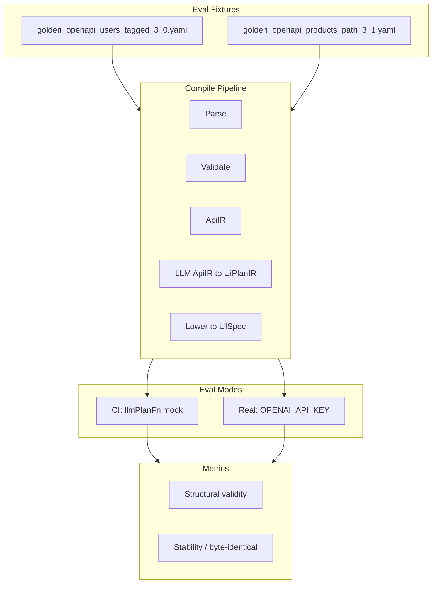

> **Superseded:** This plan has been merged into [mvp_v3_dev_plan_8f51c1e9.plan.md](mvp_v3_dev_plan_8f51c1e9.plan.md) Phase 6.25. Use the main plan for implementation. This file is kept for reference only.

# LLM Evals for Determinism (Pre-Phase 6.5)

**Goal:** Prove the OpenAI LLM step (ApiIR → UiPlanIR) is sufficiently deterministic before building the full generated UI. Same OpenAPI → same UISpec → same UI behavior.

---

## Current State

- **Eval harness** ([eval/eval-ai.ts](eval/eval-ai.ts)): Legacy payload-based flow; `generateSpecWithAI` throws (deprecated).
- **LLM step** ([lib/compiler/uiplan/llm-plan.ts](lib/compiler/uiplan/llm-plan.ts)): Uses `temperature: 0`, `response_format: { type: "json_object" }`, retries on Zod failure. Already has `source` param for metrics.
- **Pipeline** ([lib/compiler/pipeline.ts](lib/compiler/pipeline.ts)): `compileOpenAPI(openapiString, { source, llmPlanFn })` — supports mock for CI.
- **Golden fixtures**: [tests/compiler/fixtures/](tests/compiler/fixtures/) — `golden_openapi_users_tagged_3_0.yaml`, `golden_openapi_products_path_3_1.yaml`.
- **Existing utils**: [eval/utils/validator.ts](eval/utils/validator.ts) (UISpec schema + logical integrity), [eval/utils/comparator.ts](eval/utils/comparator.ts) (fingerprint + similarity), [eval/utils/reporter.ts](eval/utils/reporter.ts).

---

## Architecture

---

## Implementation Plan

### 1. Create `eval/utils/compile-openapi.ts`

- **Purpose:** Single entry point for eval to call the pipeline.
- **Signature:** `compileOpenAPI(openapiString: string, options?: { source?: "eval"; llmPlanFn?: (apiIr) => UiPlanIR })`.
- **Behavior:** Call `lib/compiler/pipeline.compileOpenAPI` with `source: "eval"` and optional `llmPlanFn`.
- **Return:** `{ success, specs?: Record<string, UISpec>, errors?: CompilerError[] }` — same shape as pipeline output.

### 2. Adapt validator for multi-spec output

- **Current:** [eval/utils/validator.ts](eval/utils/validator.ts) validates a single `UISpec`.
- **Change:** Add `validateSpecs(specs: Record<string, UISpec>)` that:
  - Validates each spec with `validateSpec(spec)`.
  - Returns `{ isValid, errors: string[], perSpec: Record<slug, ValidationResult> }`.
  - All specs must pass for overall validity.

### 3. Adapt comparator for multi-spec fingerprint

- **Current:** [eval/utils/comparator.ts](eval/utils/comparator.ts) fingerprints a single UISpec.
- **Change:** Add `extractFingerprintMulti(specs: Record<string, UISpec>)` that:
  - Sorts slugs, builds `{ fingerprints: Record<slug, StructuralFingerprint>, canonical: string }` where `canonical` is a stable string (e.g. `stringify(specs)` keyed by slug) for byte-identical comparison.
  - Use `canonical` for strict determinism; use fingerprints for structural similarity when byte-identical fails.

### 4. Update `eval/eval-ai.ts`

- **Fixtures:** Load OpenAPI YAML from `eval/fixtures/*.yaml` (or symlink to `tests/compiler/fixtures/` for golden specs).
- **Flow:** For each fixture:
  - Run `compileOpenAPI(openapiString, { source: "eval", llmPlanFn })` N times.
  - If `OPENAI_API_KEY` is set: use real LLM (no `llmPlanFn`).
  - If not set: use `llmPlanFn` mock (same as [tests/compiler/uiplan.test.ts](tests/compiler/uiplan.test.ts) `mockLlmPlan`) — CI mode.
- **Validation:** For each run, call `validateSpecs(specs)`.
- **Determinism:** For valid runs:
  - **Strict:** Compare `canonical` strings — byte-identical across all N runs.
  - **Fallback:** If not byte-identical, use `compareMultipleFingerprints` for structural similarity.
- **Report:** Keep existing report format; adapt for multi-spec (valid rate, stability, per-fixture results).

### 5. Pass/fail criteria

- **Structural validity:** ≥90% of runs produce valid UISpecs (all specs in each run pass schema + logical integrity).
- **Determinism:** ≥90% stability (fingerprint similarity) or **100% byte-identical** when strict mode is desired.
- **Recommendation:** Start with strict byte-identical as the target. If the real LLM cannot achieve it across runs, document and use fingerprint similarity as the metric; consider prompt tightening if drift is high.

### 6. Fixtures and legacy removal

- **Add:** Copy or symlink `golden_openapi_users_tagged_3_0.yaml` and `golden_openapi_products_path_3_1.yaml` to `eval/fixtures/`.
- **Remove:** Delete `eval/fixtures/*.json` (payload fixtures), `eval/utils/ai-generator.ts`.
- **Update:** [eval/README.md](eval/README.md) — document OpenAPI flow, new fixtures, CLI options, when to run (prompt/schema/model changes).

### 7. CLI options (preserve and extend)

- `--quick` / `-q`: 2 runs instead of default (e.g. 5).
- `--fixture NAME`: Run single fixture.
- `--runs N`: Override runs per fixture.
- `--output-dir DIR`: Report output.
- `--replay-failures`: Replay saved failures (adapt for OpenAPI fixtures).
- **New:** `--real-llm`: Require `OPENAI_API_KEY`; fail if not set. Default: use mock when key missing.

---

## File Summary

| File                            | Action                                                                       |
| ------------------------------- | ---------------------------------------------------------------------------- |
| `eval/utils/compile-openapi.ts` | Create — pipeline caller, source: "eval"                                     |
| `eval/utils/validator.ts`       | Update — add `validateSpecs` for multi-spec                                  |
| `eval/utils/comparator.ts`      | Update — add `extractFingerprintMulti`, `canonicalString` for byte-identical |
| `eval/eval-ai.ts`               | Replace — OpenAPI fixtures, compile pipeline, multi-spec validation          |
| `eval/fixtures/`                | Add golden YAML; remove JSON payloads                                        |
| `eval/utils/ai-generator.ts`    | Delete                                                                       |
| `eval/README.md`                | Update — OpenAPI flow, new fixtures, CLI                                     |

---

## Determinism Strategy

1. **LLM settings:** Already `temperature: 0` and `response_format: json_object` — good baseline.
2. **Normalizer:** [lib/compiler/uiplan/normalize.ts](lib/compiler/uiplan/normalize.ts) produces byte-stable UiPlanIR after schema validation.
3. **Lowering:** Deterministic given UiPlanIR + ApiIR.
4. **Eval measures:** Byte-identical UISpec JSON across N runs; if not, structural fingerprint similarity.
5. **If drift:** Investigate prompt (e.g. label wording, optional fields); consider stricter schema or few-shot examples.

---

## Execution Order

1. Create `compile-openapi.ts`.
2. Add `validateSpecs` and `extractFingerprintMulti` / canonical string.
3. Update `eval-ai.ts` with OpenAPI flow.
4. Add fixtures, remove legacy.
5. Update README.
6. Run `npm run eval:ai` in CI (mock) and locally with API key (real).

---

## Success Criteria

- Same OpenAPI compiled N times → byte-identical UISpec map (or ≥90% structural similarity).
- Eval runs in CI without `OPENAI_API_KEY` (mock).
- Eval runs with `OPENAI_API_KEY` for real determinism checks.
- Clear report: valid rate, stability, per-fixture breakdown.

