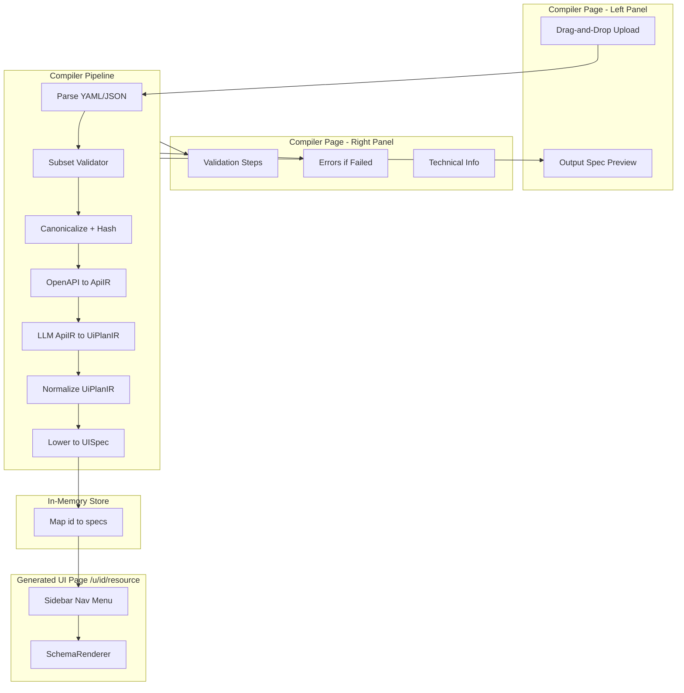

# RapidUI MVP v3 — OpenAPI Compiler Development Plan

**Reference:** [mvp_v3_blueprint.md](.cursor/mvp_v3/mvp_v3_blueprint.md)  
**Format reference:** [mvp_v2_dev_plan_complete.md](.cursor/context/mvp_v2_dev_plan_complete.md)

---

## Executive Summary

Evolve RapidUI from "JSON payload → AI → UISpec" into a **deterministic OpenAPI compiler** that treats OpenAPI as the source of truth. The main page becomes a **compiler UI**: drag-and-drop upload, progress panel, output spec. The generated UI lives at `/u/{id}/{resource}` with sidebar nav—like a real internal admin dashboard. Simulates future workflow: deploy page, user accesses by spec.

**Key invariants:**

- Same OpenAPI → same UISpec → same UI
- Unsupported constructs → hard compile errors (no guessing)
- Renderer remains unchanged; lowering produces UISpec compatible with existing SchemaRenderer

---

## Current State vs Target


| Aspect      | Current                            | Target (MVP v3)                                  |
| ----------- | ---------------------------------- | ------------------------------------------------ |
| Spec source | JSON payload (Demo/External/Paste) | OpenAPI upload only                              |
| Generation  | AI infers from sample              | Deterministic compiler pipeline                  |
| Output      | Single UISpec                      | One UISpec per resource (multi-resource OpenAPI) |
| Validation  | Zod on AI output                   | Subset validator + Zod at each stage             |
| Determinism | Best-effort (temp 0.3)             | Canonicalization, hashing, byte-stable outputs   |


---

## Blueprint Alignment

### Fully Aligned

- 7-phase implementation with CHECKPOINTs
- OpenAPI 3.0.x and 3.1.x support
- Strict subset validation (oneOf/anyOf/allOf → hard error)
- ApiIR → UiPlanIR → UISpec pipeline
- LLM as constrained classifier (labels, ordering, readOnly only)
- Error taxonomy with code, stage, message, jsonPointer
- Golden specs for snapshot testing

### Design Decisions (Resolved)

1. **Compiler page layout:** Left panel = drag-and-drop upload + output spec at bottom. Right panel = progress, validation steps, errors, technical info (like a real compiler). No embedded preview on compiler page.
2. **Output URLs:** `/{id}` where `id` = first 12 chars of `sha256(openapiCanonicalHash + sessionId)` when sessionId provided (compiler page), else first 12 chars of hash (evals). Same spec + different session → different id → shareable unique URLs. Separate paths per resource: `/u/{id}/users`, `/u/{id}/products`. Sidebar nav for switching between resources (like real internal admin UI).
3. **Persistence:** In-memory store (Map). Compilations keyed by id. Resets on server restart.
4. **Generated UI page:** `/u/[id]/[resource]` — sidebar with nav menu + SchemaRenderer for selected resource. No compiler UI, no embedded preview. No session; URLs are shareable. Anyone with the URL sees the same data.
5. **Mock backend:** Generated UI pages use a mock API (like MVP v2 Demo API). Routes `/api/mock/[id]/[resource]` for CRUD. Seed data generated from OpenAPI schemas (not predefined Demo seeds). Shared data per compilation+resource (no session). SchemaRenderer uses MockAdapter.
6. **PUT vs PATCH:** Prefer PATCH for edit view when both exist.
7. **New API route:** `POST /api/compile-openapi` for full pipeline. `GET /api/compilations/[id]` to fetch stored specs.
8. **Resource slug:** `resourceSlug = slugify(resourceName)` (e.g. "Users" → "users"). Use slugs for URLs and mock API routes; use names for sidebar labels.
9. **Session only on compiler page:** Session created once per compiler page visit (new tab = new session). Passed to compile API; id = hash(openapiHash + sessionId) for unique shareable URLs. Generated UI page has no session; anyone can access shared data.
10. **Legacy removal:** Completely remove Demo, External, and Paste JSON modes. Main page (`/`) is compiler-only. Delete: demo store, demo/external adapters, proxy, generate-ui, lib/ai/prompt.ts, lib/ai/payload-guard.ts, lib/inference/, ConnectSection, ExternalApiSection, paste flow, tests/inference/, tests/spec/fallbackGenerator.test.ts. Replace eval with OpenAPI-based eval.

---

## Supporting Documents Analysis


| Document                                                                                | Assessment                                                                                    |
| --------------------------------------------------------------------------------------- | --------------------------------------------------------------------------------------------- |
| [ApiIR_to_UiPlanIR_system_prompt.md](.cursor/mvp_v3/ApiIR_to_UiPlanIR_system_prompt.md) | Solid. Use as base for `prompt.system.txt`; minor tweaks for schema injection in user prompt. |
| [UiPlanIR_definitions.md](.cursor/mvp_v3/UiPlanIR_definitions.md)                       | Good. JSON Schema + Zod definitions are accurate; use `label` minLength=1.                    |
| [UiPlanIR_normalizer.md](.cursor/mvp_v3/UiPlanIR_normalizer.md)                         | Correct. Implement as-is; `stripUndefined` must handle optional keys for stable JSON.         |


**Corrections to apply:**

- UiPlanIR `label` in FieldPlan: allow empty string or omit; some fields may not need labels. Change to `label: z.string().optional()` (no minLength) to match "optional label" in prompt.
- Normalizer: ensure `stripUndefined` does not strip `false` or `0`; only strip `undefined`.

---

## Architecture




---

## Phase 1: OpenAPI Ingestion & Subset Validator

**Goal:** Parse OpenAPI and reject unsupported constructs early.

### Tasks

1. **OpenAPI parser** (`lib/compiler/openapi/parser.ts`): Parse YAML and JSON. Use `yaml` + native `JSON.parse`. Detect version (3.0 vs 3.1).
2. **Subset validator** (`lib/compiler/openapi/subset-validator.ts`): Validate against supported subset. Produce structured errors with `{ code, stage, message, jsonPointer }`.
3. **Error codes** (`lib/compiler/errors.ts`): Define error taxonomy: `OAS_UNSUPPORTED_SCHEMA_KEYWORD`, `OAS_MULTIPLE_SUCCESS_RESPONSES`, `OAS_MULTIPLE_TAGS`, `OAS_MISSING_REQUEST_BODY`, `OAS_MULTIPLE_PATH_PARAMS`, `OAS_EXTERNAL_REF`, `OAS_AMBIGUOUS_RESOURCE_GROUPING`, `IR_INVALID`, `UIPLAN_INVALID`, `UIPLAN_LLM_UNAVAILABLE`, `UISPEC_INVALID`, etc.
4. **Validation rules:** oneOf/anyOf/allOf → hard error; multiple success responses (200+201) → error; missing request body on POST/PUT/PATCH → error; multiple path params → error; external $ref (http/https/file) → error.
5. **Upload UI** (`components/connect/OpenApiDropZone.tsx`): Drag-and-drop zone (accept `.yaml`, `.yml`, `.json`). Click-to-browse fallback. Read file, parse, validate.
6. **Compiler page layout** (`app/page.tsx`): Replace entire page with two-panel layout. Left: drop zone + output spec at bottom. Right: progress panel.
7. **Legacy removal:** Delete `lib/demoStore/`, `lib/adapters/demo-adapter.ts`, `lib/adapters/external-adapter.ts`, `app/api/demo/`, `app/api/proxy/`, `app/api/generate-ui/`, `lib/examples.ts`, `lib/externalApiExamples.ts`, `lib/ai/prompt.ts`, `lib/ai/payload-guard.ts`, `lib/inference/` (payload-parser, spec-generator, fallback-generator, test-inference, test-payloads), `components/connect/ConnectSection.tsx`, `ExternalApiSection.tsx`, `ResourceSelector.tsx`, `VersionSelector.tsx`, `DataPathSelector.tsx`, `GenerateButton.tsx`, `GenerationSuccessToast.tsx`, paste UI. Delete `tests/inference/`, `tests/spec/fallbackGenerator.test.ts`. Update `lib/adapters/index.ts` to export only `createMockAdapter`. Keep `lib/session.ts`, `lib/adapters/types.ts`, `lib/ai/client.ts`, `lib/ai/metrics.ts`, renderer components.

### File Summary


| File                                       | Action                                      |
| ------------------------------------------ | ------------------------------------------- |
| `lib/compiler/errors.ts`                   | Create — error taxonomy, types              |
| `lib/compiler/openapi/parser.ts`           | Create — parse YAML/JSON                    |
| `lib/compiler/openapi/subset-validator.ts` | Create — validate subset                    |
| `components/connect/OpenApiDropZone.tsx`   | Create — drag-and-drop upload               |
| `components/compiler/ProgressPanel.tsx`    | Create — right panel: steps, errors, tech   |
| `app/page.tsx`                             | Replace — two-panel compiler, remove legacy |


### CHECKPOINT 1

Same invalid spec → same ordered error list. `golden_openapi_invalid_expected_failure.yaml` fails with expected errors (multiple tags, multiple success responses, multiple path params, oneOf). `golden_openapi_users_tagged_3_0.yaml` and `golden_openapi_products_path_3_1.yaml` pass validation.

---

## Phase 2: Canonicalization & Hashing

**Goal:** Produce canonical OpenAPI JSON and stable hash.

### Tasks

1. **$ref resolver** (`lib/compiler/openapi/ref-resolver.ts`): Resolve local `$ref` only (same document). Inline resolved schemas. Reject external refs.
2. **Canonicalizer** (`lib/compiler/openapi/canonicalize.ts`): Stable key ordering (e.g. alphabetical), stable array ordering. Remove ignored fields (e.g. `description`, `example` for structure; keep for annotations if needed). Produce deterministic JSON.
3. **Hashing** (`lib/compiler/hash.ts`): `sha256(JSON.stringify(canonical))` using `crypto.createHash`. `openapiCanonicalHash`.
4. **Stable stringify:** Use `fast-json-stable-stringify` (add as explicit dependency). Canonicalizer and hash use it for deterministic JSON.

### File Summary


| File                                   | Action |
| -------------------------------------- | ------ |
| `lib/compiler/openapi/ref-resolver.ts` | Create |
| `lib/compiler/openapi/canonicalize.ts` | Create |
| `lib/compiler/hash.ts`                 | Create |


### CHECKPOINT 2

Same spec with reordered keys → same canonical JSON. Same canonical JSON → same hash. Snapshot test for golden specs.

---

## Phase 3: OpenAPI → ApiIR (Deterministic) ✓

**Goal:** Convert canonical OpenAPI into pure semantic IR.

### Tasks

1. **ApiIR types** (`lib/compiler/apiir/types.ts`): Define `ApiIR`, `ResourceIR`, `OperationIR` per blueprint.
2. **Resource grouping** (`lib/compiler/apiir/grouping.ts`): If all ops have exactly one tag → group by tag. Else: strip prefixes `["api","v1","v2","v3"]`, take first segment → resource key. Ambiguous → compile error.
3. **Operation mapping** (`lib/compiler/apiir/operations.ts`): Map each operation to `OperationIR` with `kind`: GET list → `list`, GET `/{id}` → `detail`, POST → `create`, PUT/PATCH → `update`, DELETE → `delete`. CRUD only; non-CRUD → error.
4. **Schema extraction:** Resolve request/response schemas. Single canonical success response (200 or 201). `identifierParam` for detail/update/delete (single path param).
5. **ApiIR builder** (`lib/compiler/apiir/build.ts`): Orchestrate grouping + operations. Produce byte-stable ApiIR JSON.
6. **apiIrHash:** `sha256(JSON.stringify(apiIr))` with stable ordering.
7. **slugify utility** (`lib/utils/slugify.ts`): `slugify(s)` → lowercase, replace spaces with `-`, strip non-alphanumeric. Used for `resourceSlug = slugify(resourceName)` (e.g. "Users" → "users").

### ApiIR Schema (from blueprint)

```ts
ApiIR { api: { title, version }, resources: ResourceIR[] }
ResourceIR { name, key, operations: OperationIR[] }
OperationIR { id, method, kind, path, identifierParam?, requestSchema?, responseSchema }
```

### File Summary


| File                               | Action                            |
| ---------------------------------- | --------------------------------- |
| `lib/compiler/apiir/types.ts`      | Create                            |
| `lib/compiler/apiir/grouping.ts`   | Create                            |
| `lib/compiler/apiir/operations.ts` | Create                            |
| `lib/compiler/apiir/build.ts`      | Create                            |
| `lib/utils/slugify.ts`             | Create — resource name → URL slug |


### CHECKPOINT 3

ApiIR JSON is byte-stable. Golden specs produce expected ApiIR. Ambiguous grouping → compile error. Snapshot tests.

---

## Phase 4: LLM Planning (ApiIR → UiPlanIR) ✓

**Goal:** LLM does classification only (labels, ordering, readOnly). No structure invention.

### Tasks

1. **UiPlanIR schema** (`lib/compiler/uiplan/`): `uiplan.schema.json`, `uiplan.schema.ts` (Zod) from [UiPlanIR_definitions.md](.cursor/mvp_v3/UiPlanIR_definitions.md). Fix: `label` optional without minLength.
2. **System prompt** (`lib/compiler/uiplan/prompt.system.txt`): From [ApiIR_to_UiPlanIR_system_prompt.md](.cursor/mvp_v3/ApiIR_to_UiPlanIR_system_prompt.md).
3. **User prompt** (`lib/compiler/uiplan/prompt.user.ts`): Template injecting schema + ApiIR JSON. Replace `<API_IR_JSON_HERE>`.
4. **LLM invocation** (`lib/compiler/uiplan/llm-plan.ts`): Check `process.env.OPENAI_API_KEY` before calling; if missing, return `{ code: "UIPLAN_LLM_UNAVAILABLE", stage, message }`. Call OpenAI with `temperature: 0`, `response_format: { type: "json_object" }`. Retry max 2 on validation failure. Validate with Zod. Never log or hardcode API key.
5. **Normalizer** (`lib/compiler/uiplan/normalize.ts`): From [UiPlanIR_normalizer.md](.cursor/mvp_v3/UiPlanIR_normalizer.md). Sort resources by name, views in fixed order, dedupe fields, sort fields by order then path.
6. **uiPlanHash:** `sha256(stableStringify(normalized))` after normalization.
7. **Format Zod errors** (`lib/compiler/uiplan/format-errors.ts`): `formatZodError` → `{ code: "UIPLAN_INVALID", stage, jsonPointer, message }`.

### File Summary


| File                                     | Action |
| ---------------------------------------- | ------ |
| `lib/compiler/uiplan/uiplan.schema.json` | Create |
| `lib/compiler/uiplan/uiplan.schema.ts`   | Create |
| `lib/compiler/uiplan/prompt.system.txt`  | Create |
| `lib/compiler/uiplan/prompt.user.ts`     | Create |
| `lib/compiler/uiplan/llm-plan.ts`        | Create |
| `lib/compiler/uiplan/normalize.ts`       | Create |
| `lib/compiler/uiplan/format-errors.ts`   | Create |


### CHECKPOINT 4

Same ApiIR → same normalized UiPlanIR. Invalid output → retry max 2 → fail with structured error. Snapshot test.

---

## Phase 5: Lowering (UiPlanIR → UISpec)

**Goal:** Produce deterministic UISpec consumed by existing renderer.

**Input:** Lowering receives both `UiPlanIR` and `ApiIR`. UiPlanIR has field paths and layout; ApiIR has schemas for type inference (UiPlanIR has no type info).

### Tasks

1. **Lowering logic** (`lib/compiler/lowering/lower.ts`): For each resource in UiPlanIR, produce one UISpec. Map ViewPlan fields to UISpec `Field[]` (name = path, label, type from ApiIR schema, required, options for enum). `table.columns` = list view field paths. `form.fields` = create + edit merged/deduplicated. `filters` = list view string/number fields.
2. **Schema type inference:** From ApiIR schema (responseSchema for list/detail, requestSchema for create/edit): `type` → string/number/boolean/enum. `enum` → options. `required` from schema.
3. **Stable IDs:** `viewId = hash(resource + viewType)`, `fieldId = hash(resource + fieldPath)`. Use for deterministic ordering if needed.
4. **idField:** Infer from detail path param; prefer `id` if in schema. Store per-spec for mock API (ID generation, getById).
5. **Nested paths:** UISpec Field `name` supports dot paths (e.g. `profile.firstName`). Add `flattenRecord`/`unflattenRecord` utils: flatten for FormModal initialValues, unflatten on submit before adapter.create/update.
6. **Array fields:** UISpec has no array type. Exclude array-of-primitive fields from lowering for MVP.
7. **Output:** `Record<string, UISpec>` keyed by resource slug. Validate each with `UISpecSchema.parse()`.

### File Summary


| File                                       | Action                                   |
| ------------------------------------------ | ---------------------------------------- |
| `lib/compiler/lowering/lower.ts`           | Create                                   |
| `lib/compiler/lowering/schema-to-field.ts` | Create — map JSON Schema to UISpec Field |
| `lib/utils/flattenRecord.ts`               | Create — flatten nested for form         |
| `lib/utils/unflattenRecord.ts`             | Create — unflatten for API submit        |


### CHECKPOINT 5

Same UiPlanIR → byte-identical UISpec map. Each UISpec passes existing validator. Snapshot tests.

---

## Phase 6: Pipeline, Persistence & Mock Backend ✓

**Goal:** Compile OpenAPI, persist specs, expose working mock CRUD API, and show a minimal placeholder page so the "View UI" link works.

### Tasks

1. **Pipeline** (`lib/compiler/pipeline.ts`): Orchestrate parse → validate → canonicalize → apiir → llm → normalize → lower. Export `compileOpenAPI(openapiString, options?: { source?, llmPlanFn?, sessionId? })`. When `sessionId` provided: id = sha256(hash + sessionId).slice(0,12). When absent (evals): id = hash.slice(0,12). Pass `source` to llm-plan for `recordOpenAICall`. Optional `llmPlanFn` injects mock for tests (CI without API key).
2. **In-memory compilation store** (`lib/compiler/store.ts`): `Map<id, { specs, resourceNames, resourceSlugs, apiIr, openapiCanonicalHash }>`. `resourceSlugs = resourceNames.map(slugify)`. Specs keyed by slug. Store `apiIr` for seed generation.
3. **Compile API** (`app/api/compile-openapi/route.ts`): POST `{ openapi: string, sessionId?: string }`. Call `compileOpenAPI(openapi, { source: "api", sessionId })`. On success: persist (specs + apiIr), return `{ id, url, resourceNames }`. On failure: return `{ errors }`, no persist.
4. **Fetch API** (`app/api/compilations/[id]/route.ts`): GET returns `{ specs, resourceNames }` for id. 404 if not found.
5. **Schema-based seed generator** (`lib/compiler/mock/seed-generator.ts`): Generate sample records from JSON Schema (from ApiIR `responseSchema` for list). Use `type`, `enum`, `properties`, `required`. Deterministic: same schema → same seeds. Produce 3–5 sample records per resource.
6. **Mock data store** (`lib/compiler/mock/store.ts`): Per `(id, resource)`: mutable records (shared, no session). Seeds initialized from seed-generator on first access. `getRecords`, `createRecord`, `updateRecord`, `deleteRecord`, `getById`, `reset`.
7. **Mock API routes** (`app/api/mock/[id]/[resource]/route.ts`, ...): `[resource]` = slug (e.g. `users`). GET list, POST create, GET by id, PUT/PATCH update, DELETE. Use `specs[resource].idField` for ID generation and lookups. No session param — shared data.
8. **Reset endpoint** (`app/api/mock/[id]/[resource]/reset/route.ts`): POST reset restores seeds for that compilation+resource.
9. **MockAdapter** (`lib/adapters/mock-adapter.ts`): Calls `/api/mock/[id]/[resource]`. `createMockAdapter(compilationId, resource)`. No session — shareable URLs.
10. **Compiler page wiring** (`app/page.tsx`): Create session on mount (`createSessionId()`). On parse+validate success → call compile API with `{ openapi, sessionId }`. Add compile steps to progress. On success: show "View UI" link to `/u/{id}/{firstResource}`.
11. **Root redirect** (`app/u/[id]/page.tsx`): Redirect to `/u/[id]/[firstResource]`.
12. **Minimal generated UI page** (`app/u/[id]/[resource]/page.tsx`): Simple placeholder. Fetch specs from API. On 404 (stale id): show "This UI is no longer available. Re-upload the OpenAPI spec to regenerate." Otherwise: show resource name, list of resource names, and a minimal "Specs loaded" message. No SchemaRenderer yet—proves fetch + routing work.

### File Summary


| File                                              | Action                                     |
| ------------------------------------------------- | ------------------------------------------ |
| `lib/compiler/pipeline.ts`                        | Create — orchestrate full compile pipeline |
| `lib/compiler/store.ts`                           | Create — compilation store (specs + apiIr) |
| `lib/compiler/mock/fixtures.ts`                   | Create — getPredefinedData, isGoldenSpec   |
| `lib/compiler/mock/fixtures/*.json`               | Create — predefined users, products data   |
| `lib/compiler/mock/store.ts`                      | Create — per-session mock data             |
| `app/api/compile-openapi/route.ts`                | Create — full pipeline, persist            |
| `app/api/compilations/[id]/route.ts`              | Create — GET specs by id                   |
| `app/api/mock/[id]/[resource]/route.ts`           | Create — GET list, POST create             |
| `app/api/mock/[id]/[resource]/[paramId]/route.ts` | Create — GET, PUT/PATCH, DELETE            |
| `app/api/mock/[id]/[resource]/reset/route.ts`     | Create — POST reset                        |
| `lib/adapters/mock-adapter.ts`                    | Create — CRUD adapter for mock API         |
| `app/page.tsx`                                    | Update — wire compile API, "View UI" link  |
| `app/u/[id]/page.tsx`                             | Create — redirect to first resource        |
| `app/u/[id]/[resource]/page.tsx`                  | Create — minimal placeholder page          |


### CHECKPOINT 6

Compile succeeds → persist → Fetch API returns specs. Mock API works (list, create, get, update, delete, reset) via direct API calls. Compiler page shows "View UI" link. Link works: redirect → minimal page shows "Specs loaded" for resource. Same spec re-uploaded → same id.

---

## Phase 6.25: LLM Evals for Determinism

**Goal:** Prove the LLM step (ApiIR → UiPlanIR) is sufficiently deterministic before Phase 6.5 UI work. Same OpenAPI → same UISpec → same UI. **Runs before Phase 6.5** — we cannot ship UI that produces different output each time.

**Drift source:** The LLM is the only non-deterministic stage. Full-pipeline drift = LLM drift. We need both full-pipeline evals (user contract) and LLM-only evals (diagnostic isolation).

### Design Decisions (Phase 6.25)


| Decision               | Choice                          | Rationale                                                                                                                                                       |
| ---------------------- | ------------------------------- | --------------------------------------------------------------------------------------------------------------------------------------------------------------- |
| **Two fixture sets**   | OpenAPI + ApiIR (independent)   | True isolation: full pipeline fails + LLM-only passes → bug in parse/build/lower, not LLM. LLM-only reads pre-computed ApiIR from files; no pipeline code runs. |
| Fixture location       | `tests/compiler/fixtures/`      | OpenAPI: `*.yaml` (exclude invalid). ApiIR: `apiir/*.json` (generated, committed).                                                                              |
| LLM-only similarity    | UiPlanIR structural fingerprint | Mirrors UISpec approach; structural comparison vs brittle string diff.                                                                                          |
| Retry & timeout        | Eval layer only                 | Production unchanged; evals more likely to hit rate limits/timeouts.                                                                                            |
| `--replay-failures`    | Adapt for OpenAPI               | Store `{ fixtureName, runNumber, openapiPath }`; replay for debugging.                                                                                          |
| `--parallel`           | Defer                           | Sequential by default avoids rate limits; parallel adds complexity.                                                                                             |
| No valid runs          | Exit 1                          | All invalid = eval failed; CI must fail.                                                                                                                        |
| `validateSpecs` return | `{ isValid, errors, perSpec }`  | Simple pass/fail + per-resource debugging.                                                                                                                      |


### Tasks

1. **eval/utils/compile-openapi.ts:** Pipeline caller with `source: "eval"`. No `llmPlanFn` — evals always use real LLM. Wrap with retry (429/503 → retry once, 2s backoff) and per-run timeout (60s). Validation failure = no retry.
2. **eval/utils/llm-only-eval.ts:** Load ApiIR from **pre-computed fixture files** (`tests/compiler/fixtures/apiir/*.json`). No pipeline code runs. ApiIR → UiPlanIR, N runs. Call `llmPlan(apiIr, { source: "eval" })` N times. Compare via UiPlanIR fingerprint. True LLM isolation.
3. **Require OPENAI_API_KEY:** At startup, throw if missing: `OPENAI_API_KEY is required for evals. Add it to .env.local to run LLM determinism evaluation.`
4. **Validator:** Add `validateSpecs(specs: Record<string, UISpec>)` → `{ isValid: boolean; errors: string[]; perSpec: Record<string, PerSpecValidationResult> }` where `PerSpecValidationResult` includes schema + logical integrity (reuse `validateSpec` per spec). All specs must pass for overall validity.
5. **Comparator:** Add `canonicalString(specs)` — stable stringify for byte-identical comparison. Add `compareSpecsMulti(run1, run2)` — assert same slugs; per-resource fingerprint comparison; overall = **min** of per-resource (each resource must ≥90%). Add `diffCanonical(a, b)` — human-readable diff for debugging. Add UiPlanIR fingerprint + similarity for LLM-only evals.
6. **eval/eval-ai.ts:** Full pipeline evals. Load OpenAPI YAML from `tests/compiler/fixtures/*.yaml` (exclude invalid). Run `compileOpenAPI` N times **sequentially**. Per fixture: validate each run; for valid runs, assert same resource set (slugs), then `compareSpecsMulti`; overall similarity = min per-resource.
7. **eval/eval-llm-only.ts:** LLM-only evals. Load ApiIR from `tests/compiler/fixtures/apiir/*.json` (pre-computed). Run `llmPlan` N times sequentially. Compare normalized UiPlanIR via fingerprint similarity. `npm run eval:llm`.
8. **Fixtures — two independent sets:**
  - **OpenAPI** (`tests/compiler/fixtures/*.yaml`): Source for full pipeline. Exclude `golden_openapi_invalid_expected_failure.yaml`.
  - **ApiIR** (`tests/compiler/fixtures/apiir/*.json`): Pre-generated, committed. Source for LLM-only. One JSON file per OpenAPI fixture (e.g. `golden_openapi_users_tagged_3_0.json`). **Regenerate when parse/validate/build changes** via `npm run fixtures:generate-apiir`.
9. **fixtures:generate-apiir script:** Reads OpenAPI fixtures, runs parse → validate → resolve → build, writes ApiIR JSON to `apiir/`. Run after pipeline (parse/validate/build) changes; commit updated ApiIR files.
10. **Retry & timeout:** In eval layer only. Detect 429/503 from `CompileFailure` error message (e.g. "rate limit", "429", "503"); retry full compile once with 2s backoff. Per-run timeout 60s via `Promise.race`; timeout counts as invalid run.
11. **CLI:** `--quick` / `-q` (2 runs full, 5 runs llm-only), `--fixture NAME`, `--runs N`, `--output-dir DIR`, `--replay-failures`, `--json` (CI: `{ passed, validity, similarity, errors }`). No `--parallel` in Phase 6.25.

### Pass/fail criteria

- **Full pipeline:** ≥90% valid runs AND ≥90% per-resource structural similarity (min across resources). Same resource set across runs. Different slugs → fail immediately.
- **LLM-only:** ≥90% valid runs AND ≥90% UiPlanIR fingerprint similarity.
- **No valid runs:** Exit 1 (eval failed).
- On failure: diff output for prompt debugging. Exit 1 on fail, 0 on pass.

### Eval architecture

```
Fixtures (tests/compiler/fixtures/) → Full pipeline: compileOpenAPI × N (sequential)
                                    → LLM-only: parse → ApiIR → llmPlan × N (sequential)
Compare: same slugs? per-resource fingerprint ≥90%? diff on failure
```

### Stress test mitigations


| Risk                    | Mitigation                                                            |
| ----------------------- | --------------------------------------------------------------------- |
| Rate limits (429)       | Sequential by default. Retry once with 2s backoff.                    |
| Timeouts                | Per-run 60s. Timeout = invalid run.                                   |
| Different resource sets | Assert same slugs before similarity; fail fast if not.                |
| Per-resource masking    | Each resource must ≥90% independently; overall = min.                 |
| Model drift             | Log model + date in report. Re-run after prompt/schema/model changes. |


### File Summary


| File                            | Action                                                                                 |
| ------------------------------- | -------------------------------------------------------------------------------------- |
| `eval/utils/compile-openapi.ts` | Create — pipeline caller, source: "eval", retry/timeout wrapper                        |
| `eval/utils/llm-only-eval.ts`   | Create — ApiIR → UiPlanIR N runs, fingerprint comparison                               |
| `eval/utils/validator.ts`       | Update — `validateSpecs` → `{ isValid, errors, perSpec }`                              |
| `eval/utils/comparator.ts`      | Update — `canonicalString`, `compareSpecsMulti`, `diffCanonical`, UiPlanIR fingerprint |
| `eval/utils/reporter.ts`        | Update — RunResult: `specs: Record<string, UISpec>                                     |
| `eval/eval-ai.ts`               | Replace — OpenAPI from tests/compiler/fixtures, full pipeline                          |
| `eval/eval-llm-only.ts`         | Create                                                                                 |
| `eval/fixtures/`                | Remove JSON; keep failures/ for replay; read fixtures from tests/compiler/fixtures     |
| `eval/utils/ai-generator.ts`    | Delete                                                                                 |
| `eval/README.md`                | Update — OpenAPI flow, OPENAI_API_KEY required, CLI, when to run                       |
| `package.json`                  | Add `eval:llm` script                                                                  |


### CHECKPOINT 6.25

- `npm run eval:ai` runs full pipeline evals; passes with ≥90% validity + similarity.
- `npm run eval:llm` runs LLM-only evals.
- OPENAI_API_KEY required; fails fast if missing.
- Reports include diff on failure. `--json` for CI.
- No valid runs → exit 1.

### 6.25a: Mock & UI Refinement (Golden Specs, DataTable, Predefined Data)

**Completed alongside Phase 6.25.** Ref: [fix_datatable_dates_and_realistic_seeds_6074b76f.plan.md](fix_datatable_dates_and_realistic_seeds_6074b76f.plan.md)

**Golden specs only (MVP):** Support only the two golden specs. Reject non-golden at compile with 422: "Only demo specs supported. Use golden_openapi_users_tagged_3_0.yaml or golden_openapi_products_path_3_1.yaml." No adapter selection, no seed generator.

**Predefined data:** `lib/compiler/mock/fixtures/users.json` and `products.json` match the golden YAML schemas. Fixture matching via canonical OpenAPI hash. `fixtures.ts`: `getPredefinedData(hash, resourceSlug)`, `isGoldenSpec(hash)`. Run `npx tsx scripts/compute-golden-hashes.ts` to update hashes when golden YAML or canonicalizer changes.

**DataTable date display:** `lib/utils/formatDate.ts` — `formatDateForDisplay(value, formatHint?)`. ISO 8601 + Unix timestamp via date-fns. Avoids false positives (`"1"`, `"2001"` → null). DataTable uses it for string cells and nested objects.

**No Reset Data button:** Generated UI does not expose backend reset. Sidebar has nav only.

**Reset on every compile:** `clearForCompilation(id)` before `putCompilation`. Re-upload same spec (same session) → same id → mock cleared → fresh predefined data on next request.

**Removed:** `lib/compiler/mock/seed-generator.ts`, `POST /api/mock/[id]/[resource]/reset`, `resetMockData` from adapter, `store.reset()`.

---

## Phase 6.5: Full Generated UI Page

**Goal:** Replace minimal page with full SchemaRenderer UI: sidebar nav, CRUD from UI, flatten/unflatten for nested forms. (No Reset Data button — mock clears on re-compile per 6.25a.)

### Tasks

1. **CompiledUISidebar** (`components/compiler/CompiledUISidebar.tsx`): Sidebar nav with links to `/u/[id]/[resource]` for each resource. Display names (e.g. "Users", "Products").
2. **Full resource page** (`app/u/[id]/[resource]/page.tsx`): Replace minimal placeholder. Layout: sidebar + main content. Fetch specs from API. Create `MockAdapter` without session. Pass spec + adapter to SchemaRenderer. Wire flatten/unflatten: use `flattenRecord` for FormModal initialValues, `unflattenRecord` on submit before adapter.create/update.
3. **404 handling:** On stale id (fetch 404): show "This UI is no longer available. Re-upload the OpenAPI spec to regenerate."

### File Summary


| File                                        | Action                                  |
| ------------------------------------------- | --------------------------------------- |
| `components/compiler/CompiledUISidebar.tsx` | Create — sidebar nav                    |
| `app/u/[id]/[resource]/page.tsx`            | Replace — full sidebar + SchemaRenderer |


### CHECKPOINT 6.5

"View UI" link works. Generated UI shows seeded data from OpenAPI schemas. Full CRUD (list, create, edit, delete) from UI. Reset restores seeds. Shared data — URLs are shareable; anyone with the link sees the same data.

---

## Phase 7: Determinism Harness, Golden Specs & Eval Update

**Goal:** Prove compiler correctness. Update eval harness for OpenAPI pipeline.

### Tasks

1. **Snapshot tests** (`tests/compiler/`):
  - `canonical.test.ts`: Golden specs → canonical JSON snapshot
  - `apiir.test.ts`: Golden specs → ApiIR snapshot
  - `uiplan.test.ts`: ApiIR → UiPlanIR (mock LLM or fixture) → normalized snapshot
  - `lowering.test.ts`: UiPlanIR fixture → UISpec snapshot
  - `invalid.test.ts`: `golden_openapi_invalid_expected_failure.yaml` → assert fails with expected error codes + order
2. **Full pipeline test:** Golden Users spec → full compile → UISpec snapshot. Golden Products spec → same. Use `llmPlanFn` fixture to avoid real LLM in CI; optional real-LLM run when `OPENAI_API_KEY` set.
3. **Golden spec location:** Copy or symlink `.cursor/mvp_v3/specs/*.yaml` to `tests/compiler/fixtures/` for test access.
4. **Eval harness update** (`eval/`): Replace payload-based eval with OpenAPI-based eval.
  - **Fixtures:** Use OpenAPI specs (golden_users.yaml, golden_products.yaml) instead of JSON payloads.
  - **Entry point:** Call `compileOpenAPI(openapiString)` from pipeline (export testable function).
  - **Metrics:** `llm-plan.ts` accepts optional `source` param; pass `"eval"` for eval runs so `recordOpenAICall` uses `source: "eval"`.
  - **Tests:** Structural validity (UISpec passes schema), determinism (same OpenAPI → same UISpec across N runs), stability metrics.
  - **Remove:** Old `eval/utils/ai-generator.ts` (payload → UISpec). Create `eval/utils/compile-openapi.ts` that calls pipeline.
  - **Keep:** `eval/utils/validator.ts`, `comparator.ts`, `reporter.ts`; adapt for `Record<slug, UISpec>` (validate each spec, fingerprint multi-spec output).
5. **Eval legacy removal:** Delete `eval/fixtures/*.json` (payload fixtures). Replace with OpenAPI fixtures or symlink to `tests/compiler/fixtures/`. Update `eval/README.md`.
6. **CI:** Snapshot tests and eval must pass. Any change to spec or compiler invalidates snapshots.

### File Summary


| File                               | Action                                          |
| ---------------------------------- | ----------------------------------------------- |
| `tests/compiler/fixtures/`         | Create — golden specs                           |
| `tests/compiler/canonical.test.ts` | Create                                          |
| `tests/compiler/apiir.test.ts`     | Create                                          |
| `tests/compiler/uiplan.test.ts`    | Create — fixture-based, no LLM                  |
| `tests/compiler/lowering.test.ts`  | Create — fixture → UISpec                       |
| `tests/compiler/invalid.test.ts`   | Create                                          |
| `tests/compiler/pipeline.test.ts`  | Create — full E2E, mock LLM                     |
| `eval/utils/compile-openapi.ts`    | Create — calls pipeline, source: "eval"         |
| `eval/eval-ai.ts`                  | Update — use OpenAPI fixtures, compile pipeline |
| `eval/README.md`                   | Update — OpenAPI flow, new fixtures             |
| `lib/compiler/uiplan/llm-plan.ts`  | Update — optional source param for metrics      |


### CHECKPOINT 7

Same input compiled twice → byte-identical outputs. Invalid spec fails with expected errors. Eval runs with OpenAPI fixtures; determinism and validity metrics reported.

---

## Page Integration Summary

### Compiler Page (main page)

1. **Layout:** Two panels. Left: drag-and-drop zone + output spec preview at bottom. Right: progress panel with validation steps, errors, technical info.
2. **Flow:** User drops file → parse → validate → (on success) compile → progress updates per stage → persist → show "View UI" link to `/u/{id}/{firstResource}`.
3. **On failure:** Errors listed in right panel. No link. User can fix and re-upload.

### Generated UI Page (`/u/[id]/[resource]`)

**Phase 6:** Minimal placeholder—fetch specs, show "Specs loaded" for resource. Proves routing and fetch work.

**Phase 6.5:** Full UI.

1. **Layout:** Sidebar (nav menu: Users, Products, etc.) + main content (SchemaRenderer).
2. **Data:** Fetch specs from `GET /api/compilations/[id]`. Use `MockAdapter` for CRUD. Seed data generated from OpenAPI schemas. Shared per compilation; Reset Data restores seeds for all viewers.
3. **Navigation:** Sidebar links to `/u/[id]/users`, `/u/[id]/products`. Reset Data button.

---

## File Structure (New/Modified)

```
lib/
  compiler/
    errors.ts
    hash.ts
    pipeline.ts
    store.ts              # In-memory compilation store (specs + apiIr)
    mock/
      seed-generator.ts   # Schema-based sample data
      store.ts            # Per-session mock data
    openapi/
      parser.ts
      subset-validator.ts
      ref-resolver.ts
      canonicalize.ts
    apiir/
      types.ts
      grouping.ts
      operations.ts
      build.ts
    uiplan/
      uiplan.schema.json
      uiplan.schema.ts
      prompt.system.txt
      prompt.user.ts
      llm-plan.ts
      normalize.ts
      format-errors.ts
    lowering/
      lower.ts
      schema-to-field.ts
      README.md            # Array exclusion, future array support
  adapters/
    mock-adapter.ts       # CRUD adapter for mock API
  utils/
    slugify.ts            # Resource name → URL slug
    flattenRecord.ts      # Nested → flat for form
    unflattenRecord.ts    # Flat → nested for API

app/
  api/
    compile-openapi/
    compilations/
      [id]/
    mock/
      [id]/
        [resource]/
          route.ts        # GET list, POST create
          [paramId]/
            route.ts      # GET, PUT/PATCH, DELETE
  u/
    [id]/
      page.tsx           # Redirect to first resource
      [resource]/
        page.tsx         # Sidebar + SchemaRenderer

components/
  connect/
    OpenApiDropZone.tsx
  compiler/
    ProgressPanel.tsx
    CompiledUISidebar.tsx

eval/
  utils/
    compile-openapi.ts   # Calls pipeline, source: "eval", retry/timeout
    llm-only-eval.ts     # ApiIR → UiPlanIR, N runs (Phase 6.25)
  eval-ai.ts             # Full pipeline evals (Phase 6.25)
  eval-llm-only.ts       # LLM-only evals (Phase 6.25)
  README.md              # Updated docs
  fixtures/failures/     # Saved failures for --replay-failures (reads from tests/compiler/fixtures)

tests/
  compiler/
    fixtures/
    canonical.test.ts
    apiir.test.ts
    uiplan.test.ts
    lowering.test.ts
    invalid.test.ts
    pipeline.test.ts
```

---

## Error Taxonomy (Stable)


| Code                              | Stage        |
| --------------------------------- | ------------ |
| `OAS_PARSE_ERROR`                 | Parse        |
| `OAS_UNSUPPORTED_SCHEMA_KEYWORD`  | Subset       |
| `OAS_MULTIPLE_SUCCESS_RESPONSES`  | Subset       |
| `OAS_MULTIPLE_TAGS`               | Subset       |
| `OAS_MISSING_REQUEST_BODY`        | Subset       |
| `OAS_MULTIPLE_PATH_PARAMS`        | ApiIR        |
| `OAS_AMBIGUOUS_RESOURCE_GROUPING` | ApiIR        |
| `OAS_EXTERNAL_REF`                | Canonicalize |
| `IR_INVALID`                      | ApiIR        |
| `UIPLAN_INVALID`                  | UiPlan       |
| `UIPLAN_LLM_UNAVAILABLE`          | UiPlan       |
| `UISPEC_INVALID`                  | Lowering     |


---

## Environment & API Keys

- **OPENAI_API_KEY:** Read from `process.env.OPENAI_API_KEY` only. Never hardcode or log. Missing → `UIPLAN_LLM_UNAVAILABLE` structured error. Document in `.env.example` and README.

---

## Success Criteria

- OpenAPI upload produces UI end-to-end with seeded data and full CRUD
- Same OpenAPI → same UISpec → same UI
- All unsupported constructs fail loudly with structured errors
- Renderer compatible (flatten/unflatten for nested forms)
- Golden specs: Users and Products compile; invalid spec fails predictably
- Legacy Demo/External/Paste removed; compiler-only flow

---

## Open Questions / Future Work

1. **OpenAPI + Base URL:** Connect compiled spec to real API (adapter from OpenAPI + base URL). Out of scope for MVP v3.
2. **Spec from URL:** User provides URL to fetch OpenAPI spec. Compile on fetch. Future.
3. **Spec from GitHub repo:** User connects repo; watch spec file for changes; regenerate on update; UI auto-updates. Future.
4. **UiPlanIR schema evolution:** If schema changes, version the prompt and schema files.
5. **LLM model:** Use `gpt-4o-mini` for cost; consider `gpt-4o` for complex schemas if needed.

**When to run eval (Phase 6.25):** After changes to UiPlanIR prompts (`lib/compiler/uiplan/prompt.*`), schema (`uiplan.schema.ts`), or LLM model/temperature. Eval uses OpenAPI fixtures and reports determinism and validity metrics. **Run before Phase 6.5** — evals must pass before shipping full UI.

---

## Stress Test Analysis

See [.cursor/plans/mvp_v3_stress_test_analysis.md](.cursor/plans/mvp_v3_stress_test_analysis.md) for detailed discrepancy analysis, edge cases, and recommended adjustments. Key findings incorporated into this plan: resource slug, idField flow, flatten/unflatten for nested forms, array field exclusion, Phase 7 test coverage.

---

## Implementation Todo List

- **Phase 1 — OpenAPI Ingestion & Subset Validator**
  - lib/compiler/errors.ts — error taxonomy (incl. UIPLAN_LLM_UNAVAILABLE)
  - lib/compiler/openapi/parser.ts — parse YAML/JSON
  - lib/compiler/openapi/subset-validator.ts — validate subset
  - components/connect/OpenApiDropZone.tsx — drag-and-drop upload
  - components/compiler/ProgressPanel.tsx — right panel
  - app/page.tsx — two-panel compiler layout
  - Legacy removal — delete demo/external/paste, adapters, inference, etc.
- **Phase 2 — Canonicalization & Hashing** ✓
  - ✓ npm install fast-json-stable-stringify (explicit dep)
  - ✓ lib/compiler/openapi/ref-resolver.ts
  - ✓ lib/compiler/openapi/canonicalize.ts
  - ✓ lib/compiler/hash.ts
- **Phase 3 — OpenAPI → ApiIR** ✓
  - ✓ lib/compiler/apiir/types.ts
  - ✓ lib/compiler/apiir/grouping.ts
  - ✓ lib/compiler/apiir/operations.ts
  - ✓ lib/compiler/apiir/build.ts
  - ✓ lib/utils/slugify.ts
- **Phase 4 — LLM Planning (ApiIR → UiPlanIR)** ✓
  - ✓ lib/compiler/uiplan/uiplan.schema.json
  - ✓ lib/compiler/uiplan/uiplan.schema.ts
  - ✓ lib/compiler/uiplan/prompt.system.txt
  - ✓ lib/compiler/uiplan/prompt.user.ts
  - ✓ lib/compiler/uiplan/llm-plan.ts — OPENAI_API_KEY check, optional source param
  - ✓ lib/compiler/uiplan/normalize.ts
  - ✓ lib/compiler/uiplan/format-errors.ts
- **Phase 5 — Lowering (UiPlanIR → UISpec)** ✓
  - ✓ lib/compiler/lowering/lower.ts
  - ✓ lib/compiler/lowering/schema-to-field.ts
  - ✓ lib/compiler/lowering/README.md — array exclusion, future array support
  - ✓ lib/utils/flattenRecord.ts
  - ✓ lib/utils/unflattenRecord.ts
- **Phase 6 — Pipeline, Persistence & Mock Backend** ✓
  - ✓ lib/compiler/pipeline.ts — compileOpenAPI with optional llmPlanFn
  - ✓ lib/compiler/store.ts — globalThis for dev hot-reload persistence
  - ✓ lib/compiler/mock/seed-generator.ts
  - ✓ lib/compiler/mock/store.ts
  - ✓ app/api/mock/[id]/[resource]/route.ts
  - ✓ app/api/mock/[id]/[resource]/[paramId]/route.ts
  - ✓ app/api/mock/[id]/[resource]/reset/route.ts
  - ✓ lib/adapters/mock-adapter.ts
  - ✓ app/api/compile-openapi/route.ts
  - ✓ app/api/compilations/[id]/route.ts
  - ✓ app/page.tsx — wire compile API, UISpec output, View UI links
  - ✓ app/u/[id]/page.tsx — redirect to first resource
  - ✓ app/u/[id]/[resource]/page.tsx — minimal placeholder page
- **Phase 6.25 — LLM Evals for Determinism** ✓
  - ✓ eval/utils/compile-openapi.ts — pipeline caller, source: "eval", retry/timeout wrapper
  - ✓ eval/utils/llm-only-eval.ts — ApiIR → UiPlanIR N runs, UiPlanIR fingerprint comparison, diff on failure
  - ✓ eval/utils/validator.ts — validateSpecs → { isValid, errors, perSpec }
  - ✓ eval/utils/comparator.ts — canonicalString, compareSpecsMulti, diffCanonical, UiPlanIR fingerprint
  - ✓ eval/eval-ai.ts — full pipeline, read fixtures from tests/compiler/fixtures, reports, diff on failure
  - ✓ eval/eval-llm-only.ts — LLM-only evals, reports, diff on failure for prompt debugging
  - ✓ eval/fixtures/ — remove JSON; keep failures/ for replay
  - ✓ eval/utils/ai-generator.ts — delete
  - ✓ eval/README.md — update
  - ✓ package.json — add eval:llm script
- **Phase 6.5 — Full Generated UI Page**
  - components/compiler/CompiledUISidebar.tsx — sidebar nav + Reset Data
  - app/u/[id]/[resource]/page.tsx — replace with full SchemaRenderer + adapter
- **Phase 7 — Determinism Harness, Golden Specs & Eval**
  - tests/compiler/fixtures/ — golden specs
  - tests/compiler/canonical.test.ts
  - tests/compiler/apiir.test.ts
  - tests/compiler/uiplan.test.ts
  - tests/compiler/lowering.test.ts
  - tests/compiler/invalid.test.ts
  - tests/compiler/pipeline.test.ts — use llmPlanFn fixture for CI
  - eval/utils/compile-openapi.ts — pipeline caller, source: "eval"
  - eval/eval-ai.ts — update for OpenAPI fixtures
  - eval/README.md — update docs
  - lib/compiler/uiplan/llm-plan.ts — optional source param
  - Legacy: delete eval/utils/ai-generator.ts, eval/fixtures/*.json

