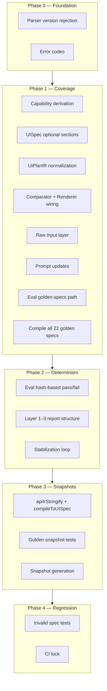

# RapidUI MVP v3 — Implementation Blueprint

## Current State vs Blueprint


| Blueprint Stage           | Current State                                                                  | Gap                                                                                                         |
| ------------------------- | ------------------------------------------------------------------------------ | ----------------------------------------------------------------------------------------------------------- |
| Raw input layer           | None — compile receives string directly                                        | Add UTF-8/LF normalization, raw spec hash, persist hash (Phase 1)                                           |
| Parse                     | Exists in [lib/compiler/openapi/parser.ts](lib/compiler/openapi/parser.ts)     | Reject unsupported versions (2.x, 1.x, missing, malformed) before any compiler work; stable error code      |
| Subset validation         | Exists; generic error codes                                                    | Add stable codes: `OAS_UNSUPPORTED_ONEOF`; use existing `OAS_INVALID_RESPONSE_STRUCTURE` for primitive root |
| Reference resolution      | Exists; rejects external refs                                                  | Already has `OAS_EXTERNAL_REF`                                                                              |
| Canonicalization          | Exists                                                                         | Minor: canonical hash output                                                                                |
| ApiIR                     | Exists                                                                         | Array-root/wrapped-list normalization                                                                       |
| **Capability derivation** | **Missing** — mock-adapter hardcodes all true                                  | **New stage**: derive from operations, **embed in ApiIR** (`apiIr.resources[].capabilities`)                |
| LLM phase                 | Exists                                                                         | Update prompt: renderer constraints, nested paths, JSON fallback                                            |
| UiPlanIR normalize        | Exists in [lib/compiler/uiplan/normalize.ts](lib/compiler/uiplan/normalize.ts) | Validate `field.path` exists in ApiIR; reject invented fields                                               |
| Lowering                  | Exists                                                                         | UISpec optional sections (`table?`, `form?`, `detail?`, `filters?`); capability-driven modes                |
| Renderer                  | Exists; adapter has capabilities                                               | Renderer receives UISpec + capabilities only (never ApiIR); derive mode from capabilities at render time    |
| Evals                     | `eval:ai`, `eval:llm` with similarity                                          | Hash-based pass/fail; 20 runs; Layer 1–3 report structure                                                   |
| Snapshots                 | Golden plan: ApiIR only                                                        | Add UISpec snapshots after determinism                                                                      |
| Invalid spec regression   | 1 test, 1 spec                                                                 | Dedicated specs per error type; stable error codes                                                          |


---

## Build Order (Blueprint Phases)




---

## Phase 0 — Foundation

**Goal:** Early validation and stable error codes. Must pass before Phase 1.

**Dependencies:** None.

### 0.1 Parser Version Rejection

- **Update** [lib/compiler/openapi/parser.ts](lib/compiler/openapi/parser.ts): reject unsupported OpenAPI versions before any meaningful parse.
- Accept only supported 3.x versions. Reject `2.x`, `1.x`, missing version, malformed version string.
- **Add** `OAS_UNSUPPORTED_VERSION` to [lib/compiler/errors.ts](lib/compiler/errors.ts).

**Checkpoint 0.1:** Run `parseOpenAPI` on OpenAPI 2.0 and 1.0 specs → expect `{ success: false, error: { code: "OAS_UNSUPPORTED_VERSION" } }`. Run on valid 3.x spec → parse succeeds. Unit test in `tests/compiler/parser.test.ts` or similar.

### 0.2 Error Codes (prerequisite for later phases)

- **Add** `UIPLAN_INVENTED_FIELD_PATH` to [lib/compiler/errors.ts](lib/compiler/errors.ts).
- **Add** `OAS_UNSUPPORTED_ONEOF` to [lib/compiler/errors.ts](lib/compiler/errors.ts) (Phase 4 subset-validator will emit it).

**Checkpoint 0.2:** `npm test` passes; no new failures. Error codes exist and are exported.

---

**Phase 0 Exit Criteria:** Parser rejects unsupported versions with stable code; error codes added. `npm test` green.

---

## Phase 1 — Coverage

**Goal:** All 22 golden specs compile end-to-end into valid UISpecs.

**Dependencies:** Phase 0 complete.

### 1.1 Capability Derivation (new)

- **Create** `lib/compiler/apiir/capabilities.ts`
- Derive per-resource `{ list, detail, create, update, delete }` from `ResourceIR.operations`
- **Embed in ApiIR:** Compute once after `buildApiIR`, store as `apiIr.resources[].capabilities`
- **Lowering receives capabilities explicitly** — pipeline pattern:

```
  apiIr = buildApiIR(...)
  deriveCapabilities(apiIr)
  capabilitiesBySlug = { [r.key]: r.capabilities for r in apiIr.resources }
  uiSpec = lower(apiIr, uiPlan, capabilitiesBySlug)
```

- **Signature:** `lower(apiIr, uiPlan, capabilitiesBySlug: Record<string, Capabilities>)` — UiPlanIR may contain multiple resources; each resource receives its own capabilities keyed by slug.
- **Rule:** Lowering may receive ApiIR for structural lowering, but capability decisions must come only from the explicit `capabilitiesBySlug` argument, never inferred ad hoc from operations inside lowering.

**Checkpoint 1.1:** Unit test: given a ResourceIR with `GET /items` and `POST /items`, `deriveCapabilities` returns `{ list: true, detail: false, create: true, update: false, delete: false }`. Pipeline embeds capabilities in `apiIr.resources[].capabilities`. `lower()` receives `capabilitiesBySlug` and uses it (no ad hoc inference). `npm test` passes.

### 1.2 UISpec Optional Sections

- **Update** [lib/spec/schema.ts](lib/spec/schema.ts): make `table`, `form`, `filters` optional; make `.refine()` checks conditional
- Add optional `detail?: { fields: string[] }`
- **Update** [lib/compiler/lowering/lower.ts](lib/compiler/lowering/lower.ts): only emit sections when capabilities allow
- **Add `assertCapabilityConsistency()`** in lowering: if `capabilities.list` → table must exist; if `capabilities.create` → form must exist
- **Add `validateUISpecAgainstCapabilities()`** — enforce strictly:

```
  Lower → validateUISpecAgainstCapabilities → return UISpec → snapshot
  

```

  Never snapshot unvalidated output. Prevents corrupt snapshots.

- **Renderer:** Handle missing sections gracefully; derive mode from capabilities at render time (do not store mode)
- **Comparator:** [eval/utils/comparator.ts](eval/utils/comparator.ts) — `extractFingerprint` must tolerate missing sections:
  - `spec.table?.columns ?? []`
  - `spec.form?.fields ?? []`
  - `spec.filters ?? []`
  - `spec.detail?.fields ?? []`
- **Snapshot tests:** Accept optional sections; never assume presence

**Checkpoint 1.2:** Schema allows `table?`, `form?`, `detail?`, `filters?`. Lowering emits sections only when capabilities allow. `assertCapabilityConsistency` and `validateUISpecAgainstCapabilities` run after lower. Unit test: resource with only `list` → UISpec has `table`, no `form`. `npm test` passes.

### 1.3 UiPlanIR Normalization (from Supporting Improvements)

- **Update** [lib/compiler/uiplan/normalize.ts](lib/compiler/uiplan/normalize.ts): validate every `field.path` exists in ApiIR when `apiIr` is passed.
- **Fail hard on invented paths** — `!apiIrPathSet.has(field.path)` → throw `CompilerError("UIPLAN_INVENTED_FIELD_PATH")`.
- **Freeze ordering:** `fields.sort((a,b) => (a.order ?? 0) - (b.order ?? 0) || a.path.localeCompare(b.path))` inside normalization, NOT in lowering.
- **Production pipeline always passes `apiIr`** to `normalizeUiPlanIR(uiPlan, apiIr)`.

**Checkpoint 1.3:** Unit test: `normalizeUiPlanIR` with invented `field.path` → throws `UIPLAN_INVENTED_FIELD_PATH`. Valid paths → no throw. Field ordering is stable. `npm test` passes.

### 1.4 Comparator + Renderer Wiring

- **Update** [eval/utils/comparator.ts](eval/utils/comparator.ts): `extractFingerprint` tolerates missing sections — `spec.table?.columns ?? []`, `spec.form?.fields ?? []`, `spec.filters ?? []`, `spec.detail?.fields ?? []`.
- **Update** [lib/adapters/mock-adapter.ts](lib/adapters/mock-adapter.ts): accept capabilities param.
- **Update** [app/u/[id]/[resource]/page.tsx](app/u/[id]/[resource]/page.tsx) and [CompiledUIContent](components/compiler/CompiledUIContent.tsx): pass capabilities from `apiIr.resources[]` to adapter.
- **Update** [components/renderer/SchemaRenderer.tsx](components/renderer/SchemaRenderer.tsx): handle missing sections; derive mode from capabilities at render time.

**Checkpoint 1.4:** `extractFingerprint(spec)` with missing `table`/`form` does not throw. Renderer renders a list-only resource without form. `npm test` passes; manual smoke test in dev app.

### 1.5 Capability Specs Setup + Eval Validation (Before Prompt Updates)

Before updating the LLM prompt, validate that the pipeline and evals work correctly across the capability matrix. **Minimal set** — focus on capability coverage; more evals on golden specs later. Use standard eval report output (no separate findings doc).

**Path/schema reference:** [docs/openapi-subset-v1.md](docs/openapi-subset-v1.md) — supported methods (GET, POST, PUT, PATCH, DELETE), path structure, request/response rules.

**1.5a Fixture setup**

- **Create** `tests/compiler/fixtures/capability-specs/` folder (similar to `demo/`)
- **Move** the four existing specs from `fixtures/` root into `capability-specs/`:
  - `create-only-spec.yaml` — POST only
  - `detail-only-spec.yaml` — GET /{id} only
  - `list-only-spec.yaml` — GET list only
  - `list-detail-only-spec.yaml` — GET list + GET /{id} (read-only)
- **Create** additional specs (OpenAPI 3.0.3, single resource `/items` or `/items/{id}`; follow [openapi-subset-v1.md](docs/openapi-subset-v1.md) for supported paths and schema):
  - `update-only-spec.yaml` — PATCH /{id} only (form from update)
  - `list-create-spec.yaml` — GET list + POST (table + form, no detail)
  - `list-detail-create-spec.yaml` — GET list + GET /{id} + POST
  - `list-detail-update-spec.yaml` — GET list + GET /{id} + PATCH
  - `list-detail-create-update-spec.yaml` — GET list + GET /{id} + POST + PATCH (CRUD minus delete)
  - `list-detail-delete-spec.yaml` — GET list + GET /{id} + DELETE (no form when only delete)
  - `create-update-spec.yaml` — POST + PATCH /{id} (form only, both create and update)
  - `detail-update-spec.yaml` — GET /{id} + PATCH (detail + form, no list)
- **Do NOT create** `list-create-update-spec.yaml` — we do not support edit without GET for individual item (simplify: require list, detail, create, update when update is present).
- **Update** [scripts/generate-apiir-fixtures.ts](scripts/generate-apiir-fixtures.ts): add capability-specs source; **call `deriveCapabilities(apiIr)`** before writing so fixtures match pipeline output (ApiIR must include capabilities).
- **Update** [tests/compiler/lowering.test.ts](tests/compiler/lowering.test.ts): change `loadApiIr` paths to `capability-specs/list-only-spec.yaml`, etc.
- **Run** `npm run fixtures:generate-apiir` — produces `tests/compiler/fixtures/apiir/capability-specs/*.json`

**Capability → section mapping (for validation):**


| Capabilities                    | Expected sections                |
| ------------------------------- | -------------------------------- |
| list only                       | table, filters                   |
| detail only                     | detail                           |
| create only                     | form                             |
| update only                     | form                             |
| list + detail                   | table, detail, filters           |
| list + create                   | table, form, filters             |
| list + detail + create          | table, detail, form, filters     |
| list + detail + update          | table, detail, form, filters     |
| list + detail + create + update | table, detail, form, filters     |
| list + detail + delete          | table, detail, filters (no form) |


**1.5b Eval runs**

- **Run** `npm run eval:llm -- --dir capability-specs --runs 5` — validate LLM returns correct UiPlanIR (no invented table/form/detail when capability is absent)
- **Run** `npm run eval:ai -- --dir capability-specs --runs 5` — validate full pipeline produces valid UISpecs; sections match capabilities per table above
- **Use standard eval reports** — no separate findings doc; eval output goes to `eval/reports/` as usual.

**Checkpoint 1.5b:** Evals complete without crashes for all capability specs. Fix any capability/lowering/renderer issues before prompt work.

### 1.5c Prompt Updates

- **Update** [lib/compiler/uiplan/prompt.system.txt](lib/compiler/uiplan/prompt.system.txt): clarify label rules, ordering rules, nested path handling, readOnly behavior, JSON fallback, deterministic constraints
- **Keep prompt focused:** LLM decides labels, ordering, readOnly only. Do NOT have LLM think about table columns, filters, navigation, actions — those belong to lowering
- **Encode principles, not examples** — no spec-specific hacks (e.g. "if resource is Task, put title first")
- Skip `hidden` field for MVP v3

**Checkpoint 1.5c:** Prompt file updated. No automated checkpoint — defer validation to 1.8 (golden compile). If golden compile fails due to LLM output, iterate prompt here.

### 1.6 Raw Input Layer

- Add input normalization before parse: UTF-8, LF line endings
- Compute `sha256(rawSpec)` → **rawSpecHash**
- **Persist `rawSpecHash` in storage** and **return it from `CompileSuccess`**
- **Canonical hash** = compiler-stage artifact only; do not treat it as user-input identity. Keep for internal diagnostics if needed.
- **Contract:** `rawSpecHash` = user input identity; canonical hash = compiler artifact; UISpec hash = output identity

#### Raw input layer — storage wiring

Persist rawSpecHash through the compile pipeline.

**Affected files:**

- `lib/compiler/pipeline.ts` — compute rawSpecHash; include in CompileSuccess
- `app/api/compile-openapi/route.ts` — store rawSpecHash
- `app/api/compilations/[id]/update/route.ts` — store rawSpecHash
- `lib/db/compilations.ts` — add rawSpecHash field; update rowToEntry / putCompilation
- `lib/compiler/mock/store.ts` — add rawSpecHash to mock entries

**Checkpoint 1.6:** `CompileSuccess` includes `rawSpecHash`. API routes and DB persist it. Migration `002_add_raw_spec_hash.sql` applied. Unit test: compile returns same `rawSpecHash` for same input. `npm test` passes.

### 1.7 Eval Golden-Specs Path + compileToApiIR

- **Add** `compileToApiIR(spec: string): ApiIR` to [lib/compiler/pipeline.ts](lib/compiler/pipeline.ts): sync, parse → validate → resolve → buildApiIR; no LLM. Throws on failure.
- **Add** `generate:apiir-fixtures` script: reads golden-specs, runs `compileToApiIR`, writes to `fixtures/apiir/golden-specs/{archetype}.json`.
- **Update** [eval/eval-ai.ts](eval/eval-ai.ts): when `--dir golden-specs`, resolve to `tests/compiler/golden-specs/`; scan subdirs; take first `.yaml`/`.yml` per subdir.
- **Update** [eval/eval-llm-only.ts](eval/eval-llm-only.ts): when `--dir golden-specs`, load ApiIR from `fixtures/apiir/golden-specs/{archetype}.json`.

**Checkpoint 1.7:** `compileToApiIR` exists and works. `npm run generate:apiir-fixtures` (or `fixtures:generate-apiir --golden`) populates fixtures. `npm run eval:ai -- --dir golden-specs --quick` discovers 22 specs. `npm run eval:llm -- --dir golden-specs --quick` runs using fixtures.

### 1.8 Golden Spec Compilation

- **Single source:** [tests/compiler/golden-specs/](tests/compiler/golden-specs/) is the only golden-spec root
- **Structure:** Each archetype is one subdirectory; each subdir contributes exactly one `.yaml` or `.yml`
- **Evals:** When `--dir golden-specs`, resolve to `tests/compiler/golden-specs/` (not `tests/compiler/fixtures/golden-specs/`). Scan subdirs in sorted order; take first `.yaml`/`.yml` per subdir
- Run full pipeline on all 22 golden specs; fix failures until all produce valid UISpecs
- **Prompt stabilization rules:** During Phase 1–2, prompt changes are expected — but only generalizable rule improvements (clarify label/ordering/nested path/readOnly/JSON fallback). Forbidden: spec-specific hacks (e.g. "if resource is Task, put title first")
- **Operational rule:** Do not change prompt and code in same stabilization cycle. Loop: fix prompt OR fix code, then run eval again. Not both — otherwise debugging becomes chaotic

**Checkpoint 1.8:** `npm run eval:ai -- --dir golden-specs --runs 3` completes; all 22 archetypes produce valid UISpecs (no compile failures). Fix any failures (prompt OR code per cycle) until green. Manual smoke test: compile a golden spec in the app, view rendered UI.

---

**Phase 1 Exit Criteria:** All 22 golden specs compile end-to-end. Evals run on golden-specs path. Renderer handles optional sections. `rawSpecHash` persisted. `npm test` green.

---

## Phase 2 — Determinism

**Goal:** Evals show stable UiPlanIR and UISpec outputs (unique hashes = 1 across 20 runs).

**Dependencies:** Phase 1 complete (all 22 compile; evals run on golden-specs).

### 2.1 Eval Hash-Based Pass/Fail

- **Update** [eval/eval-ai.ts](eval/eval-ai.ts) and [eval/eval-llm-only.ts](eval/eval-llm-only.ts): use hashes for pass/fail
- **Quick mode:** `--runs 5` for development (saves API time); use `--runs 20` only before snapshot generation
- Exit criteria: For each spec, unique UiPlanIR hashes = 1 and unique UISpec hashes = 1 (across 20 runs)

**Checkpoint 2.1:** Evals compute and report unique UiPlanIR/UISpec hash counts per spec. Pass = unique hashes = 1. `npm run eval:ai -- --dir golden-specs --runs 3` and `eval:llm` produce hash-based pass/fail (may not pass yet).

### 2.2 Eval Report Structure (Blueprint Layers)

- **Layer 1 — Summary:** spec name, runs, success rate, unique UiPlanIR/UISpec hashes, determinism pass/fail
- **Layer 2 — Stage analysis:** canonical stable? ApiIR stable? UiPlanIR stable? UISpec stable?
- **Layer 3 — Diff breakdown (enough to debug, not a mini observability platform):** first divergent run index, unique hash counts, unified diff, counts for label/order/readOnly/field-presence deltas
- **Update** [eval/utils/report-schema.ts](eval/utils/report-schema.ts)

**Checkpoint 2.2:** Report includes Layer 1 (summary), Layer 2 (stage analysis), Layer 3 (diff breakdown). `diffUnified` used for divergence output. Report schema updated.

### 2.3 Stabilization Loop

- Run `eval:llm` on golden specs; inspect diff reports; tighten prompt/normalization; move rules out of LLM if needed
- Run `eval:ai`; fix lowering/normalization instability; repeat until exit criteria met
- **Fix prompt OR fix code per cycle** — never both in same iteration. Otherwise debugging becomes chaotic

**Checkpoint 2.3:** `npm run eval:llm -- --dir golden-specs --runs 20` → unique UiPlanIR hashes = 1 for all specs. `npm run eval:ai -- --dir golden-specs --runs 20` → unique UISpec hashes = 1 for all specs. Use `--runs 5` during dev; 20 only for final verification.

---

**Phase 2 Exit Criteria:** For each of 22 golden specs, unique UiPlanIR hashes = 1 and unique UISpec hashes = 1 across 20 runs. Determinism proven before Phase 3.

---

## Phase 3 — Snapshots

**Goal:** Lock ApiIR and UISpec snapshots after determinism is proven.

**Dependencies:** Phase 2 complete (determinism proven). `compileToApiIR` exists (Phase 1.7).

### 3.1 Snapshot Format

- Per golden archetype dir: `apiir.snapshot.json`, `uiplan.fixture.json`, `uispec.snapshot.json`
- ApiIR snapshot: `{ "meta": { "compilerVersion": "mvp-v3" }, "apiir": {...} }`
- UISpec snapshot: `{ "meta": { "compilerVersion": "mvp-v3", ... }, "uispecs": { "slug1": {...}, "slug2": {...} } }` (multi-resource)
- **Require** `snapshot.meta.compilerVersion` — validates snapshot format when formats evolve. Keep metadata boring; avoid churn.
- `uiplan.fixture.json` — freezes LLM output; mock `llmPlanFn` reads this in CI. No separate UiPlanIR snapshot.

**Checkpoint 3.1:** Snapshot format documented. `meta.compilerVersion` required. No implementation yet.

### 3.2 Golden Snapshot Tests

- **Test pipeline:** spec → ApiIR (real); ApiIR → UiPlanIR (fixture); UiPlanIR → UISpec (real lowering). This freezes the LLM phase.
- **Add `compileToApiIR(spec)`** — sync, stops at buildApiIR, no LLM. Throws on failure.
- **Add `compileToUISpec(spec, { llmPlanFn })`** — full pipeline; `llmPlanFn` returns UiPlanIR from pre-generated fixture. CI never calls real LLM. Keeps golden UISpec tests explicit and boring.
- `UPDATE_GOLDEN=1` to regenerate (uses real LLM locally for UiPlanIR fixtures + UISpec snapshots)

**Checkpoint 3.2:** `compileToUISpec(spec, { llmPlanFn })` exists. Golden UISpec test loads fixture, runs lowering, compares to snapshot. No LLM in CI.

### 3.3 Snapshot Generation

- Only generate snapshots **after** evals show determinism
- **Never snapshot unvalidated output** — validateUISpecAgainstCapabilities must run before any UISpec snapshot is written

**Checkpoint 3.3:** Snapshot generation script/flow runs only after determinism. `validateUISpecAgainstCapabilities` guards all UISpec snapshot writes.

### 3.4 ApiIR Fixture Generation (for LLM eval)

Golden OpenAPI specs must generate ApiIR fixtures used by `eval:llm`.

**Location:** `tests/compiler/fixtures/apiir/golden-specs/{archetype}.json`

**Generation process:**

1. Read OpenAPI spec from `tests/compiler/golden-specs/{archetype}/*.yaml`
2. `compileToApiIR(spec)`
3. Serialize with `apiIrStringify`
4. Write to `fixtures/apiir/golden-specs/{archetype}.json`

**Regeneration:** `UPDATE_GOLDEN=1 npm run generate:apiir-fixtures`

**Checkpoint 3.4:** `generate:apiir-fixtures` produces fixtures at `fixtures/apiir/golden-specs/{archetype}.json`. (Already in Phase 1.7; verify format matches.)

### 3.5 Golden Spec Regression (Simplified)

- **Add `apiIrStringify`** — stable stringify: recursive object-key sort, arrays preserved. Use `fast-json-stable-stringify` or equivalent. Unit test for stability.
- **Create** [tests/compiler/golden-specs.test.ts](tests/compiler/golden-specs.test.ts):
  - Scan `golden-specs/` subdirs: `readdirSync(...).filter(n => !n.startsWith('.')).sort()` — ignore hidden files (`.DS_Store`, `.gitkeep`)
  - **Integrity:** each archetype dir must have exactly one `.yaml`/`.yml` and one `apiir.snapshot.json` — relax when `UPDATE_GOLDEN=1` and snapshot missing (then create it)
  - Load spec → `compileToApiIR(spec)` → load snapshot; validate `snapshot.meta`, `snapshot.meta.compilerVersion`, and `snapshot.apiir` on load (throw if missing)
  - **Compare:** `apiIrStringify(actual) === apiIrStringify(snapshot.apiir)` — **apiIrStringify must sort object keys recursively** (use `fast-json-stable-stringify` or `sortKeysDeep`) to avoid Node/V8 object-order snapshot drift. **Arrays must NOT be sorted** — only object keys; e.g. `fields: [a,b,c]` must remain `[a,b,c]`.
  - **On mismatch:** use `diffUnified` from [eval/utils/comparator.ts](eval/utils/comparator.ts) for Git-style unified diff; print brief console output: `ApiIR snapshot mismatch: <archetype>` plus diff (truncate if huge)
  - **Snapshot writes:** `fs.writeFileSync(path, JSON.stringify(obj, null, 2) + "\n")` — always end with newline (avoids git diff noise)
- **Skip** (from full regression plan): structural apiir-diff.ts, apiir-diff-renderer.ts, compile-openapi.ts wrapper, reports/apiir-diffs/ markdown output

**Checkpoint 3.5:** `apiIrStringify` exists with unit test. `tests/compiler/golden-specs.test.ts` scans golden-specs; ApiIR path: `compileToApiIR` → compare to `apiir.snapshot.json`; UISpec path: `compileToUISpec` with `llmPlanFn` from `uiplan.fixture.json` → compare to `uispec.snapshot.json`. `UPDATE_GOLDEN=1` regenerates. `npm run test:golden:update` works. `npm test` passes.

---

**Phase 3 Exit Criteria:** ApiIR and UISpec snapshots locked. `golden-specs.test.ts` passes. `UPDATE_GOLDEN=1` regenerates. CI runs golden tests without LLM.

---

## Phase 4 — Regression Protection

**Goal:** Lock snapshots and invalid-spec tests into CI.

**Dependencies:** Phase 3 complete (snapshots locked).

### 4.1 Invalid Spec Regression

- **Create** invalid spec fixtures: `invalid_oneof.yaml` → `OAS_UNSUPPORTED_ONEOF`; `invalid_external_ref.yaml` → `OAS_EXTERNAL_REF`; `invalid_circular_ref.yaml` → `OAS_CIRCULAR_REF`; `invalid_primitive_response.yaml` → `OAS_INVALID_RESPONSE_STRUCTURE`; `invalid_non_json_response.yaml` → `OAS_INVALID_RESPONSE_STRUCTURE`; `invalid_tag_patterns.yaml` → `OAS_MULTIPLE_TAGS`; `invalid_missing_request_body.yaml` → `OAS_MISSING_REQUEST_BODY` (create ops without body)
- **Update** [lib/compiler/openapi/subset-validator.ts](lib/compiler/openapi/subset-validator.ts): add stable error codes
- **Extend** [tests/compiler/invalid.test.ts](tests/compiler/invalid.test.ts): one test per invalid spec

**Checkpoint 4.1:** Each invalid spec fixture exists. Each produces exactly the expected error code. `tests/compiler/invalid.test.ts` has one test per invalid spec. `npm test` passes invalid tests.

### 4.2 CI Integration

- **CI runs:** `npm test` only — unit tests, golden ApiIR snapshot tests, golden UISpec snapshot tests (with mock LLM), invalid spec tests
- **CI does NOT run:** `eval:ai`, `eval:llm` — those require OPENAI_API_KEY; run manually
- **No LLM in CI:** Golden ApiIR tests use `compileToApiIR`. Golden UISpec tests use `llmPlanFn` mock from fixture — never calls real API
- **Add npm script:** `"test:golden:update": "UPDATE_GOLDEN=1 vitest run tests/compiler/golden-specs.test.ts"` for local snapshot regeneration

**Checkpoint 4.2:** `npm test` runs unit tests, golden ApiIR tests, golden UISpec tests (mock LLM), invalid spec tests. No eval:ai/eval:llm in CI. `test:golden:update` script works.

---

**Phase 4 Exit Criteria:** All invalid specs fail with stable codes. CI runs `npm test` only. No LLM in CI. Blueprint Definition of Done satisfied.

---

## Supporting Improvements (folded into phases above)

- **UiPlanIR Normalization** → Phase 1.3 (invented paths, field ordering)
- **Renderer Capability Wiring** → Phase 1.4 (adapter capabilities, SchemaRenderer missing sections)

---

## File Summary


| File                                               | Action                                                                                                                                                                                                                                         |
| -------------------------------------------------- | ---------------------------------------------------------------------------------------------------------------------------------------------------------------------------------------------------------------------------------------------- |
| `lib/compiler/input/normalize.ts` (or in pipeline) | Create/Update — UTF-8/LF normalization, raw hash                                                                                                                                                                                               |
| `lib/compiler/apiir/capabilities.ts`               | Create — derive capabilities; embed in ResourceIR                                                                                                                                                                                              |
| `lib/compiler/apiir/types.ts`                      | Update — add `capabilities` to ResourceIR                                                                                                                                                                                                      |
| `lib/compiler/pipeline.ts`                         | Update — add `compileToApiIR(spec)`; add `compileToUISpec(spec, { llmPlanFn })`; embed capabilities; pass capabilities explicitly to lower()                                                                                                   |
| `lib/spec/schema.ts`                               | Update — optional table/form/detail/filters                                                                                                                                                                                                    |
| `lib/compiler/lowering/lower.ts`                   | Update — lower(apiIr, uiPlan, capabilitiesBySlug: Record<string, Capabilities>); assertCapabilityConsistency; validateUISpecAgainstCapabilities after lower, before return                                                                     |
| `lib/compiler/uiplan/normalize.ts`                 | Update — fail hard on invented paths (UIPLAN_INVENTED_FIELD_PATH); freeze field ordering here (not in lowering)                                                                                                                                |
| `lib/compiler/errors.ts`                           | Add `UIPLAN_INVENTED_FIELD_PATH`; add parser version error (e.g. `OAS_UNSUPPORTED_VERSION`)                                                                                                                                                    |
| `lib/compiler/openapi/parser.ts`                   | Update — reject 2.x, 1.x, missing, malformed version before parse continues                                                                                                                                                                    |
| `lib/compiler/uiplan/prompt.system.txt`            | Update — renderer constraints, nested paths                                                                                                                                                                                                    |
| `lib/compiler/openapi/subset-validator.ts`         | Update — stable error codes                                                                                                                                                                                                                    |
| `lib/adapters/mock-adapter.ts`                     | Update — accept capabilities param (derived from ApiIR)                                                                                                                                                                                        |
| `app/u/[id]/[resource]/page.tsx`                   | Update — derive capabilities from apiIr; pass to content                                                                                                                                                                                       |
| `components/compiler/CompiledUIContent.tsx`        | Update — accept capabilities; pass to adapter                                                                                                                                                                                                  |
| `components/renderer/SchemaRenderer.tsx`           | Update — handle missing sections; use adapter capabilities                                                                                                                                                                                     |
| `eval/eval-ai.ts`, `eval/eval-llm-only.ts`         | Update — hash-based pass/fail, report layers, golden-specs path + subdir scan                                                                                                                                                                  |
| `eval/utils/comparator.ts`                         | Update — tolerate missing `table`, `form`, `filters`, `detail` in extractFingerprint and related functions                                                                                                                                     |
| `eval/utils/report-schema.ts`                      | Update — Layer 1–3 structure                                                                                                                                                                                                                   |
| `tests/compiler/invalid.test.ts`                   | Extend — per-error-type invalid specs                                                                                                                                                                                                          |
| `tests/compiler/fixtures/invalid/*.yaml`           | Create — invalid_oneof, invalid_primitive_response, etc.                                                                                                                                                                                       |
| `tests/compiler/golden-specs.test.ts`              | Create — spec discovery, integrity check, compileToApiIR/compileToUISpec comparison, diffUnified on mismatch, UPDATE_GOLDEN support                                                                                                            |
| `lib/compiler/apiir` (apiIrStringify)              | Verify/Update — stable stringify; add unit test for stringify stability                                                                                                                                                                        |
| `package.json`                                     | Add `test:golden:update`, `generate:apiir-fixtures` scripts                                                                                                                                                                                    |
| `app/api/compile-openapi/route.ts`                 | Update — persist rawSpecHash during compilation                                                                                                                                                                                                |
| `app/api/compilations/[id]/update/route.ts`        | Update — persist rawSpecHash on update                                                                                                                                                                                                         |
| `lib/db/compilations.ts`                           | Update — add rawSpecHash column handling                                                                                                                                                                                                       |
| `lib/compiler/mock/store.ts`                       | Update — add rawSpecHash to mock store entries                                                                                                                                                                                                 |
| `scripts/generate-apiir-fixtures.ts`               | Create/Update — generate ApiIR fixtures from golden OpenAPI specs using compileToApiIR; support --golden for golden-specs/; add capability-specs source                                                                                        |
| `tests/compiler/fixtures/capability-specs/*.yaml`  | Create — move 4 existing specs; create 8 new specs (update-only, list-create, list-detail-create, list-detail-update, list-detail-create-update, list-detail-delete, create-update, detail-update). No list-create-update (edit requires GET). |
| `tests/compiler/lowering.test.ts`                  | Update — change loadApiIr paths to `capability-specs/*.yaml` after move                                                                                                                                                                        |
| `eval/utils/compile-openapi.ts`                    | Update — add to non-retryable list: OAS_UNSUPPORTED_ONEOF, OAS_UNSUPPORTED_VERSION, OAS_INVALID_RESPONSE_STRUCTURE                                                                                                                             |
| `scripts/migrations/002_add_raw_spec_hash.sql`     | Create — add raw_spec_hash VARCHAR(64) column to compilations table (nullable for existing rows)                                                                                                                                               |


---

## Audit & Clarifications

### Spec count

- **22 archetype dirs** = 22 compile targets; **21 unique OpenAPI files** — `array_of_objects` and `wrapped_list_response` share one spec.

### Error codes

- Use **OAS_INVALID_RESPONSE_STRUCTURE** for primitive root and for non-JSON response (already exists).
- Add **OAS_UNSUPPORTED_ONEOF** for `oneOf` only. Keep `anyOf`/`allOf` under `OAS_UNSUPPORTED_SCHEMA_KEYWORD` unless separate codes needed later.

### Raw input layer

- Add `lib/compiler/input/normalize.ts` or integrate into pipeline before parse.
- **rawSpecHash** is persisted in storage and returned from `CompileSuccess`. Canonical hash is not the persisted user-input identity.

### UISpec schema refinements

- When `table`/`form` optional, `.refine()` checks must be conditional.

### UISpec snapshot format (multi-resource)

- `{ "meta": { "compilerVersion": "mvp-v3", ... }, "uispecs": { "slug1": {...}, "slug2": {...} } }`

### Eval golden-specs support

- `--dir golden-specs` resolves to `tests/compiler/golden-specs/` (not `tests/compiler/fixtures/golden-specs/`).
- Scan archetype subdirs in sorted order; take first `.yaml`/`.yml` per subdir.

### Golden plan integrity

- When adding UISpec tests: integrity check expands to require `apiir.snapshot.json`, `uispec.snapshot.json`, `uiplan.fixture.json` per archetype (or relax when `UPDATE_GOLDEN=1`).
- **ApiIR regression:** Scan subdirs with `readdirSync`; ignore hidden files (`filename.startsWith('.')`). Validate `snapshot.meta`, `snapshot.meta.compilerVersion`, and `snapshot.apiir` on load. On mismatch: `diffUnified(expectedStr, actualStr)` from eval/utils/comparator.ts; console output `ApiIR snapshot mismatch: <archetype>` + diff. Write snapshots: `fs.writeFileSync(path, JSON.stringify(obj, null, 2) + "\n")`.
- **apiIrStringify:** Required stable primitive for snapshot infrastructure. Recursively sort object keys; never sort arrays (preserve element order). Use same stringify path in snapshot generation and comparison. Add a small unit test for stringify stability.

### Normalize + ApiIR

- `normalizeUiPlanIR(uiPlan, apiIr?)` — add optional apiIr for path existence validation.
- **Production pipeline always passes `apiIr`** — invented field-path validation must be enforced. Tests that omit it should be rare and intentional.

---

## Core Invariant

**LLM cannot change structure.** Structure comes from ApiIR, capabilities, and lowering. LLM only adds presentation metadata (labels, order, readOnly). This is the correct hybrid compiler architecture.

**Enforcement (concrete):**

- ApiIR defines structural possibility
- Capabilities define interaction affordance
- UiPlanIR only contributes presentation metadata within allowed paths
- Lowering constructs the final structural UISpec
- Renderer interprets only UISpec + capabilities

---

## Pipeline Flow (Final)

```
OpenAPI → Parse → Subset Validation → Resolve Refs → Canonicalize → ApiIR
   → deriveCapabilities() → LLM (presentation only) → Normalize UiPlanIR
   → Lower → Validate UISpec → UISpec → Renderer
```

Protected by: evals (determinism), snapshots (regression), invalid tests (subset boundary).

---

## Definition of Done (Blueprint)

1. OpenAPI subset frozen and enforced
2. All 22 golden specs compile successfully
3. Evals on golden specs show stable UiPlanIR and UISpec (unique hashes = 1)
4. ApiIR and UISpec snapshots locked
5. Invalid specs fail with stable error codes
6. Renderer is capability-driven and purely interprets UISpec
7. Same spec upload produces identical UISpec and UI
8. **Golden snapshot tests run without LLM access** (CI remains deterministic)

---

## Post-MVP cleanup (after all phases done)

- **Remove lazy capabilities backfill** in `lib/db/compilations.ts` — `rowToEntry` currently derives capabilities from apiIr when missing (for pre-Phase-1.1 compilations). Once no such rows exist: run migration to add capabilities to api_ir, or persist capabilitiesBySlug at write time; then remove the backfill block and `deriveCapabilities` import from the DB layer.

---

## Locked Decisions (pre-implementation)

1. `--dir golden-specs` resolves to `tests/compiler/golden-specs/`; scan sorted archetype subdirs; first `.yaml`/`.yml` per subdir.
2. `rawSpecHash` is persisted and returned from `CompileSuccess`; canonical hash is not the persisted user-input identity.
3. Parser rejects unsupported OpenAPI versions early with stable error codes.
4. `invalid_non_json_response.yaml` maps to `OAS_INVALID_RESPONSE_STRUCTURE`.
5. `eval/utils/comparator.ts` must tolerate missing `table`, `form`, `filters`, `detail`.
6. Add `compileToUISpec(spec, { llmPlanFn })` to keep golden UISpec tests explicit and boring.
7. `apiIrStringify` is a required stable primitive: recursive object-key sorting, array order preserved, unit-tested.
8. `lower(apiIr, uiPlan, capabilitiesBySlug: Record<string, Capabilities>)` is the canonical signature.
9. Production pipeline always calls `normalizeUiPlanIR(uiPlan, apiIr)`.
10. `OAS_UNSUPPORTED_ONEOF` for `oneOf` only; keep `anyOf`/`allOf` under existing generic code unless needed later.

---

## Sprint Tips (speed optimizations)

- **Snapshot writes:** `JSON.stringify(obj, null, 2) + "\n"` — always add trailing newline. Keeps git diffs clean.
- **Phase 2 determinism debugging:** Add `console.log(specName, uniqueUiPlanHashes, uniqueUISpecHashes)` — surfaces instability 10× faster.

### Implementation order (recommended)

**Phase 0:** 0.1 Parser → 0.2 Error codes → **Checkpoint 0**

**Phase 1:** 1.1 Capabilities → 1.2 UISpec optional → 1.3 UiPlanIR normalize → 1.4 Comparator + Renderer → 1.5a Capability-specs fixtures → 1.5b Eval validation → 1.5c Prompt → 1.6 Raw input → 1.7 compileToApiIR + eval path → 1.8 Golden compile → **Checkpoint 1.8**

**Phase 2:** 2.1 Hash-based pass/fail → 2.2 Report layers → 2.3 Stabilization loop → **Checkpoint 2.3**

**Phase 3:** 3.1 Format → 3.2 compileToUISpec + golden test → 3.3 Snapshot gen → 3.4 ApiIR fixtures (verify) → 3.5 apiIrStringify + golden-specs.test.ts → **Checkpoint 3.5**

**Phase 4:** 4.1 Invalid specs → 4.2 CI → **Checkpoint 4.2**

---

### Phase 1 step order (avoids ambiguous failures)

1. **Parser version rejection** (Phase 0) — early validation.
2. **Capability derivation** — everything downstream depends on it.
3. **UISpec optional sections** — schema + lowering.
4. **Comparator update** — prevent crashes during evals (`spec.table?.columns ?? []`, etc.).
5. **Capability specs setup + eval validation** — move specs to capability-specs/, generate ApiIR (with deriveCapabilities), run eval:llm and eval:ai (--runs 5); use standard eval reports.
6. **Raw input layer + rawSpecHash** — safe once pipeline compiles.
7. **Golden-spec compilation** — run 22 specs; fix failures.

Each layer stable before the next.

---

## Checkpoint Summary (quick reference)


| Phase | Checkpoint              | Command / Criteria                                                          |
| ----- | ----------------------- | --------------------------------------------------------------------------- |
| 0     | 0.1 Parser              | Unit test: OpenAPI 2.x → `OAS_UNSUPPORTED_VERSION`                          |
| 0     | 0.2 Error codes         | `npm test` passes                                                           |
| 1     | 1.1 Capabilities        | Unit test: deriveCapabilities; lower receives capabilitiesBySlug            |
| 1     | 1.2 UISpec optional     | Unit test: list-only resource → table, no form                              |
| 1     | 1.3 UiPlanIR            | Unit test: invented path → `UIPLAN_INVENTED_FIELD_PATH`                     |
| 1     | 1.4 Comparator/Renderer | extractFingerprint no throw; renderer smoke test                            |
| 1     | 1.5a Fixtures           | capability-specs folder + generate-apiir                                    |
| 1     | 1.5b Eval validation    | eval:llm + eval:ai on capability-specs (--runs 5); standard eval reports    |
| 1     | 1.5c Prompt             | (Deferred to 1.8)                                                           |
| 1     | 1.6 Raw input           | rawSpecHash in CompileSuccess; DB persists                                  |
| 1     | 1.7 Eval path           | `eval:ai --dir golden-specs --quick`; `eval:llm --dir golden-specs --quick` |
| 1     | 1.8 Golden compile      | `eval:ai --dir golden-specs --runs 3` → all 22 valid                        |
| 2     | 2.1 Hash pass/fail      | Evals report unique hash counts                                             |
| 2     | 2.2 Report layers       | Layer 1–3 in report                                                         |
| 2     | 2.3 Determinism         | `eval:llm` + `eval:ai` —runs 20 → unique hashes = 1                         |
| 3     | 3.5 Golden test         | `npm test` includes golden-specs.test.ts; `test:golden:update` works        |
| 4     | 4.1 Invalid             | One test per invalid spec; correct error codes                              |
| 4     | 4.2 CI                  | `npm test` runs all; no LLM in CI                                           |


