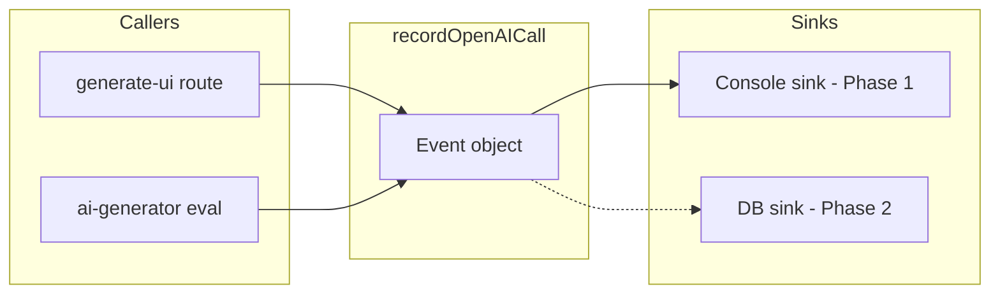

# Permanent OpenAI API Metrics Tracking

## Current State

- **[app/api/generate-ui/route.ts](app/api/generate-ui/route.ts)**: Uses `logAITiming()` which logs to console (latency, prompt_tokens, completion_tokens). Only this route tracks metrics.
- **[eval/utils/ai-generator.ts](eval/utils/ai-generator.ts)**: No metrics tracking; direct OpenAI calls for the eval harness.
- **No observability stack**: No OpenTelemetry, Vercel Analytics, or log aggregator in use.

## Recommended Approach: Centralized Metrics Module

Create a single `lib/ai/metrics.ts` module that all OpenAI call sites use. This keeps the implementation simple, avoids duplication, and follows OpenTelemetry GenAI semantic conventions for attribute names so you can plug in an OTLP exporter later without changing call sites.

### Metrics to Track (per call)


| Metric            | Attribute (OTel-style)         | Purpose        |
| ----------------- | ------------------------------ | -------------- |
| Latency (ms)      | `gen_ai.operation.duration_ms` | Performance    |
| Prompt tokens     | `gen_ai.usage.input_tokens`    | Cost, usage    |
| Completion tokens | `gen_ai.usage.output_tokens`   | Cost, usage    |
| Model             | `gen_ai.request.model`         | Model tracking |
| Source            | `rapidui.source` (api or eval) | Context        |
| Success/failure   | `gen_ai.response.status`       | Reliability    |


### Architecture: Sink Abstraction

Use a sink abstraction so call sites never change when adding DB or OTLP later:




- **Phase 1 (now)**: Console sink only; structured JSON logs.
- **Phase 2 (later)**: Add DB sink; call sites unchanged.

### Implementation Steps

1. **Create `lib/ai/metrics.ts**`
  - Define `OpenAICallEvent` type: `timestamp`, `model`, `duration_ms`, `prompt_tokens`, `completion_tokens`, `source` ("api" | "eval"), `status` ("success" | "error").
  - Define `MetricsSink` type: `(event: OpenAICallEvent) => void | Promise<void>`.
  - Export `recordOpenAICall(event)` that passes the event to all registered sinks.
  - Register `consoleSink` (structured JSON to stdout) as the default sink.
  - Keep the interface minimal; no external dependencies.
2. **Update [app/api/generate-ui/route.ts**](app/api/generate-ui/route.ts)
  - Replace `logAITiming` with `recordOpenAICall` after each OpenAI completion.
  - Pass `source: "api"` and include validation timing if desired (or keep validation as a separate event).
3. **Update [eval/utils/ai-generator.ts**](eval/utils/ai-generator.ts)
  - Add `recordOpenAICall` after successful completion and on error.
  - Pass `source: "eval"` so eval runs are distinguishable from production API calls.
4. **Optional: Environment-based behavior**
  - In development: log to console (pretty or JSON).
  - In production: JSON to stdout (Vercel/Node captures this).
  - Add `OPENAI_METRICS_DISABLED=true` to disable if needed (e.g. in CI without noise).

### Example Output (structured log)

```json
{
  "event": "openai_call",
  "timestamp": "2026-02-17T18:00:00.000Z",
  "gen_ai.request.model": "gpt-4o-mini",
  "gen_ai.operation.duration_ms": 1234,
  "gen_ai.usage.input_tokens": 512,
  "gen_ai.usage.output_tokens": 256,
  "rapidui.source": "api",
  "gen_ai.response.status": "success"
}
```

### Future Extensions (no code changes to call sites)

- **OTLP exporter**: Add `@opentelemetry/api` and push spans to Honeycomb, Jaeger, or Datadog.
- **Cost estimation**: Multiply tokens by model-specific rates (e.g. gpt-4o-mini) and add `estimated_cost_usd`.
- **Aggregation**: Parse logs in a log aggregator to build dashboards (latency p95, token usage over time, error rate).

---

## Phase 2: DB + Analytics Dashboard (Future)

When ready for a real analytics dashboard, add a DB sink and admin page without changing any call sites.

### DB Schema


| Column            | Type        | Purpose                |
| ----------------- | ----------- | ---------------------- |
| id                | uuid        | Primary key            |
| timestamp         | timestamptz | When the call happened |
| model             | text        | e.g. gpt-4o-mini       |
| duration_ms       | int         | Latency                |
| prompt_tokens     | int         | Input tokens           |
| completion_tokens | int         | Output tokens          |
| source            | text        | "api" or "eval"        |
| status            | text        | "success" or "error"   |


### DB Sink Implementation

Add a `dbSink` that inserts into the table and register it in `lib/ai/metrics.ts`:

```typescript
async function dbSink(event: OpenAICallEvent) {
  await db.insert(openaiCalls).values({
    timestamp: new Date(event.timestamp),
    model: event.model,
    duration_ms: event.duration_ms,
    prompt_tokens: event.prompt_tokens,
    completion_tokens: event.completion_tokens,
    source: event.source,
    status: event.status,
  });
}
sinks.push(dbSink);
```

### Analytics Page

- **Route**: `/admin/analytics` (protect with auth when added).
- **API**: `GET /api/admin/analytics` — query DB, return aggregates.
- **Metrics to display**: Calls over time, total tokens, latency (avg/p95), success vs error rate, breakdown by source and model.

### DB: Vercel Postgres

Use **Vercel Postgres** for Phase 2. Integrates with Vercel deployment; add `@vercel/postgres` and create the `openai_calls` table via migration or SQL.

### Alternatives Considered


| Approach                                  | Pros                            | Cons                              |
| ----------------------------------------- | ------------------------------- | --------------------------------- |
| **@opentelemetry/instrumentation-openai** | Auto-instrumentation, full OTel | Requires OTLP backend, more setup |
| **Langfuse / LangSmith**                  | LLM-focused, trace UI           | External service, heavier         |
| **Vercel Analytics**                      | Built-in                        | Not for custom API metrics        |


The recommended approach is the lightest path that follows standards and can evolve without refactoring call sites.