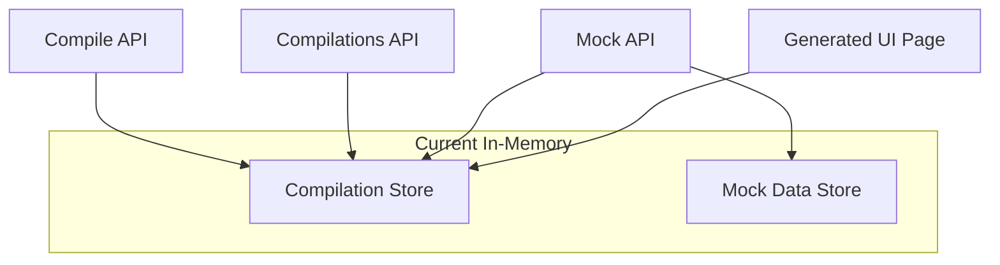

# Postgres Storage Migration Plan

**Status:** Phase 1 complete (Phase 2 deferred)

**Stress test:** [postgres_storage_migration_stress_test.md](postgres_storage_migration_stress_test.md)

---

## Current Architecture




**Two stores:**

1. **Compilation store** ([lib/compiler/store.ts](lib/compiler/store.ts)) — `Map<id, CompilationEntry>`. Holds specs, apiIr, accountId, name, status, diffFromPrevious, timestamps. **Required to migrate** — data lost on restart.
2. **Mock data store** ([lib/compiler/mock/store.ts](lib/compiler/mock/store.ts)) — `Map<accountId:dataKey:resourceSlug, ResourceData>`. Holds CRUD records for generated UI. **Optional** — predefined specs re-seed from fixtures; custom specs start empty.

---

## Recommendation

- **Phase 1 (required):** Migrate compilation store — enables production deployment.
- **Phase 2 (optional):** Migrate mock data store — CRUD changes persist across restarts for a better demo.

---

## Phase 1: Compilation Store → Postgres ✅

### 1.1 Setup

- Add `@neondatabase/serverless` (or `@vercel/postgres` if using legacy Vercel Postgres).
- Connect Neon via [Vercel Marketplace](https://vercel.com/marketplace/neon) or direct Neon project.
- Env: `process.env.POSTGRES_URL ?? process.env.DATABASE_URL` (Neon integration may inject either).

### 1.2 Schema

```sql
CREATE TABLE compilations (
  id VARCHAR(12) PRIMARY KEY,
  account_id VARCHAR(36) NOT NULL,
  name VARCHAR(255),
  status VARCHAR(20) DEFAULT 'success',
  specs JSONB NOT NULL,
  api_ir JSONB NOT NULL,
  openapi_canonical_hash VARCHAR(64) NOT NULL,
  resource_names JSONB NOT NULL,
  resource_slugs JSONB NOT NULL,
  diff_from_previous JSONB,
  errors JSONB,
  created_at TIMESTAMPTZ NOT NULL DEFAULT NOW(),
  updated_at TIMESTAMPTZ NOT NULL DEFAULT NOW()
);

CREATE INDEX idx_compilations_account_id ON compilations(account_id);
CREATE INDEX idx_compilations_updated_at ON compilations(updated_at DESC);
```

### 1.3 Data Layer

Create [lib/db/compilations.ts](lib/db/compilations.ts):

- `putCompilation(id, entry)` — INSERT ... ON CONFLICT (id) DO UPDATE; preserve `created_at` on conflict (do not overwrite with new value)
- `getCompilation(id)` — SELECT by id
- `hasCompilation(id)` — SELECT 1 WHERE id = ?
- `listCompilationsByAccount(accountId)` — SELECT id, name, status, created_at, updated_at WHERE account_id = ? ORDER BY updated_at DESC
- `deleteCompilation(id)` — DELETE WHERE id = ?

Map `CompilationEntry` fields to columns; `specs`, `apiIr`, `diffFromPrevious`, `errors` as JSONB.

**Async interface:** All store functions become async (`Promise<T>`). All callers must `await`.

### 1.4 Postgres Only (No Fallback)

- **No in-memory fallback.** App always uses Postgres. Remove existing in-memory Map from [lib/compiler/store.ts](lib/compiler/store.ts).
- [lib/compiler/store.ts](lib/compiler/store.ts) becomes a thin facade that imports and re-exports from `lib/db/compilations.ts` (or inlines the DB calls).
- **Local dev:** Requires `POSTGRES_URL` or `DATABASE_URL` (e.g. Neon free tier, or local Postgres).
- **CI:** Tests run locally only for now; no CI Postgres setup.

### 1.5 Callers (no API changes)

All callers use the same store interface:

- [app/api/compile-openapi/route.ts](app/api/compile-openapi/route.ts) — `putCompilation`
- [app/api/compilations/route.ts](app/api/compilations/route.ts) — `listCompilationsByAccount`
- [app/api/compilations/[id]/route.ts](app/api/compilations/[id]/route.ts) — `getCompilation`, `deleteCompilation`
- [app/api/compilations/[id]/update/route.ts](app/api/compilations/[id]/update/route.ts) — `getCompilation`, `putCompilation`
- [app/u/[id]/page.tsx](app/u/[id]/page.tsx), [app/u/[id]/[resource]/page.tsx](app/u/[id]/[resource]/page.tsx) — `getCompilation`
- [app/api/mock/[id]/[resource]/route.ts](app/api/mock/[id]/[resource]/route.ts) — `getCompilation` (for entry metadata)

---

## Phase 2: Mock Data Store → Postgres (Optional)

### 2.1 Schema

```sql
CREATE TABLE mock_data (
  account_id VARCHAR(36) NOT NULL,
  data_key VARCHAR(64) NOT NULL,
  resource_slug VARCHAR(64) NOT NULL,
  records JSONB NOT NULL DEFAULT '[]',
  list_schema JSONB NOT NULL,
  id_field VARCHAR(64) NOT NULL DEFAULT 'id',
  PRIMARY KEY (account_id, data_key, resource_slug)
);
```

### 2.2 Data Layer

Create [lib/db/mock-data.ts](lib/db/mock-data.ts):

- `getOrCreateResource(...)` — `INSERT ... ON CONFLICT DO NOTHING` then `SELECT`; avoids race when two requests init same resource
- `getRecords`, `createRecord`, `updateRecord`, `deleteRecord`, `getById` — same semantics as current store
- `clearForCompilation(accountId, compilationId, hash)` — DELETE WHERE account_id = ? AND data_key = ? (for custom specs only)

**Note:** Each create/update/delete rewrites the `records` JSONB array. Fine for demo-sized data; for larger datasets, consider per-record rows (more complex schema).

### 2.3 Postgres Only

Same as Phase 1: no fallback. [lib/compiler/mock/store.ts](lib/compiler/mock/store.ts) delegates to `lib/db/mock-data.ts`.

---

## Migration Checklist


| Task                                                             | Phase |
| ---------------------------------------------------------------- | ----- |
| Add `@neondatabase/serverless` dependency                        | 1     |
| Add `POSTGRES_URL` or `DATABASE_URL` to `.env.example`           | 1     |
| Create `scripts/migrations/001_compilations.sql` + run manually  | 1     |
| Implement `lib/db/compilations.ts`                               | 1     |
| Replace in-memory store with Postgres in `lib/compiler/store.ts` | 1     |
| Add `await` at all 8+ call sites                                 | 1     |
| Verify compile, list, get, delete, update flows                  | 1     |
| *(Phase 2 deferred — mock store stays in-memory)*                | —     |


---

## Risks and Notes

- **Evals:** [eval/utils/compile-openapi.ts](eval/utils/compile-openapi.ts) calls `compileOpenAPI` only; no store usage. No changes.
- **Tests:** Pipeline tests don't touch store. API/integration tests require a Postgres instance (e.g. Neon test branch, CI Postgres service).
- **Serverless:** Neon serverless driver is connection-pool friendly; use pooled connection URL when available.
- **JSONB size:** `specs` and `apiIr` can be large. Monitor row size; consider compression if needed.
- **Error handling:** Catch DB errors in data layer; surface 500 to API callers. Log for debugging.

---

## Decisions (Resolved)

1. **Migrations:** SQL files + manual run (simplest).
2. **Phase 2:** Deferred. Mock data store stays in-memory.
3. **Local dev:** Neon (DB in `.env.local`). Document in `.env.example`.
4. **CI:** Tests run locally only.
5. **hasCompilation:** Implement in Postgres layer.

