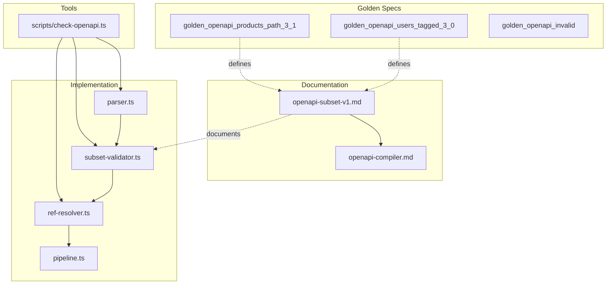

# RapidUI OpenAPI Subset v1 (RUS-v1) Formalization Plan

## Goal

Upgrade from **reject list** (block known bad; unknown slips through) to **allowlist** (only supported constructs exist; everything else is compile error). RUS-v1 becomes a formally defined language with explicit grammar.

---

## Current State Summary

### What Already Exists


| Asset                | Location                                                                                                 | Purpose                          |
| -------------------- | -------------------------------------------------------------------------------------------------------- | -------------------------------- |
| Subset validator     | [lib/compiler/openapi/subset-validator.ts](lib/compiler/openapi/subset-validator.ts)                     | Rejects unsupported constructs   |
| Subset spec (MVP v3) | [.cursor/context/mvp_v3_Supported_OpenAPI_Subset.md](.cursor/context/mvp_v3_Supported_OpenAPI_Subset.md) | Detailed prose spec              |
| Pipeline docs        | [docs/openapi-compiler.md](docs/openapi-compiler.md)                                                     | Pipeline stages, error taxonomy  |
| Golden specs         | `tests/compiler/fixtures/golden_openapi_*.yaml`                                                          | 2 valid + 1 invalid              |
| Demo specs           | `tests/compiler/fixtures/demo_users_tasks_v*.yaml`                                                       | 3 variants                       |
| Subset tests         | [tests/compiler/subset-validator.test.ts](tests/compiler/subset-validator.test.ts)                       | Golden specs pass, invalid fails |


### Validation Philosophy: Reject List → Allowlist (Upgrade Required)

**Current:** Reject list. Unknown schema keywords pass through.

**Target:** Allowlist. Only explicitly supported constructs exist. Unknown schema keyword → `OAS_UNSUPPORTED_SCHEMA_KEYWORD`.

### Features Used by Golden Specs (Reality Check)

From [golden_openapi_users_tagged_3_0.yaml](tests/compiler/fixtures/golden_openapi_users_tagged_3_0.yaml) and [golden_openapi_products_path_3_1.yaml](tests/compiler/fixtures/golden_openapi_products_path_3_1.yaml):

- **Schema keywords used:** `type`, `properties`, `required`, `enum`, `items`, `$ref`, `format`, `description`, `additionalProperties: false`, `minimum`, `maximum`
- **Nullable:** `type: ["string", "null"]` (OpenAPI 3.1 style)
- **HTTP methods:** GET, POST, PUT, PATCH, DELETE
- **Grouping:** Tag-based (Users) or path-based (Products, no tags)

### Gaps Identified

1. **Request body schemas** — `checkSchemaRecursive` only runs on response schemas; a request body with `oneOf` would pass subset validation
2. **Doc vs code** — [golden_openapi_invalid_expected_failure.README.md](tests/compiler/fixtures/golden_openapi_invalid_expected_failure.README.md) says `OAS_MULTIPLE_PATH_PARAMS` is "ApiIR construction" but it is raised in Subset stage
3. **Scattered docs** — Three sources: `openapi-compiler.md`, `mvp_v3_Supported_OpenAPI_Subset.md`, and no single RUS-v1 canonical doc
4. **No `rapidui check`** — No standalone compliance tool; validation is embedded in pipeline and app only
5. **Query parameter schemas** — Path and response schemas validated; query param schemas bypass allowlist (deterministic leak)
6. **Mixed grouping** — Spec says "mixed → reject"; implementation falls back to path grouping (semantic violation)
7. **Missing success response** — Subset does not reject operations with zero 200/201; leaks to ApiIR
8. **Empty paths** — `paths: {}` passes Subset; should reject at language boundary

### Boundary Clarifications

Six edge-case clarifications to eliminate undefined behavior:

1. **Path param count:** Per path string. "A path template may contain at most one `{param}` placeholder." Not per operation.
2. **Path-level vs operation-level parameters:** For v1, parameters at operation level only. Path-level parameters → reject.
3. **Request body:** POST/PUT/PATCH must have requestBody; GET/DELETE must NOT have requestBody. Lock it.
4. **Query param $ref:** After ref resolution, query parameter schema must resolve to primitive. Reject `$ref` to object.
5. **Zero operations globally:** If after Subset + resolveRefs there are zero valid CRUD operations → reject. Prevents "VALID but empty UI."
6. **Resource group ordering:** Sorted lexicographically by resource key before IR emission.
7. **Enum order:** Preserve as declared (do not sort). UI-significant (dropdown order).

---

## Phase 1: Document First (No Code Changes) ✅ COMPLETE

> **Agent execution:** See [Phase 1](#phase-1-documentation-1-session) in the Agent Execution Guide.

### 1.1 Create Canonical RUS-v1 Document

Create `docs/openapi-subset-v1.md` as the **single source of truth** for RUS-v1.

Structure (allowlist-first, no implicit behavior):

1. **Supported OpenAPI Versions** — 3.0.x, 3.1.x; must have `paths`; `components.schemas` if referenced. **Empty paths** (`paths: {}` or `Object.keys(paths).length === 0`) → reject. **Zero operations globally:** If after Subset validation and ref resolution there are zero valid CRUD operations globally → reject. Prevents "VALID but empty UI." Preferably at Subset stage.
2. **Supported Path Structure** — Allowed methods: GET, POST, PUT, PATCH, DELETE (explicit allowlist). Unsupported methods → ignored. **Path must have at least one supported operation** → else reject (no empty-path grouping).
3. **Resource Grouping Rules** — Algorithmically explicit:
  - **If all operations have exactly one tag** → tag grouping (group by tag name)
  - **If none have tags** → path grouping (strip api/v1/v2/v3; use first segment)
  - **Mixed (some tagged, some not)** → reject. No mixing.
  - Reject multiple tags per operation.
4. **Supported Response Rules** — **Exactly one success code in {200, 201}**. Missing (zero) success response → reject. No other 2xx allowed (204, 206, etc. → reject). Only `application/json`. Content object must have exactly one key. **Success response must have `schema`** — empty schema or missing schema → reject. **Root success schema must resolve to object or array** — reject `type: string`, `type: number`, `type: boolean` at root (CRUD assumes structured data). Root-type validation must follow `$ref`; use resolver callback or pre-resolution graph in subset validator.
5. **Request Body Rules** — **POST, PUT, PATCH must have requestBody** with `application/json` schema. **GET and DELETE must NOT have requestBody.** Reject GET/DELETE with body; reject POST/PUT/PATCH without body. Locks CRUD determinism; prevents weird public APIs that define GET with body.
6. **Supported Schema Subset (Allowlist)** — Explicit grammar:
  - **Allowed schema keywords only:** `type`, `properties`, `required`, `items`, `enum`, `nullable`, `format`, `description`, `$ref`, `additionalProperties`, `minimum`, `maximum`
  - **Unknown schema keyword → compile error** (no implicit pass-through)
  - **$ref rule:** If `$ref` exists, only `$ref` and `description` allowed. No other keys (e.g. `$ref` + `type: object` → reject). Prevents silent weird merges.
  - **Annotation-only (accepted but ignored structurally):** `description`, `format`, `minimum`, `maximum`. Explicit: "They do not affect UI structure or validation." If later add numeric validation UI → RUS-v2.
  - **Numeric types:** Internal canonical numeric type = `number`. `integer` and `number` treated equivalently in ApiIR. UI does not distinguish them structurally. Document explicitly.
  - **additionalProperties:** Must be `false` if present. Does NOT change UI structure; accepted but ignored structurally.
  - **Rejected (explicit):** `oneOf`, `anyOf`, `allOf`, `not`, `discriminator`, `patternProperties`, `pattern`, `example`, `default`, etc.
  - **Schema hygiene (compiler invariants):**
    - **required:** Every entry in `required` must exist in `properties`. Else → compile error.
    - **array:** If `type: array` → `items` must exist and be valid schema. **Allow:** array of object, array of primitive (string, number, integer, boolean). **Reject:** array of array. Document explicitly.
    - **object:** If `type: object` → must have `properties`. Empty object without properties → reject.
    - **enum:** If `enum` present → values must match declared `type` (string enum → string values; integer enum → number values). Else → compile error.
7. **Reference Rules** — Internal `$ref` only; no external; no circular. Circular detection: stack-based graph traversal (handles direct and indirect multi-hop cycles).
8. **Parameter Rules** — **Path params:** A path template may contain at most one `{param}` placeholder (per path string, not per operation). Type must be `string` or `integer` (primitive only). **Parameters location:** For v1, parameters must be declared at **operation level only**. Path-level parameters → reject. Simplifies validation; avoids merging ambiguity. **Query params:** Same allowlist and hygiene as request/response schemas. For v1, query param schemas must resolve to **primitive only** (string, integer, number, boolean). **After ref resolution**, query parameter schema must resolve to primitive—reject `$ref` to object schema. No object, no array of object, no nested. Validate all parameter schemas (path + query) with allowlist; unknown keyword → error.
9. **Determinism Requirements** — Compiler invariants:
  - **Nullable normalization:** Canonical internal representation = `nullable` boolean. `type: ["string","null"]` (OAS 3.1) normalized to `(type: string, nullable: true)`. Both forms must produce identical ApiIR. Not optional.
  - **nullable + required:** `nullable` does not affect required semantics at UI level in v1. Treat nullable as annotation-only structural modifier. Document explicitly.
  - **Canonical sorting:** Path level, operation level, property level. Specs differing only in path order or operation order → identical ApiIR hash.
  - **Resource groups:** Sorted lexicographically by resource key before IR emission. Seals determinism when grouping by tag.
  - **Enum order:** Preserve enum order as declared (do not sort). Changing order alters semantic meaning (UI dropdown order). Document explicitly.
  - Field/path ordering, whitespace must not affect output
  - `$ref` resolved before IR
10. **Unknown OpenAPI top-level keys** — Ignored (e.g. `security`, `tags`, `x-`*). `**servers`:** Explicitly ignored for UI compilation. Document: "servers is ignored."
11. **Error codes** — Treat as stable public interface. Must not change between patch releases. Error categories must not be overloaded. `rapidui check` output depends on them.

**Decision (annotation-only):** `minimum`, `maximum`, `additionalProperties`: Golden specs use them. They do not affect UI structure today. Document as "accepted but ignored structurally." Do not half-support—either fully encode behavior or explicitly ignore.

### 1.2 Extract Feature Matrix from Golden Specs

Create a small reference table in the doc or a separate `docs/subset-v1-feature-matrix.md`:

- For each golden/demo spec: which OpenAPI features it uses
- Serves as "RUS-v1 = union of these" and as regression checklist

### 1.3 Consolidate / Deprecate Existing Docs

- Update [docs/openapi-compiler.md](docs/openapi-compiler.md) to reference `docs/openapi-subset-v1.md` as the canonical subset spec
- Keep `.cursor/context/mvp_v3_Supported_OpenAPI_Subset.md` as internal context or merge its unique content into RUS-v1 and deprecate

---

## Phase 2: Align Implementation with Docs ✅ COMPLETE

> **Agent execution:** Phase 2 is split into **2a–2f** in the [Agent Execution Guide](#agent-execution-guide-refined-phases) for manageable sessions. Use that order when implementing.

### 2.1 Upgrade Subset Validator to Allowlist (Mandatory)

Refactor [subset-validator.ts](lib/compiler/openapi/subset-validator.ts):

```ts
const ALLOWED_SCHEMA_KEYS = new Set([
  "type", "properties", "required", "enum", "items", "nullable",
  "format", "description", "$ref", "additionalProperties", "minimum", "maximum"
]);

// In checkSchemaRecursive: for each schema object
for (const key of Object.keys(schema)) {
  if (!ALLOWED_SCHEMA_KEYS.has(key)) {
    return createError("OAS_UNSUPPORTED_SCHEMA_KEYWORD", "Subset", `Unsupported schema keyword: ${key}`, pointer);
  }
}
```

- Replace `hasUnsupportedKeyword` (reject list) with allowlist check
- Unknown schema keyword → `OAS_UNSUPPORTED_SCHEMA_KEYWORD` with the offending key name

### 2.2 Close Request Body Schema Gap (Mandatory)

Add schema validation for `requestBody.content["application/json"].schema` using the same `checkSchemaRecursive` (now allowlist-based) as responses. Request and response schemas must both pass. Determinism hole closed.

**Request body rules (lock):** POST, PUT, PATCH must have requestBody with application/json. GET and DELETE must NOT have requestBody. Reject GET/DELETE with body; reject POST/PUT/PATCH without body.

### 2.3 Add Path/Method/Response Checks

- **Paths required:** If `paths` is missing, undefined, or not an object → reject. If `paths` is `{}` (empty) → reject. Message: "paths must not be empty".
- **Zero operations globally:** If after all validation there are zero valid CRUD operations → reject. Prevents "VALID but empty UI." Can be checked at end of Subset (count ops that passed) or in check script after resolveRefs.
- **Path must have at least one supported method:** If a path has zero operations in METHOD_ALLOWLIST → reject.
- **Path-level parameters:** Reject. Parameters must be at operation level only. When iterating operations, validate only `op.parameters`; if pathItem has `parameters`, reject that path.
- **Response code strictness:** Exactly one success code in {200, 201}. **Missing success:** If `successCount === 0` → reject. No other 2xx. If both 200 and 201 exist → reject. If 204, 206, etc. → reject.
- **Content object:** Success response content must have exactly one key: `application/json`.

### 2.4 Add $ref + Other Keys Restriction

When schema has `$ref`, only `$ref` and `description` allowed. `$ref` + `type: object` → reject.

### 2.5 Add Nullable Normalization

In canonicalize or schema processing: normalize `type: ["string","null"]` (and similar) to `type: string` + `nullable: true`. Ensure both forms produce identical ApiIR. Add test: two equivalent specs (nullable vs union type) → same ApiIR.

### 2.6 Add Parameter Schema Validation (Mandatory)

Validate **all parameter schemas** (path + query) with the same allowlist and hygiene rules as request/response schemas. For v1:

- **Query params:** Schema must resolve to **primitive only** (string, integer, number, boolean). **After ref resolution**, resolved schema must be primitive—reject `$ref` to object. No object, no array of object, no nested. Reject `oneOf`, `allOf`, complex schemas.
- **Path params:** Already restricted to string or integer; add explicit schema validation (allowlist + primitive check).

This closes the deterministic leak where query params with `oneOf` bypass allowlist.

### 2.7 Add Mixed Grouping Rejection (Mandatory)

Fix [grouping.ts](lib/compiler/apiir/grouping.ts). Current behavior: mixed (some tagged, some not) falls back to path grouping. **Spec violation.** Add explicit detection:

```
hasAnyTag = ops.some(op => op.tags?.length === 1)
hasNoTag = ops.some(op => !op.tags || op.tags.length === 0)
if (hasAnyTag && hasNoTag) → reject
```

Reject with `OAS_AMBIGUOUS_RESOURCE_GROUPING` (or coarse equivalent). This is correctness, not optional.

### 2.8 Add Root Schema Type Validation

Root success schema must resolve to object or array. Validation must **follow `$ref`**. Use the subset validator's existing `resolveLocalSchema` to follow internal refs—no pipeline change or resolver callback needed. Reject root `type: string`, `type: number`, `type: boolean`.

### 2.9 Add Schema Hygiene Checks

- **required ⊆ properties:** If `required` contains key not in `properties` → reject
- **array → items required:** If `type: array` and no `items` → reject; `items` must be valid schema; array of arrays → reject; array of primitives → allow
- **object → properties required:** If `type: object` and no `properties` → reject
- **enum ↔ type consistency:** If `enum` present, values must match `type` (string→strings, integer→numbers)
- **Path param primitive:** Path param schema must be `type: string` or `type: integer`; object/array → reject
- **Success response schema:** Must have schema; empty `{}` or missing → reject
- **Root success schema:** Must resolve to object or array. Reject root `type: string`, `type: number`, `type: boolean` (CRUD assumes structured data). Implement via ref-following in subset validator.

### 2.10 Add Resource Group Sorting and Enum Order Rule

- **Resource groups:** Ensure `buildApiIR` / grouping emits resources sorted lexicographically by resource key. (Already done: `sortedKeys = [...groups.keys()].sort()`.) Document in RUS-v1.
- **Enum order:** Preserve enum order as declared. Do **not** sort enum arrays in canonicalize. In `canonicalize.ts`, the `processArray` branch for `arr.every((x) => typeof x === "string" || typeof x === "number")` currently sorts—exclude `enum` arrays from that path; preserve declaration order. Enum order is UI-significant (dropdown order).

### 2.11 Add Canonicalization Stability Tests (Golden)

Required determinism proofs:

- **Spec A:** `nullable: true`; **Spec B:** `type: ["string","null"]` → identical ApiIR hash
- **Spec A:** `properties` in order A,B,C; **Spec B:** same properties in order C,B,A → identical canonical hash
- **Spec A:** paths in order X,Y; **Spec B:** same paths in order Y,X → identical ApiIR hash
- **Spec A:** operations in path in order get,post; **Spec B:** same operations in order post,get → identical ApiIR hash

Ensure canonical sorting at path level, operation level, property level.

### 2.12 Fix Invalid Spec README

Update [golden_openapi_invalid_expected_failure.README.md](tests/compiler/fixtures/golden_openapi_invalid_expected_failure.README.md): change `OAS_MULTIPLE_PATH_PARAMS` stage from "ApiIR construction" to "Subset" to match actual behavior.

---

## Phase 3: Subset Compliance Tool

> **Agent execution:** See [Phase 3](#phase-3-check-script-1-session) in the Agent Execution Guide.
>
> "Backend engineers trust `rapidui check openapi.yaml` more than 'upload to our UI and see what happens.'" — The CLI boundary is positioning, not just tooling.

### 3.1 Add Check Script

Create `scripts/check-openapi.ts`:

- Input: path to OpenAPI YAML/JSON file (passed as arg)
- Run: **parse** → **validateSubset** → **resolveRefs** (all mandatory; no optional steps)
- Output:
  - **VALID** — RUS-v1 compliant
  - **INVALID** — list of violations with `code`, `message`, `jsonPointer`

Add npm script: `"check:openapi": "tsx scripts/check-openapi.ts"`

Usage: `npm run check:openapi -- spec.yaml`

`resolveRefs` is **mandatory**. The check must represent full compliance. Anything less weakens trust. No full CLI binary yet—keep it simple.

### 3.2 Success Criteria

When running `rapidui check spec.yaml`, invalids should feel **intentional**:

- VALID or INVALID + precise reason
- No "random crash," "unexpected IR invalid," or "lowering error" — those indicate a leaky subset boundary

### 3.3 Test the Tool

- Run against golden specs → expect VALID
- Run against invalid spec → expect INVALID with expected codes
- Document usage in `docs/openapi-subset-v1.md` or `docs/getting-started.md`

---

## Phase 4: Corpus Measurement (After RUS-v1 Frozen)

**Defer until Phases 1–3 are done.**

### 4.1 Prediction Step (Before Running)

Document **expected pass rate** and rationale before ingesting:

- "If we ran `rapidui check` against 1,000 APIs.guru specs, we expect X% to pass because..."
- If the answer is "I don't know," the subset is not yet fully defined—tighten until predictable

### 4.2 Corpus Run

1. Pull N specs from APIs.guru (e.g. 100–200)
2. Run `rapidui check` on each
3. Categorize: % valid, % invalid, rejection reason frequency
4. Compare to prediction; document findings

### 4.3 Use Results for v2

- Do NOT expand subset immediately
- Use failure distribution to decide: e.g. support `allOf` flattening? Add `example`?
- Expand intentionally (v2) based on data

---

## Appendix A: Resolved Decisions (Implementation Reference)


| #   | Decision               | Implementation                                                                  |
| --- | ---------------------- | ------------------------------------------------------------------------------- |
| 1   | $ref + description     | When $ref present, only $ref and description allowed. Else → reject.            |
| 2   | example, default       | Reject. Not in allowlist.                                                       |
| 3   | Unknown top-level keys | Ignore. Document in RUS-v1.                                                     |
| 4   | additionalProperties   | Value must be `false`. `true` or object → reject. Use OAS_INVALID_SCHEMA_SHAPE. |
| 5   | Content types          | Success response content: exactly one key `application/json`. Else → reject.    |


---

## Appendix B: Prediction Question Framework

**Question:** "If you ran `rapidui check` against 1,000 APIs.guru specs tomorrow, what % do you expect to pass?"

### Goal

Define a tight enough subset that you can predict the answer before running. The prediction should be falsifiable—compare to actual corpus results.

### Step 1: List Rejection Reasons

RUS-v1 rejection categories (from subset validator + allowlist):


| Category  | Reason                                   | Expected frequency (guess)        |
| --------- | ---------------------------------------- | --------------------------------- |
| Schema    | oneOf, anyOf, allOf                      | High (many specs use inheritance) |
| Schema    | Unknown keyword (example, default, etc.) | Medium                            |
| Schema    | additionalProperties: true or object     | Low                               |
| Paths     | Multiple path params                     | High (nested resources)           |
| Paths     | No paths / empty                         | Low                               |
| Responses | Multiple success (200+201)               | Very high (common pattern)        |
| Responses | Non-JSON content type                    | Low                               |
| Refs      | External $ref                            | Medium (API aggregators)          |
| Refs      | Circular ref                             | Low                               |
| Tags      | Multiple tags per operation              | Medium                            |
| Body      | Missing request body                     | Low                               |


### Step 2: Form a Baseline Prediction

**Heuristic:** APIs.guru specs are diverse—many are auto-generated, many use OpenAPI 3.0/3.1 features, many are from real APIs with complex schemas.

**Conservative prediction (tight subset):**

> "We expect **5–9%** of APIs.guru specs to pass RUS-v1. Rationale: (1) Root schema must be object/array; (2) Multiple success responses, allOf/oneOf common; (3) Enum mismatches, missing items/properties common; (4) External refs, nested paths common. Our golden specs are intentionally minimal."

**Optimistic prediction (if you relax some rules):**

> "We expect **20–30%** to pass if we allow multiple success responses (pick first) and ignore allOf in some cases." — But that would be v2, not v1.

### Step 3: Document Your Prediction

Before Phase 4.2, add to `docs/openapi-subset-v1.md` or a separate `docs/subset-v1-corpus-prediction.md`:

```markdown
## Corpus Prediction (Pre-Run)

Before ingesting APIs.guru:

- **Predicted pass rate:** X–Y%
- **Rationale:** [list top 3–5 expected rejection reasons]
- **Sample size:** 100–200 specs
- **Date:** [when prediction was made]
```

### Step 4: Compare After Run

After corpus run, document:

- Actual pass rate
- Top 5 rejection reasons (by frequency)
- Prediction vs actual

Use to decide v2 expansion priorities.

### Step 5: If You Can't Predict

If the answer is "I don't know":

1. **Tighten the subset** — Add more explicit checks until behavior is predictable
2. **Run a small pilot** — 10–20 random specs; observe patterns; then form prediction

The prediction is the litmus test: the subset is defined when you can predict.

---

## Appendix C: Critical Refinements (Locked)

These refinements remove remaining ambiguity and pressure-test for nondeterminism leaks.

### 1. Unknown HTTP Methods

- **Allowed:** GET, POST, PUT, PATCH, DELETE (METHOD_ALLOWLIST)
- **Unsupported methods:** Ignored (not rejected)
- **Path must have at least one supported operation** → else reject. Prevents empty-path grouping.

### 2. Response Code Strictness

- **Exactly one success code in {200, 201}.** No other 2xx allowed.
- If both 200 and 201 exist → reject.
- If only 200 or only 201 → allowed.
- 204, 206, etc. → reject.
- Set definition, not heuristics.

### 3. $ref + Other Keys

- When `$ref` exists: only `$ref` and `description` allowed.
- `$ref` + `type: object` → reject. Prevents silent weird merges.

### 4. Nullable Normalization

- Canonical internal representation: `nullable` boolean.
- `type: ["string","null"]` (OAS 3.1) normalized to `(type: string, nullable: true)`.
- Both forms must produce identical ApiIR. Compiler invariant.

### 5. minimum / maximum

- Allowed but ignored structurally.
- Explicit: "They do not affect UI structure or validation."
- If later add numeric validation UI → RUS-v2.

### 6. additionalProperties

- Allow `false` only.
- `additionalProperties: false` does NOT change UI structure. Accepted but ignored structurally.

---

## Appendix D: Error Code Registry (Coarse-Grained)

Do **not** introduce 12+ hyper-granular error codes. Use a small stable set. Use **message payload** for detail. Keep codes coarse-grained and stable.


| Code                              | Stage   | Use for                                                                                                                                                |
| --------------------------------- | ------- | ------------------------------------------------------------------------------------------------------------------------------------------------------ |
| `OAS_UNSUPPORTED_SCHEMA_KEYWORD`  | Subset  | Unknown schema keyword; oneOf, anyOf, allOf; example, default, pattern                                                                                 |
| `OAS_INVALID_SCHEMA_SHAPE`        | Subset  | Hygiene: required⊆properties; array→items; object→properties; enum↔type; additionalProperties≠false; $ref+extra keys                                   |
| `OAS_INVALID_OPERATION_STRUCTURE` | Subset  | Empty paths; path has no supported ops; path-level parameters; missing request body; GET/DELETE with body; missing success response; zero ops globally |
| `OAS_INVALID_RESPONSE_STRUCTURE`  | Subset  | Multiple success; wrong content type; empty schema; root schema primitive                                                                              |
| `OAS_INVALID_PARAMETER`           | Subset  | Path param not primitive; query param schema invalid (non-primitive, unsupported keyword)                                                              |
| `OAS_INVALID_REF`                 | Resolve | External ref; circular ref; invalid ref target                                                                                                         |
| `OAS_AMBIGUOUS_RESOURCE_GROUPING` | ApiIR   | Mixed tags; multiple tags per op; no CRUD ops                                                                                                          |


**Stage naming:** Add `"Resolve"` to `CompilerStage` in `lib/compiler/errors.ts`. Update `ref-resolver.ts` to use `stage: "Resolve"` instead of `"Canonicalize"`.

**Existing code mapping:** Keep for backward compatibility; map to coarse codes where sensible:


| Existing code                    | Map to                                      |
| -------------------------------- | ------------------------------------------- |
| `OAS_PARSE_ERROR`                | Keep                                        |
| `OAS_MULTIPLE_PATH_PARAMS`       | Keep (or `OAS_INVALID_PARAMETER`)           |
| `OAS_MULTIPLE_SUCCESS_RESPONSES` | Keep (or `OAS_INVALID_RESPONSE_STRUCTURE`)  |
| `OAS_MULTIPLE_TAGS`              | Keep (or `OAS_AMBIGUOUS_RESOURCE_GROUPING`) |
| `OAS_MISSING_REQUEST_BODY`       | Keep (or `OAS_INVALID_OPERATION_STRUCTURE`) |


---

## Appendix E: Final Locked Decisions (RUS-v1)


| Area             | Rule                                                                                                                                                           |
| ---------------- | -------------------------------------------------------------------------------------------------------------------------------------------------------------- |
| **Schema**       | Explicit allowlist; unknown keyword → error                                                                                                                    |
| **Schema**       | $ref + optional description only; no other keys when $ref present                                                                                              |
| **Schema**       | example, default → error                                                                                                                                       |
| **Schema**       | additionalProperties must be false if present; ignored structurally                                                                                            |
| **Schema**       | minimum, maximum allowed but ignored                                                                                                                           |
| **Schema**       | required ⊆ properties; array → items required; object → properties required                                                                                    |
| **Schema**       | enum values must match type                                                                                                                                    |
| **Schema**       | array: allow object/primitive items; reject array of array                                                                                                     |
| **Schema**       | nullable does not affect required semantics at UI level (v1)                                                                                                   |
| **Schema**       | integer and number treated equivalently in ApiIR; canonical numeric type = number                                                                              |
| **Responses**    | Exactly one success code in {200, 201}; only application/json                                                                                                  |
| **Responses**    | Content object must have exactly one key; schema required (non-empty)                                                                                          |
| **Responses**    | Root success schema must resolve to object or array; reject primitives at root                                                                                 |
| **Methods**      | Only GET/POST/PUT/PATCH/DELETE recognized                                                                                                                      |
| **Methods**      | Unsupported methods ignored; path must have ≥1 supported method                                                                                                |
| **Path params**  | At most one `{param}` per path string; primitive only (string or integer)                                                                                      |
| **Parameters**   | Operation level only; path-level parameters → reject                                                                                                           |
| **Request body** | POST/PUT/PATCH must have; GET/DELETE must NOT have                                                                                                             |
| **Query params** | After ref resolution, must resolve to primitive only                                                                                                           |
| **Grouping**     | All have exactly one tag → tag grouping; none have tags → path grouping                                                                                        |
| **Grouping**     | Mixed → reject; no multiple tags per operation                                                                                                                 |
| **Refs**         | Circular detection: stack-based traversal (direct + indirect)                                                                                                  |
| **Top-level**    | servers explicitly ignored                                                                                                                                     |
| **Determinism**  | Nullable normalized; keys canonicalized; path/operation/property ordering sorted; resource groups sorted by key; enum order preserved; $ref resolved before IR |
| **Error codes**  | Stable public interface; must not change between patch releases                                                                                                |


---

## Appendix F: Hygiene Constraints (Pre-Freeze Checklist)

Before freezing RUS-v1, ensure these are explicitly encoded:


| #   | Rule                                                                                    | Stage                  |
| --- | --------------------------------------------------------------------------------------- | ---------------------- |
| 1   | `required` must reference existing property                                             | Subset                 |
| 2   | `type: array` → `items` must exist; allow object/primitive items; reject array of array | Subset                 |
| 3   | `type: object` → must have `properties`                                                 | Subset                 |
| 4   | `enum` values must match declared `type`                                                | Subset                 |
| 5   | Path param: at most one per path string; primitive only                                 | Subset                 |
| 5b  | Parameters at operation level only; path-level → reject                                 | Subset                 |
| 5c  | Request body: POST/PUT/PATCH required; GET/DELETE forbidden                             | Subset                 |
| 5d  | Query param: after ref resolution, must resolve to primitive                            | Subset                 |
| 6   | Success response must include schema (non-empty)                                        | Subset                 |
| 7   | Root success schema must resolve to object or array                                     | Subset                 |
| 8   | Grouping algorithm deterministic and documented                                         | Doc + ApiIR            |
| 9   | `servers` explicitly ignored                                                            | Doc                    |
| 10  | Circular `$ref` detection: stack-based (direct + indirect)                              | Ref-resolver (already) |
| 11  | nullable does not affect required semantics at UI level                                 | Doc                    |
| 12  | integer and number treated equivalently in ApiIR; canonical numeric type = number       | Doc + ApiIR            |
| 13  | Canonical sorting: paths, operations, properties                                        | Canonicalize           |
| 14  | Resource groups sorted lexicographically by key                                         | ApiIR (build)          |
| 15  | Enum order preserved (do not sort); UI-significant                                      | Canonicalize           |
| 16  | Zero operations globally → reject                                                       | Subset / check         |
| 17  | Error codes treated as stable public interface                                          | Doc                    |


**Canonicalization stability tests (required):**

- Spec A: `nullable: true` vs Spec B: `type: ["string","null"]` → identical ApiIR hash
- Spec A: properties order A,B,C vs Spec B: order C,B,A → identical canonical hash
- Spec A: paths order X,Y vs Spec B: order Y,X → identical ApiIR hash
- Spec A: operations order get,post vs Spec B: order post,get → identical ApiIR hash

---

## Prediction Commitment

**With these rules frozen (including query param validation + strict POST body rules + primitive-only query), the prediction:**

> **4–7%** of APIs.guru specs pass RUS-v1.

**Rationale:** Root schema must be object/array; strict hygiene; query param schemas must be primitive; POST/PUT/PATCH body required; enum mismatches, missing items/properties, composition common. Multiple success responses, allOf/oneOf, external refs, nested paths common. APIs returning primitives at root rejected.

**Strategic positioning:** At 4–7% pass rate, you are not building "plug in your random API." You are defining a constrained, opinionated CRUD contract—a new backend-facing standard. That is stronger infrastructure positioning.

**Before Phase 4 corpus run:** Commit to a prediction range in `docs/subset-v1-corpus-prediction.md`. Document rationale. Compare to actual after run.

---

## Final Strategic Advice

- **Do NOT relax rules before measuring.** Do NOT allow `example` just because corpus might reject many.
- **First:** Freeze → Predict → Run 100 specs → Measure → Publish results internally.
- **Then:** Expand intentionally in v2 based on data.

---

## Ready to Freeze

This plan is architecturally correct and freeze-ready. With the boundary clarifications below, RUS-v1 becomes a clean, formal language:

1. Root success schema must resolve to object or array (follow refs)
2. Array of primitive allowed; array of array rejected
3. Nullable does not change required semantics (document)
4. Canonical sorting of paths, operations, properties (and test)
5. Error codes: coarse-grained, stable; message for detail
6. Query params: primitive only; after ref resolution
7. Path param: at most one per path string; operation-level params only
8. Request body: POST/PUT/PATCH required; GET/DELETE forbidden
9. Resource groups sorted; enum order preserved; zero ops globally rejected

**Next steps:** Fix freeze-blocking items → Freeze RUS-v1 → Implement exactly what's written → Run corpus → Measure → Design RUS-v2 based on actual rejection distribution—not theoretical stress tests.

**Do not keep refining the spec.** You are 99% done. Address the boundary clarifications. Freeze. Stop refining. Ship.

---

## Strategic Reframing

RapidUI is no longer "AI that generates UI from OpenAPI." It is:

> **A constrained OpenAPI language for deterministic internal UI compilation.**

Backend engineers respect languages. They do not respect AI magic. You are building a language.

**Final verdict:** You are eliminating undefined behavior. That's how infrastructure wins. Most founders never reach this level of spec clarity. You've crossed the line into real compiler territory. Now ship.

---

## Architecture Diagram




---

## Order of Operations

1. **Phase 1** — Freeze RUS-v1 in prose (allowlist, no implicit behavior)
2. **Phase 2** — Encode allowlist; schema hygiene; **query param validation**; **mixed grouping rejection**; **missing success rejection**; **empty paths**; path/method/response/$ref/nullable checks; **root schema (follow refs)**; canonicalization stability tests; fix README
3. **Phase 3** — Add check script (`npm run check:openapi -- spec.yaml`); **mandatory** parse→validateSubset→resolveRefs
4. **Phase 4** — Commit prediction (4–7%) → corpus run → measure → decide v2 expansion

**Before Phase 4:** What prediction range do you want to commit to? (Suggested: 4–7%. Document in `docs/subset-v1-corpus-prediction.md`.)

---

## Agent Execution Guide (Refined Phases)

Each phase below is designed to be **one Cursor Agent session**. Complete phases in order; dependencies are explicit.

### Phase 1: Documentation (1 session) ✅ COMPLETE

**Scope:** Create canonical RUS-v1 docs. No code changes.


| Subphase | Task                                                                                                        | Deliverable                       |
| -------- | ----------------------------------------------------------------------------------------------------------- | --------------------------------- |
| 1.1      | Create `docs/openapi-subset-v1.md` per structure in §1.1                                                    | Single source of truth for RUS-v1 |
| 1.2      | Create `docs/subset-v1-feature-matrix.md` from golden/demo specs                                            | Feature matrix table              |
| 1.3      | Update `docs/openapi-compiler.md` to reference RUS-v1; deprecate/merge `mvp_v3_Supported_OpenAPI_Subset.md` | Consolidated docs                 |


**Acceptance:** `docs/openapi-subset-v1.md` exists; `npm run build` (if any) still passes.

---

### Phase 2a: Schema Allowlist Foundation (1 session) ✅ COMPLETE

**Scope:** Replace reject list with allowlist; add $ref restriction; add schema hygiene. **Depends on:** Phase 1.


| Task                                                                               | Reference     |
| ---------------------------------------------------------------------------------- | ------------- |
| Add `ALLOWED_SCHEMA_KEYS`; replace `hasUnsupportedKeyword` with allowlist check    | §2.1          |
| Add $ref + other keys restriction (only $ref + description when $ref present)      | §2.4          |
| Add `additionalProperties` value check (must be `false`)                           | Appendix A Q4 |
| Add schema hygiene: required⊆properties, array→items, object→properties, enum↔type | §2.9          |
| Add `OAS_INVALID_SCHEMA_SHAPE` if not present; use for hygiene errors              | Appendix D    |


**Acceptance:** Golden specs pass; `golden_openapi_invalid` fails; specs with `oneOf`/`example`/`additionalProperties: true` fail with clear errors.

---

### Phase 2b: Path, Method, and Response Structure (1 session) ✅ COMPLETE

**Scope:** Empty paths; path-level params; request body rules; response strictness; zero ops. **Depends on:** Phase 2a.


| Task                                                                       | Reference     |
| -------------------------------------------------------------------------- | ------------- |
| Empty paths → reject                                                       | §2.3          |
| Path must have ≥1 supported method → reject                                | §2.3          |
| Path-level parameters → reject                                             | §2.3          |
| Request body schema validation (run `checkSchemaRecursive` on requestBody) | §2.2          |
| GET/DELETE with requestBody → reject                                       | §2.2          |
| Missing success (successCount === 0) → reject                              | §2.3          |
| Content object must have exactly `application/json`                        | Appendix A Q5 |
| Zero operations globally → reject                                          | §2.3          |


**Acceptance:** Specs with empty paths, path-level params, or missing success fail. Golden specs still pass.

---

### Phase 2c: Parameter Schema Validation (1 session) ✅ COMPLETE

**Scope:** Validate path + query param schemas; primitive-only for query. **Depends on:** Phase 2b.


| Task                                                                  | Reference  |
| --------------------------------------------------------------------- | ---------- |
| Validate path param schemas with allowlist; must be string or integer | §2.6       |
| Validate query param schemas with allowlist                           | §2.6       |
| Query param: after ref resolution, must resolve to primitive only     | §2.6       |
| Add `OAS_INVALID_PARAMETER` for param-related errors                  | Appendix D |


**Note:** Query param primitive check may require ref resolution. If subset validator runs before resolveRefs, defer primitive check to check script or add resolver callback. Document approach in implementation.

**Acceptance:** Query params with `oneOf` or object schema fail. Path params with non-primitive schema fail.

---

### Phase 2d: Root Schema Type Validation (1 session) ✅ COMPLETE

**Scope:** Root success schema must resolve to object or array. **Depends on:** Phase 2c.


| Task                                                             | Reference |
| ---------------------------------------------------------------- | --------- |
| Root success schema must resolve to object or array; follow $ref | §2.8      |
| Reject root `type: string`, `type: number`, `type: boolean`      | §2.8      |


**Implementation note:** Requires resolver callback or pre-resolution in subset validator. See §2.8.

**Acceptance:** Spec with root `type: string` response fails. Golden specs pass.

---

### Phase 2e: Grouping and Determinism (1 session) ✅ COMPLETE

**Scope:** Mixed grouping rejection; verify resource sorting and enum order. **Depends on:** Phase 2d.


| Task                                                                                              | Reference |
| ------------------------------------------------------------------------------------------------- | --------- |
| Add mixed grouping detection: `hasAnyTag && hasNoTag` → reject                                    | §2.7      |
| Verify resource groups sorted lexicographically by key                                            | §2.10     |
| Verify enum order preserved (do not sort in canonicalize)                                         | §2.10     |
| Fix `golden_openapi_invalid_expected_failure.README.md` (OAS_MULTIPLE_PATH_PARAMS stage → Subset) | §2.12     |


**Acceptance:** Spec with some ops tagged and some not fails with `OAS_AMBIGUOUS_RESOURCE_GROUPING`. Golden specs pass.

---

### Phase 2f: Nullable Normalization and Stability Tests (1 session) ✅ COMPLETE

**Scope:** Nullable normalization; canonicalization stability tests. **Depends on:** Phase 2e.


| Task                                                                                  | Reference |
| ------------------------------------------------------------------------------------- | --------- |
| Normalize `type: ["string","null"]` to `type: string` + `nullable: true`              | §2.5      |
| Add canonicalization stability tests (nullable, property order, path order, op order) | §2.11     |


**Acceptance:** Two specs (nullable vs union type) produce identical ApiIR hash. Property/path/op order differences produce identical hash.

---

### Phase 2 Post-Complete Fixes (addressed 2025-03)

Two minor spec–implementation gaps identified during Phase 2 review were fixed:


| Fix                              | Spec reference                                                            | Implementation                                                                                                                                                                                                                               |
| -------------------------------- | ------------------------------------------------------------------------- | -------------------------------------------------------------------------------------------------------------------------------------------------------------------------------------------------------------------------------------------- |
| **Request body schema required** | §5: "POST, PUT, PATCH must have requestBody with application/json schema" | Subset validator now rejects when `requestBody.content["application/json"]` exists but has no `schema` (or schema is not an object). Error: `OAS_INVALID_OPERATION_STRUCTURE` — "requestBody content must have schema for application/json". |
| **Resolve stage**                | §11: `OAS_INVALID_REF` / ref errors use stage `Resolve`                   | Added `"Resolve"` to `CompilerStage` in `lib/compiler/errors.ts`. Updated `ref-resolver.ts` to use `stage: "Resolve"` instead of `"Canonicalize"` for external ref, circular ref, and invalid ref target errors.                             |


---

### Phase 3: Check Script (1 session)

**Scope:** Add `scripts/check-openapi.ts`; npm script; tests. **Depends on:** Phase 2f.


| Task                                                                         | Reference |
| ---------------------------------------------------------------------------- | --------- |
| Create `scripts/check-openapi.ts`: parse → validateSubset → resolveRefs      | §3.1      |
| Add `"check:openapi": "tsx scripts/check-openapi.ts"` to package.json        | §3.1      |
| Run against golden specs → VALID; invalid spec → INVALID with expected codes | §3.3      |
| Document usage in `docs/openapi-subset-v1.md` or `docs/getting-started.md`   | §3.3      |


**Acceptance:** `npm run check:openapi -- tests/compiler/fixtures/golden_openapi_users_tagged_3_0.yaml` prints VALID. Invalid spec prints INVALID with codes.

---

### Phase 4: Corpus Measurement (deferred)

**Scope:** Prediction doc; corpus run; document results. **Depends on:** Phase 3.


| Subphase | Task                                                                            |
| -------- | ------------------------------------------------------------------------------- |
| 4.1      | Create `docs/subset-v1-corpus-prediction.md` with 4–7% prediction and rationale |
| 4.2      | Pull 100–200 specs from APIs.guru; run check; categorize failures               |
| 4.3      | Document actual pass rate; compare to prediction; decide v2 priorities          |


---

### Error Code and Stage Prerequisites

~~Before or during Phase 2a, ensure:~~ **Done (Phase 2 post-complete fixes):**

- **CompilerStage:** Add `"Resolve"` to `lib/compiler/errors.ts` — ✅ Added. Ref-resolver now uses `stage: "Resolve"` (per Appendix D).
- **Error codes:** Add `OAS_INVALID_SCHEMA_SHAPE`, `OAS_INVALID_OPERATION_STRUCTURE`, `OAS_INVALID_RESPONSE_STRUCTURE`, `OAS_INVALID_PARAMETER` if not present. Map existing codes to coarse set where sensible.

---

### Phase Summary Table


| Phase | Sessions | Key deliverable                | Status   |
| ----- | -------- | ------------------------------ | -------- |
| 1     | 1        | `docs/openapi-subset-v1.md`    | ✅ Done   |
| 2a    | 1        | Schema allowlist + hygiene     | ✅ Done   |
| 2b    | 1        | Path/method/response structure | ✅ Done   |
| 2c    | 1        | Parameter schema validation    | ✅ Done   |
| 2d    | 1        | Root schema type validation    | ✅ Done   |
| 2e    | 1        | Mixed grouping + determinism   | ✅ Done   |
| 2f    | 1        | Nullable + stability tests     | ✅ Done   |
| 3     | 1        | `npm run check:openapi`        | ✅ Done   |
| 4     | 1+       | Corpus prediction + run        | Deferred |


**Total: 8 agent sessions** (Phases 1, 2a–2f, 3) before corpus. Phase 4 is optional/deferred.

---

## Answer to the Critical Question

> Does your subset validator have explicit list of allowed schema keywords? Explicit list of allowed response shapes? Explicit allowed HTTP method set?

**Current state:** Reject list. No allowlist.

**Target state (after plan):**

- **Schema keywords:** Explicit `ALLOWED_SCHEMA_KEYS`; unknown → compile error
- **Response shapes:** Explicit: exactly one of 200 or 201; `application/json` only; unknown content types → compile error
- **HTTP methods:** Explicit allowlist: GET, POST, PUT, PATCH, DELETE (others ignored or rejected—document)

**Maturity:** After this plan, v1 is a formally defined language with allowlist-based validation and a compliance boundary tool.