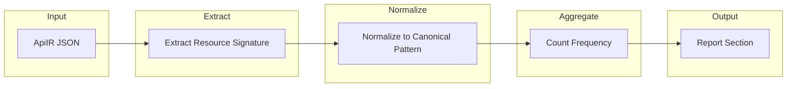

# Structural Pattern Mining Implementation Plan

## Summary

Add a **Structural Pattern Distribution** analysis that discovers which API design motifs repeat across successfully compiled resources. This answers: *What structural patterns do APIs that compile successfully share?* — enabling compiler optimization and UI generation defaults.

## Architecture




## Key Files


| File                                                                         | Role                                                                                                                                                                                |
| ---------------------------------------------------------------------------- | ----------------------------------------------------------------------------------------------------------------------------------------------------------------------------------- |
| [lib/compiler/apiir/types.ts](lib/compiler/apiir/types.ts)                   | Add `queryParamCount?: number` to `OperationIR`                                                                                                                                     |
| [lib/compiler/apiir/operations.ts](lib/compiler/apiir/operations.ts)         | Extract `queryParamCount` from `parameters` in the OpenAPI doc (path-level + op-level merged; op overrides). Count where `in === "query"`. Reuse merge logic from subset-validator. |
| [scripts/corpus-data/analyze-apiir.ts](scripts/corpus-data/analyze-apiir.ts) | Extend with pattern mining: `ResourceSignature`, `extractResourceSignature`, `normalizePattern`, `mineStructuralPatterns`, `formatPatternMiningReport`                              |
| [scripts/corpus-report.ts](scripts/corpus-report.ts)                         | Add "Structural Pattern Distribution" section after existing Language Analysis                                                                                                      |
| [scripts/corpus-pattern-mining.ts](scripts/corpus-pattern-mining.ts)         | New standalone script to run on ApiIR fixtures                                                                                                                                      |


## Implementation Details

### 1. Resource Signature Extraction

For each `ResourceIR`, compute a signature by aggregating across all operations (reuse logic from `analyzeResourceShape`):

```typescript
interface ResourceSignature {
  fields: number;        // max property count across ops
  has_id: boolean;       // any prop named id, _id, *Id, *_id
  enums: number;
  arrays: number;
  nested_objects: number; // direct child props with type object
  depth: number;
  query_params: number;  // max query param count across ops (filter complexity driver)
  operations: OperationKind[];  // unique kinds, sorted
}
```

- **Schema source**: Use `getObjectSchema(responseSchema)` per operation (handles `array` → `items`). Take max fields, enums, arrays, depth across ops.
- **has_id**: Check top-level property names: `id`, `_id`, or match `/Id$/`, `/_id$/` (case-insensitive).
- **nested_objects**: Count direct children where `type === "object"` (or includes object).
- **operations**: `[...new Set(res.operations.map(o => o.kind))].sort()` using `KIND_ORDER`.

Reuse existing helpers from [analyze-apiir.ts](scripts/corpus-data/analyze-apiir.ts): `getObjectSchema`, `countEnumFields`, `countArrayFields`, `schemaDepth`. Add `countNestedObjects`, `hasIdField`.

### 2. Pattern Normalization

Convert signature to canonical pattern string. Two formats:

**Raw (for deduplication):**

```
fields:4 enums:0 arrays:0 depth:1 ops:list+detail+create
```

**Bucketed (for report readability):**

```
fields≤8 depth0 ops:list+detail+create
```

Bucketing rules:

- **fields**: First matching bucket: ≤4, else ≤6, else ≤8, else ≤10, else ≤12, else >12
- **depth**: 0, 1, 2, 3+ — **include depth0** because `schemaDepth` returns 0 for flat objects (most resources)
- **ops**: exact sorted list joined by `+`
- **Pattern key stays minimal**: fields + depth + ops only. Exclude enums/arrays from v1 — they explode pattern space without much insight; add later if needed.

For the report, use bucketed form. Raw form can be used internally for exact grouping.

### 3. Frequency Counting and Examples

- Build `Map<patternString, { count: number; examples: string[] }>` across all resources.
- For each resource, add to pattern's examples (up to 3): `specId/resource.key` (e.g. `hubapi.com__users/users`, `ebay.com__commerce-charity/charity`). Use `key` (stable slug), not `name` (UI label).
- Sort by count descending.
- Compute share: `count / totalResources * 100`.

### 4. Report Output Format

```
#### Structural Pattern Distribution

Top Resource Patterns

1. fields≤8 depth0 ops:list+detail
   41 resources (37%)
   examples: hubapi.com__users/users, ebay.com__events/events, stripe.com__customers/customers

2. fields≤10 depth0 ops:list+detail+create
   34 resources (31%)
   examples: ...

3. fields≤6 depth0 ops:list
   19 resources (17%)
   examples: ...
```

Human-readable; avoid machine-looking output.

### 5. Integration Points

**corpus-report.ts** (around line 376, after "Spec Complexity Distribution"):

- Change `compileValidSpecsToApiIR` return shape from `{ apiIr, strategy }` to `{ apiIr, strategy, specPath }` so mining can derive `specId` for examples.
- Call `mineStructuralPatterns(entries)` where each entry is `{ apiIr, specPath }`.
- Append `formatPatternMiningReport(...)` to the report.

Flow: validator view → rejection analysis → resource stats → spec complexity → **structural motifs**.

**Standalone script**:

- `scripts/corpus-pattern-mining.ts`: Read ApiIR JSON from `tests/compiler/fixtures/apiir/corpus-valid-v1/` (or path arg), run mining, print report to stdout.
- npm script: `corpus:pattern-mining`
- Pre-generated fixtures may lack `queryParamCount`; default to 0.

### 6. Edge Cases


| Case                                  | Handling                                              |
| ------------------------------------- | ----------------------------------------------------- |
| Resource with no object schema        | Skip (no fields); or use ops-only pattern             |
| Wrapped responses (`{ data: [...] }`) | Analyze root schema; no unwrapping (known limitation) |
| Multiple ops with different schemas   | Take max fields/depth; union enums/arrays             |
| Empty operations                      | Skip resource                                         |


### 7. Testing

- Unit test in `tests/compiler/` or `scripts/corpus-data/`: feed known ApiIR, assert signature extraction and pattern normalization.
- Snapshot or golden output for `formatPatternMiningReport` on corpus-valid-v1 fixtures.

### 8. Design Principle

**Pattern mining is for understanding, not expansion.** Do not use results to loosen the subset automatically. Language evolution remains deliberate.

### 9. Optional Future Addition: Field Feature Distribution

A secondary report that reveals UI complexity signals. Uses data already in `ResourceSignature`:

```
Field Feature Distribution

Enums present:        42% of resources
Arrays present:       38%
Nested objects:       21%
Resources with >3 filters: 14%
```

- **Enums present**: `signature.enums > 0`
- **Arrays present**: `signature.arrays > 0`
- **Nested objects**: `signature.nested_objects > 0`
- **>3 filters**: `signature.query_params > 3`

Easy to add later; no new extraction logic required.

---

## Resolved Decisions

- **Enums/arrays in pattern key**: No. Keep minimal (fields + depth + ops).
- **Examples per pattern**: Yes. 1–3 per motif; use `specId/resource.key`.
- **Standalone script**: Yes. `corpus:pattern-mining` for quick iteration without re-running corpus.

---

## Implementation Checklist

Before coding, ensure:

1. **queryParamCount extraction** — In `mapOperation`, read `pathItem.parameters` and `op.parameters` from the doc, merge (op overrides path), count `in === "query"`. Reuse subset-validator merge logic.
2. **compileValidSpecsToApiIR** — Return `{ apiIr, strategy, specPath }`.
3. **depth0 bucket** — Buckets: `depth0`, `depth1`, `depth2`, `depth3+`.
4. **KIND_ORDER** — Duplicate locally in analyze-apiir: `["list", "detail", "create", "update", "delete"]`.

---

## Success Criteria

When run on corpus-valid-v1, expect output like:

```
Top Resource Patterns

1. fields≤8 depth0 ops:list+detail
   41 resources (37%)

2. fields≤10 depth0 ops:list+detail+create
   34 resources (31%)

3. fields≤6 depth0 ops:list
   19 resources (17%)

4. fields≤12 depth1 ops:list+detail
   8 resources (7%)
```

If ~70% of APIs follow two patterns, the insight is valuable for RapidUI.

