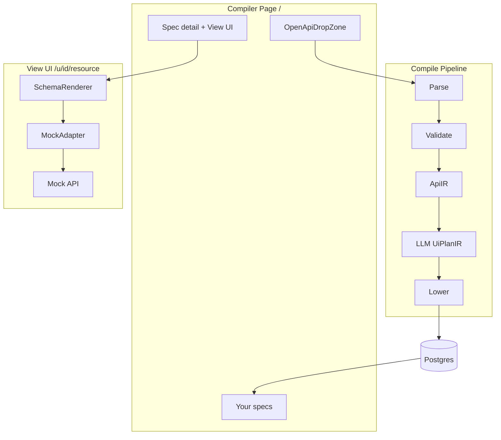

# Architecture Overview

This document describes the RapidUI MVP v3 architecture: an OpenAPI compiler that produces deterministic schema-driven CRUD interfaces.

## System Overview

RapidUI transforms OpenAPI specs into live UIs:

1. **Upload** — User drops OpenAPI (YAML/JSON) or selects a demo spec
2. **Compile** — Parse → Validate → Canonicalize → ApiIR → UiPlanIR (LLM) → UISpec
3. **Store** — Compilations saved to Postgres, scoped by account
4. **View** — Navigate to `/u/[id]/[resource]` for CRUD UI backed by mock API

The LLM is a **constrained compiler phase**. It infers labels, field order, and readOnly—it cannot add/remove fields or change structure.

## High-Level Architecture

### Compiler Pipeline

```
OpenAPI Upload
   ↓
Parse (YAML/JSON)
   ↓
Validate Subset (reject unsupported)
   ↓
Resolve $ref (local only)
   ↓
Canonicalize + Hash
   ↓
OpenAPI → ApiIR (deterministic)
   ↓
LLM Planning (ApiIR → UiPlanIR)
   ↓
Normalize UiPlanIR
   ↓
Lower (UiPlanIR → UISpec)
   ↓
Store in Postgres
```

### Runtime Flow

After compilation, the generated UI at `/u/[id]/[resource]`:

- **SchemaRenderer** renders table, form, filters from UISpec
- **MockAdapter** calls `/api/mock/[id]/[resource]` for list, create, get, update, delete
- **Mock store** generates seed data from OpenAPI schemas; CRUD persists in memory per compilation+resource


```mermaid
graph TB
    subgraph Compiler [Compiler Page /]
        Drop[OpenApiDropZone]
        List[Your specs]
        Detail[Spec detail + View UI]
    end

    subgraph Compile [Compile Pipeline]
        Parse[Parse]
        Validate[Validate]
        ApiIR[ApiIR]
        LLM[LLM UiPlanIR]
        Lower[Lower]
    end

    subgraph Runtime [View UI /u/id/resource]
        Renderer[SchemaRenderer]
        Adapter[MockAdapter]
        MockAPI[Mock API]
    end

    Drop --> Parse
    Parse --> Validate
    Validate --> ApiIR
    ApiIR --> LLM
    LLM --> Lower
    Lower --> Store[(Postgres)]
    Store --> List
    Detail --> Renderer
    Renderer --> Adapter
    Adapter --> MockAPI
```

## Data Flow

| Stage | Input | Output |
| ----- | ----- | ------ |
| Parse | OpenAPI string | Parsed document or error |
| Validate | Parsed doc | Pass or structured errors |
| Canonicalize | Resolved doc | Canonical JSON + hash |
| ApiIR | Canonical doc | Resources, operations, schemas |
| UiPlanIR | ApiIR | Field plans (labels, order, readOnly) |
| Lower | UiPlanIR + ApiIR | UISpec per resource |
| Store | Compilation | Postgres row |

## Account & Compilation Model

- **Account ID** — Generated client-side via `getOrCreateAccountId()` (stored in localStorage); used to scope compilations
- **Compilation** — One row per compiled spec: id, accountId, specs, resourceNames, resourceSlugs, apiIr, openapiCanonicalHash
- **Reset session** — Creates new accountId; previous compilations remain in DB but are no longer visible

## Adapter Layer

The `CrudAdapter` interface abstracts data access. MVP v3 uses **MockAdapter** only.

### CrudAdapter Interface (`lib/adapters/types.ts`)

```typescript
interface CrudAdapter {
  mode: "mock";
  capabilities: { create, read, update, delete };

  getSample(): Promise<Record<string, unknown>[]>;
  list(): Promise<Record<string, unknown>[]>;
  getById?(id): Promise<Record<string, unknown>>;
  create?(input): Promise<Record<string, unknown>>;
  update?(id, input): Promise<Record<string, unknown>>;
  remove?(id): Promise<void>;
}
```

### MockAdapter

- **Base URL**: `/api/mock/[compilationId]/[resource]`
- **List**: `GET` → returns records (seeded from schema or in-memory store)
- **Create**: `POST` with JSON body
- **Get**: `GET /[paramId]`
- **Update**: `PATCH /[paramId]` with JSON body
- **Delete**: `DELETE /[paramId]`

Data is shared per `accountId + compilationId + resource`; no session param. URLs are shareable.

## API Routes

### Compiler API

| Route | Method | Purpose |
| ----- | ------ | ------- |
| `/api/compile-openapi` | POST | Compile OpenAPI string; store in DB; return id, specs, apiIr. Body: `{ openapi, accountId }` |
| `/api/compilations` | GET | List compilations. Query: `?accountId=...` |
| `/api/compilations/[id]` | GET | Get compilation detail (specs, apiIr, etc.). Query: `?accountId=...` |
| `/api/compilations/[id]` | DELETE | Delete compilation. Query: `?accountId=...` |
| `/api/compilations/[id]/update` | POST | Recompile with new OpenAPI; update in place. Body: `{ openapi, accountId }` |
| `/api/demo-specs/[name]` | GET | Download demo OpenAPI file (YAML) |

### Mock API (Runtime)

| Route | Method | Purpose |
| ----- | ------ | ------- |
| `/api/mock/[id]/[resource]` | GET | List records |
| `/api/mock/[id]/[resource]` | POST | Create record |
| `/api/mock/[id]/[resource]/[paramId]` | GET | Get single record |
| `/api/mock/[id]/[resource]/[paramId]` | PATCH | Update record |
| `/api/mock/[id]/[resource]/[paramId]` | DELETE | Delete record |

## Compiler Components

| Component | Purpose |
| --------- | ------- |
| `OpenApiDropZone.tsx` | Drag-and-drop or click to upload OpenAPI file |
| `ProgressPanel.tsx` | Shows parse/validate/compile steps; endpoints; View UI link |
| `CompiledUISidebar.tsx` | Resource switcher for multi-resource compilations |
| `CompiledUIContent.tsx` | Wraps SchemaRenderer + MockAdapter; diff dialog |

## Renderer Components (Unchanged)

| Component | Purpose |
| --------- | ------- |
| `SchemaRenderer.tsx` | Main controller; adapter integration; loading/error |
| `DataTable.tsx` | TanStack Table; optional onEdit/onDelete |
| `FormModal.tsx` | Create/Edit; nested schema support |
| `FiltersPanel.tsx` | Type-specific filter inputs |

## Core Libraries

### Compiler (`lib/compiler/`)

- **openapi/** — `parser.ts`, `subset-validator.ts`, `ref-resolver.ts`, `canonicalize.ts`
- **apiir/** — `build.ts`, `grouping.ts`, `operations.ts`, `types.ts`
- **uiplan/** — `llm-plan.ts`, `prompt.system.txt`, `prompt.user.ts`, `uiplan.schema.ts`, `normalize.ts`
- **lowering/** — `lower.ts`, `schema-to-field.ts`
- **pipeline.ts** — Orchestrates full compile
- **store.ts** — Re-exports from `lib/db/compilations`
- **hash.ts** — sha256 for canonical outputs
- **errors.ts** — Error taxonomy (OAS_*, IR_*, UIPLAN_*, UISPEC_*)

### DB (`lib/db/`)

- **compilations.ts** — Postgres CRUD for compilations; requires POSTGRES_URL or DATABASE_URL

### Spec (`lib/spec/`)

- **schema.ts** — Zod schema for UISpec
- **types.ts** — TypeScript types
- **diff.ts** — `computeSpecDiff`, `computeMultiSpecDiff` for version change display
- **diffFormatters.ts** — `formatMultiSpecDiffForDisplay` for update diff dialog

### Mock Store (`lib/compiler/mock/`)

- **store.ts** — In-memory CRUD; seed from OpenAPI schema
- **fixtures.ts** — Predefined hashes for golden specs

## File Structure

```
app/
  page.tsx                    # Compiler page (upload, list, detail)
  u/
    [id]/page.tsx             # Redirect to first resource
    [id]/[resource]/page.tsx  # CRUD UI
  api/
    compile-openapi/route.ts
    compilations/route.ts
    compilations/[id]/route.ts
    compilations/[id]/update/route.ts
    demo-specs/[name]/route.ts
    mock/[id]/[resource]/route.ts
    mock/[id]/[resource]/[paramId]/route.ts

components/
  compiler/
    ProgressPanel.tsx
    CompiledUISidebar.tsx
    CompiledUIContent.tsx
  connect/
    OpenApiDropZone.tsx
  renderer/
    SchemaRenderer.tsx
    DataTable.tsx
    FormModal.tsx
    FiltersPanel.tsx

lib/
  compiler/
    openapi/
    apiir/
    uiplan/
    lowering/
    mock/
    pipeline.ts
    store.ts
    hash.ts
    errors.ts
  db/
    compilations.ts
  adapters/
    types.ts
    mock-adapter.ts
  spec/
  session.ts
```

## Technology Stack

- **Framework**: Next.js 16 (App Router)
- **UI**: shadcn/ui + Tailwind CSS
- **Table**: TanStack Table
- **Forms**: React Hook Form + Zod
- **AI**: OpenAI SDK (gpt-4o-mini, temperature 0)
- **Database**: Neon Postgres
- **Notifications**: Sonner (toasts)

## Key Design Decisions

1. **OpenAPI as source of truth** — No paste JSON, no external API; compile from spec only
2. **Determinism** — Same OpenAPI → same UISpec → same UI; canonicalization + hashing enforce this
3. **LLM boundary** — LLM sees ApiIR only; cannot add/remove fields or change structure
4. **Account-scoped compilations** — Postgres stores compilations; accountId from client
5. **Mock backend** — Generated UIs use mock API; no real backend required for demo
6. **Shareable URLs** — `/u/[id]/[resource]` works without session; mock data keyed by accountId+compilationId
