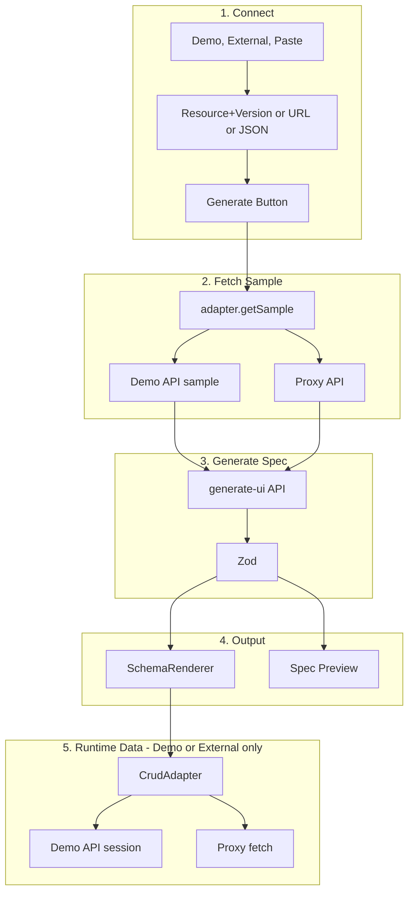

# Architecture Overview

This document describes the RapidUI.dev architecture: a one-click internal dashboard generator that connects to real APIs (demo API first, external APIs in read-only preview mode).

## System Overview

RapidUI transforms backend data into schema-driven CRUD interfaces. Users can:

1. **Demo API** — Connect to built-in demo resources (Users, Products, Tasks, etc.) with full CRUD
2. **External API** — Connect to any public REST API for read-only preview
3. **Paste JSON** — Paste arbitrary JSON for backward compatibility and ad-hoc use

All flows use AI (OpenAI) to generate UI specifications, with deterministic fallbacks for reliability.

## High-Level Architecture

The diagram below shows the **generation workflow** (how a UI spec is produced) and the **runtime flow** (how the rendered UI fetches and mutates data).

### Generation Workflow

User configures a data source, clicks Generate, and the system produces a validated UI spec:

1. **Connect** — User selects tab (Demo / External / Paste) and configures (resource+version, URL, or JSON).
2. **Sample** — `adapter.getSample()` fetches sample data: Demo API returns seeds; Proxy fetches external URL; Paste uses textarea.
3. **Spec** — Sample → `generate-ui` API → Zod validation → UISpec.
4. **Output** — Spec is passed to SchemaRenderer (renders table/form/filters) and Spec Preview (shows JSON).

### Runtime Flow

After generation, the rendered UI fetches and mutates data:

- **Demo**: SchemaRenderer uses `adapter.list()` → Demo API (session store); CRUD → Demo API.
- **External**: SchemaRenderer uses `adapter.list()` → Proxy → external URL; read-only.
- **Paste**: No adapter. SchemaRenderer uses `initialData` (parsed JSON); CRUD is local React state.

**Note:** Demo API and Proxy API are mutually exclusive—the active tab determines which path is used. Paste JSON skips the sample fetch and sends the pasted payload directly to `generate-ui`; it also skips the adapter and uses local state for CRUD.



## Data Sources

| Source    | Data Flow                    | CRUD      | Session      |
| --------- | ---------------------------- | --------- | ------------ |
| **Demo**  | Seeds → Spec gen; Session → UI | Full      | In-memory    |
| **External** | Proxy → Spec gen; Proxy → UI | Read-only | None         |
| **Paste** | Pasted JSON → Spec gen; Local → UI | Local state | React state |

### Session Design

- **Session ID** is generated via `createSessionId()` (UUID) and stored in React state only
- **No localStorage** — reload = fresh start; two users = separate data
- **Client components** — `app/page.tsx` and `SchemaRenderer.tsx` use `"use client"`
- Demo API routes receive `?session={id}&v={version}` to scope data per session and version

## Adapter Layer

The `CrudAdapter` interface abstracts data access so the renderer works with Demo API, External API, or local state.

### CrudAdapter Interface (`lib/adapters/types.ts`)

```typescript
interface CrudAdapter {
  mode: "demo" | "external";
  capabilities: { create, read, update, delete };

  getSample(): Promise<Record<string, unknown>[]>;  // For spec generation
  list(): Promise<Record<string, unknown>[]>;       // For table display

  getById?(id): Promise<Record<string, unknown>>;   // Optional, for edit form
  create?(input): Promise<Record<string, unknown>>;
  update?(id, input): Promise<Record<string, unknown>>;
  remove?(id): Promise<void>;
}
```

### getSample vs list

| Method     | Purpose                    | Data source                          |
| ---------- | -------------------------- | ------------------------------------ |
| `getSample()` | Spec generation only      | Seeds (demo) or proxy (external)      |
| `list()`   | Table display              | Session store (demo) or proxy (external) |

- **Demo**: Seeds are immutable; per-session data is a mutable copy. `getSample()` returns seeds; `list()`/create/update/delete use the session copy.
- **External**: Both call the proxy; no session. Read-only.
- **Empty list** → Table shows "No data" (no crash).

### Adapters

- **DemoAdapter** (`lib/adapters/demo-adapter.ts`): Full CRUD via `/api/demo/[resource]`. Uses `getResourceBySlug` for `idField`.
- **ExternalAdapter** (`lib/adapters/external-adapter.ts`): Read-only. `getSample()` and `list()` both call `/api/proxy` with `{ url, dataPath? }`.

## API Routes

### Demo API (`app/api/demo/`)

| Route                    | Method | Purpose                          |
| ------------------------ | ------ | -------------------------------- |
| `[resource]/route.ts`   | GET    | List records (session-scoped)    |
| `[resource]/route.ts`   | POST   | Create record                    |
| `[resource]/[id]/route.ts` | GET | Get single record                |
| `[resource]/[id]/route.ts` | PUT | Update record                    |
| `[resource]/[id]/route.ts` | DELETE | Delete record                 |
| `[resource]/sample/route.ts` | GET | Seed sample (no session)      |
| `[resource]/reset/route.ts` | POST | Reset session to seeds        |

### Proxy API (`app/api/proxy/route.ts`)

- **POST** `{ url, dataPath? }` — Fetches URL and returns extracted array
- **Security**: URL validation (reject localhost, private IPs, non-http(s)), 10s timeout, 30 req/min per IP
- **Data path**: `dataPath` supports `data`, `results`, `items`, `records`.
- **Auto-detect**: If omitted, tries array → as-is; object → `data`/`results`/`items`/`records`

### Generate UI (`app/api/generate-ui/route.ts`)

- **POST** `{ payload, intent?, existingSpec? }` — AI or fallback spec generation
- Returns `{ spec: UISpec, source: "ai" | "fallback" }`

## Connect Components

| Component                 | Purpose                                      |
| ------------------------- | -------------------------------------------- |
| `ConnectSection.tsx`      | Demo API tab: resource + version selector    |
| `ExternalApiSection.tsx`  | External API tab: URL, DataPathSelector, prompt |
| `DataPathSelector.tsx`    | Dropdown: Auto \| data \| results \| items \| records |
| `ResourceSelector.tsx`    | Dropdown for demo resources                  |
| `VersionSelector.tsx`     | v1 / v2 / v3 for demo                        |
| `GenerateButton.tsx`      | Triggers generation pipeline                 |
| `GenerationSuccessToast.tsx` | Diff toast for version/prompt changes       |

## Generation Pipeline

1. User selects resource (e.g. Users v1) or enters external URL
2. `adapter.getSample()` fetches sample data
3. Client calls `generate-ui` with `{ payload, intent? }`
4. Zod validates spec
5. `SchemaRenderer` receives spec + adapter; renders table via `adapter.list()`

## Renderer Components

| Component          | Purpose                                                |
| ------------------ | ------------------------------------------------------ |
| `SchemaRenderer.tsx` | Main controller; adapter integration; loading/error; read-only banner |
| `DataTable.tsx`    | TanStack Table; optional `onEdit`/`onDelete`; conditional actions column |
| `FormModal.tsx`    | Create/Edit; async `onSubmit`; submit button loader    |
| `FiltersPanel.tsx` | Type-specific filter inputs                            |

### Read-Only Mode

When `adapter.mode === "external"` (or capabilities lack create/update/delete):

- `onEdit` and `onDelete` are undefined → no actions column
- Create button hidden
- "Read-only preview" banner shown

## Core Libraries

### Spec (`lib/spec/`)

- `schema.ts` — Zod schema; `idField?: string` (default `"id"`)
- `types.ts` — TypeScript types
- `diff.ts` — `computeSpecDiff(prev, next)` for version/prompt change toast
- `diffFormatters.ts` — `formatDiffForDisplay(diff)` for human-readable bullets

### Demo Store (`lib/demoStore/`)

- `resources.ts` — `{ label, slug, idField }[]` per resource
- `seeds.ts` — Versioned seed data (v1, v2, v3)
- `store.ts` — per-session mutable copy; CRUD operations

### Session (`lib/session.ts`)

- `createSessionId()` — Returns UUID; no localStorage

### Utils

- `extractDataPath.ts` — `extractArrayFromResponse(body, dataPath?)` for proxy
- `urlValidation.ts` — SSRF protection for proxy URLs

## File Structure

```
app/
  page.tsx                 # Three tabs: Demo API, External API, Paste JSON
  api/
    generate-ui/route.ts
    demo/
      [resource]/route.ts
      [resource]/[id]/route.ts
      [resource]/sample/route.ts
      [resource]/reset/route.ts
    proxy/route.ts

components/
  renderer/
    SchemaRenderer.tsx
    DataTable.tsx
    FormModal.tsx
    FiltersPanel.tsx
  ui/
    alert-dialog.tsx       # Delete confirmation
  connect/
    ResourceSelector.tsx
    VersionSelector.tsx
    ConnectSection.tsx
    ExternalApiSection.tsx
    DataPathSelector.tsx
    GenerateButton.tsx
    GenerationSuccessToast.tsx

lib/
  session.ts
  adapters/
    types.ts
    demo-adapter.ts
    external-adapter.ts
    index.ts
  demoStore/
    store.ts
    seeds.ts
    resources.ts
  spec/
    schema.ts
    types.ts
    diff.ts
    diffFormatters.ts
  utils/
    extractDataPath.ts
    urlValidation.ts
  inference/
  ai/
  examples.ts
  externalApiExamples.ts
```

## Technology Stack

- **Framework**: Next.js 16 (App Router)
- **UI**: shadcn/ui + Tailwind CSS
- **Table**: TanStack Table
- **Forms**: React Hook Form + Zod
- **AI**: OpenAI SDK (gpt-4o-mini)
- **Notifications**: Sonner (toasts)

## Key Design Decisions

1. **Single page** — Connect and dashboard on one page; no spec in URL
2. **Session in React state** — No localStorage; reload = fresh start
3. **Versioned seeds** — Each version (v1/v2/v3) has separate data; no shared records
4. **Adapter abstraction** — Same renderer for demo, external, and paste (when using initialData)
5. **Read-only external** — Preview only; no create/update/delete
6. **Proxy security** — URL validation, SSRF protection, timeout, rate limit
